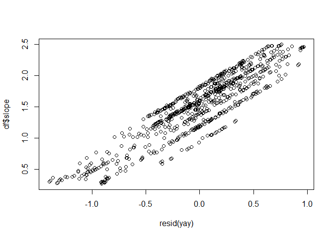
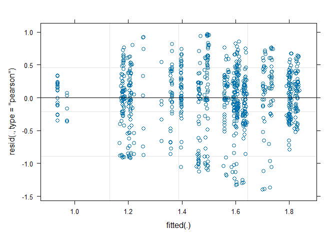

MA Fitness
================
Rutuja
2024-10-28

Analysis functions

``` r
## Calculate the maximum slope of fitted splines
spline.slope<-function(x, y, n=101, eps=1e-5, span=0.075){
  max(nderiv(loess(log(y) ~ x, degree=1, span=span), x), na.rm=TRUE)}
  
## Fits the splines
nderiv <- function(fit, x, eps=1e-5){
  (predict(fit, x + eps) - predict(fit, x - eps))/(2 * eps)}

## Calculates the sum of squared residuals from loess smoothing
loess.resid <- function(x, y, n=101, span=0.2){
    k <- loess(log(y) ~ x, degree=1, span=span)
    return(sum(k$residuals^2))
}

## Calculates the absolute sum of residuals from loess smoothing
loess.resid.v2 <- function(x, y, n=101, span=0.2){
    k <- loess(log(y) ~ x, degree=1, span=span)
    return(sum(abs(k$residuals)))
}
```

Spline span considerations: If the span is too low, then the model has
issues fitting. If the span is too high, we smooth too much.

``` r
folder <-"data/"
l <- list.files(folder)
span = 0.075   ## set arbitrarily based on data

dfs <- lapply(l[endsWith(l, '.csv')], function(r){
  d <- read.csv(paste0(folder,r))
  
  assay.name <- str_replace(str_replace(r, 'Ref', 'Rutuja'), '.csv', '.txt')
  assay.data <- read.delim(paste0(folder,assay.name))
  assay.data$Time<-seq(from=0.25,by=0.25,length.out=nrow(assay.data))

  ## Dates in a good format are nice

  d$date <- mdy(str_replace(str_replace(r, 'Ref ', ''), '.csv', ' 2023'))
  
  ## Check and note the initial OD

  d$initial <- sapply(c(1:nrow(d)), function(r){
    mean(assay.data[,which(names(assay.data)==d$well[r])][1:4])
  })
  
  ## Check and note the final OD

  d$final <- sapply(c(1:nrow(d)), function(r){
    temp <- assay.data[,which(names(assay.data)==d$well[r])]
    temp <- temp[!is.na(temp)]
    n <- length(temp)
    mean(temp[(n-3):n])
  })
  
  ## Subtracting the blanks

  blanks <- d[d$treatment == "Blank",]
  
  ## Find the good blanks
  good.blanks <- blanks %>% filter(final - initial < 0.05)
  blank.wells <- good.blanks$well
  
  ## Find the blank value for that day
  blank.val <- mean(unlist(assay.data[, blank.wells]), na.rm=TRUE)
  d$blank.val <- blank.val
  ## storing the standard deviation of the blanks
  blank.sd <- sd(unlist(assay.data[, blank.wells]), na.rm=TRUE)
  d$blank.sd <- sd(unlist(assay.data[, blank.wells]), na.rm=TRUE)
  testcols <- colnames(assay.data)
  
  assay.data <- bind_cols(assay.data[,1:2], data.frame(sapply(c(1:nrow(d)), function(r){
    ## Actually subtract the blanks from everybody else.
    ## Maybe add something to put in some tolerance for the just below blank values
    ## The only thing I can think of is adding in 1 sd values (or half sd if I am thinking half here half there)
    temp <- (assay.data[,which(names(assay.data)==d$well[r])]-blank.val)
    
    ## We are dealing with log values, so we cannot have anything negative (also that would be funny to think of since OD represents the cell density,)
    temp <- replace(temp, which(temp<=0), NA)
    temp
    })))
  colnames(assay.data) = c(testcols[1:2], d$well)
   
   ## Now doing the initial and final calculations again

  ## Check and note the initial OD

  d$initial <- sapply(c(1:nrow(d)), function(r){
    temp <- assay.data[,which(names(assay.data)==d$well[r])]
    temp <- temp[!is.na(temp)]
    n <- length(temp)
    mean(temp[1:4])
  })

  ## Check and note the final OD
  ## Being a little generous about what final means

  d$final <- sapply(c(1:nrow(d)), function(r){
    temp <- assay.data[,which(names(assay.data)==d$well[r])]
    temp <- temp[!is.na(temp)]
    n <- length(temp)
    if (n<8) return(NA)
    mean(temp[(n-7):n])
  })
  
  ### Using kind of the same template to calculate the final slope
  ## Doesnt have to be too accurate. I am literally putting a secant through the data for the last hour.

  d$final.slope <- sapply(c(1:nrow(d)), function(r){
    temp <- assay.data[,which(names(assay.data)==d$well[r])]
    temp <- temp[!is.na(temp)]
    n <- length(temp)
    if (n<4) return(NA)
    return(temp[n] - temp[(n-3)])
  })
  
   ## Calculating the maximum slope mu_max
  ## We use this as a proxy for mu which is the inherent growth rate
  
  d$slope <- sapply(c(1:nrow(d)), function(r){
    y = assay.data[,which(names(assay.data)==d$well[r])]
    if (sum(is.na(y)) >= (length(y)-64)) {
      return(NA)}
    else spline.slope(assay.data$Time, y, span=span)
  })
  
  ## this is where I do the residuals for loess fits calculations
  
  d$resids <-  sapply(c(1:nrow(d)), function(r){
    y = assay.data[,which(names(assay.data)==d$well[r])]
    if (sum(is.na(y)) >= (length(y)-64)) {
      return(NA)}
    else loess.resid(assay.data$Time, y, span=span)
  })
  
  d$resids.abs <-  sapply(c(1:nrow(d)), function(r){
    y = assay.data[,which(names(assay.data)==d$well[r])]
    if (sum(is.na(y)) >= (length(y)-64)) {
      return(NA)}
    else loess.resid.v2(assay.data$Time, y, span=span)
  })
  
   d$double_time <- log(2)/d$slope
   
   ## Populations should not go down, at least that is the hope!
   ## I am calculating the derivatives (with loess ftting) to be a little generous about some jitter in the data
   
   d$monotone <- sapply(c(1:nrow(d)), function(r){
    y = assay.data[,which(names(assay.data)==d$well[r])]
    x = assay.data$Time
    if (sum(is.na(y)) >= (length(y)-64)) return(FALSE)
    return(sum(nderiv(loess(log(y) ~ x, degree=1, span=span), x) < 0, na.rm=TRUE))
  })
   
   # d$monotone <- sapply(c(1:nrow(d)), function(r){
   #   y = assay.data[,which(names(assay.data)==d$well[r])]
   #   sum(diff(y)<0,na.rm=TRUE)<=15
   # })
   
   ## There should not be any sudden changes in OD. Put this one in so I can filter for drastic ups and downs later. Basically calculates the variance in OD changes
   
   d$OD.var <- sapply(c(1:nrow(d)), function(r){
     y = assay.data[,which(names(assay.data)==d$well[r])]
     var(diff(y),na.rm=TRUE)
   })
  
  return(d)
})

d <- do.call("rbind", dfs)

head(d)
```

    ##   well treatment       date      initial     final blank.val   blank.sd
    ## 1   A1     Blank 2023-04-06           NA        NA 0.1799465 0.01301512
    ## 2   B1        H1 2023-04-06 0.0020535098 0.7116785 0.1799465 0.01301512
    ## 3   C1        H2 2023-04-06 0.0020535098 0.7609285 0.1799465 0.01301512
    ## 4   D1        H3 2023-04-06 0.0003035098 0.6650535 0.1799465 0.01301512
    ## 5   E1        D1 2023-04-06 0.0015535098 0.5575535 0.1799465 0.01301512
    ## 6   F1        D2 2023-04-06 0.0023035098 0.4620535 0.1799465 0.01301512
    ##   final.slope    slope   resids resids.abs double_time monotone       OD.var
    ## 1          NA       NA       NA         NA          NA        0           NA
    ## 2       0.003 2.640040 4.896382   4.922268   0.2625517        0 4.899506e-05
    ## 3       0.001 2.797476 4.667765   4.881267   0.2477759        0 5.497615e-05
    ## 4       0.003 2.941911 3.205453   4.779578   0.2356112        0 3.603383e-05
    ## 5       0.001 2.865809 3.705777   4.358252   0.2418679        0 2.377293e-05
    ## 6       0.004 3.025559 4.854013   4.589752   0.2290972        0 7.162986e-06

``` r
dates.1 <- seq(mdy(04062023), mdy(04102023), 1)
dates.2 <- seq(mdy(04282023), mdy(11302023), 1)
dates.3 <- c(mdy(11022023))
ancestors <- c('H1', 'H2', 'H3', 'D1', 'C1', 'C2', 'D2', 'D3')

## the diploids that were actually haploids are being categorized as haploid ancestors here. I just remove them later
ancestors.haploid <- c('H1', 'H2', 'H3', 'C1', 'C3', 'D2', 'D3')
ancestors.diploid <- c('D1')


d$batch[d$date %in% dates.1] <- 1
d$batch[d$date %in% dates.2] <- 2
d$batch[d$date %in% dates.3] <- 3
# Labeling the dates
dates <- d %>% distinct(date)
# alphabet <- c('A', 'B')
alphabet <- c('1A', '1B', '1C', '1D', '2A', '2B', '2C', '2D', '3A')
dates <- dates %>% mutate(day = alphabet)
d <- d %>% left_join(dates, by='date') %>% select(-date)


d <- d %>% mutate(category = case_when(treatment == 'Blank' ~ 'Blank',
                              treatment %in% ancestors.haploid ~ 'Ctrl.H',
                              treatment %in% ancestors.diploid ~ 'Ctrl.D',
                              as.numeric(treatment) %% 2 == 0 ~ 'MA.D',
                              as.numeric(treatment) %% 2 == 1 ~ 'MA.H',
                              TRUE ~ 'DROPME'))


## Dropping criteria (which I swear I did not pull from thin air)

## Their job here is done
d$category[(d$category=='Blank')] <- 'DROPME'

## The curves should be increasing for the most part
d$category[d$monotone>=13] <- 'DROPME'

## Drop curves with too much variance. These are smooth curves with such a thing as reasonable variance. And the cutoff is pretty generous anyways.
d$category[d$OD.var>6e-04] <- 'DROPME'

## Remove things with high initial OD. We started with blanks. Anything other that those cannot be a good sign because then the slope will depend on initial OD with a different relationship which would make modelling it a lot harder.
d$category[d$initial>0.01] <- 'DROPME'

## Drop curves with very high or low final slope. We are hoping to have observed saturation, so it should kind of flatten out
d$category[d$final.slope>=0.03] <- 'DROPME'
d$category[d$final.slope<=-0.03] <- 'DROPME'

## Drop if the final value of OD is less the threshold. The culture should reach saturation
d$category[d$final<0.15] <- 'DROPME'

## Drop the DROPMEs
data <- d[(d$category!='DROPME'),]

cat(data$well[data$day=="1A"], file = "1A.txt")
cat(data$well[data$day=="1B"], file = "1B.txt")
cat(data$well[data$day=="1C"], file = "1C.txt")
cat(data$well[data$day=="1D"], file = "1D.txt")
cat(data$well[data$day=="2A"], file = "2A.txt")
cat(data$well[data$day=="2B"], file = "2B.txt")
cat(data$well[data$day=="2C"], file = "2C.txt")
cat(data$well[data$day=="2D"], file = "2D.txt")
cat(data$well[data$day=="3A"], file = "3A.txt")
```

To show that I did not pick the filtering thresholds from thin air

``` r
d %>% ggplot() + geom_histogram(aes(initial)) + geom_vline(xintercept = 0.02, color='red')
```

    ## `stat_bin()` using `bins = 30`. Pick better value with `binwidth`.

<!-- -->

``` r
d %>% ggplot() + geom_histogram(aes(final)) + geom_vline(xintercept = 0.15, color='red')
```

    ## `stat_bin()` using `bins = 30`. Pick better value with `binwidth`.

<!-- -->

``` r
d %>% ggplot() + geom_histogram(aes(final.slope)) + geom_vline(xintercept = c(0.03,-0.03), color='red')
```

    ## `stat_bin()` using `bins = 30`. Pick better value with `binwidth`.

<!-- -->

``` r
d %>% ggplot() + geom_histogram(aes(OD.var)) + geom_vline(xintercept = 0.0006, color='red')
```

    ## `stat_bin()` using `bins = 30`. Pick better value with `binwidth`.

<!-- -->

``` r
d %>% ggplot() + geom_histogram(aes(monotone)) + geom_vline(xintercept = 13, color='red')
```

    ## `stat_bin()` using `bins = 30`. Pick better value with `binwidth`.

<!-- -->

The blanks: Some extra information visualized

``` r
d %>% group_by(day) %>% summarize(blank.val=mean(blank.val)) %>% ggplot() + geom_col(aes(x=day,y=blank.val))
```

<!-- -->

``` r
d %>% group_by(day) %>% summarize(blank.sd=mean(blank.sd)) %>% ggplot() + geom_col(aes(x=day,y=blank.sd))
```

<!-- -->

Now time to include some more information about what happened and remove
more data.

``` r
data_trim <- data %>% 
  
  ## The diploid controls on the 1st batch of plates were not actually diploids
  filter(!((treatment %in% c('D1', 'D2', 'D3')) & (batch == 1))) %>%
  
  ## There was only 1 diploid control on the 2nd batch of plates
  filter(!((treatment %in% c('D2', 'D3')) & (batch == 2))) %>%
  
  ## This is just a test assay for a sanity check. There were no MA lines in this batch
  filter(!(batch == 3)) %>%
  
  ## This entire plate just looks awful. I don't think I can trust anything from that plate.
  filter(!(day=='2C')) %>%
  filter(!(day=='2A')) %>%
  
  ## A slope higher that that would mean a much lower doubling time and there is no reason to believe anything would grow that fast
  filter(slope < 2.5)
```

This plot is always something

``` r
## Before trimming
data %>% 
  filter(category %in% c('Ctrl.H', 'Ctrl.D')) %>%
  ggplot() +
  geom_point(aes(x=treatment, y=slope, color=treatment)) + 
  facet_grid(cols=vars(day)) +
  theme(axis.text.x = element_text(angle = 90, vjust = 0.5, hjust=1))
```

<!-- -->

``` r
## After trimming
data_trim %>% 
  filter(category %in% c('Ctrl.H', 'Ctrl.D')) %>%
  ggplot() +
  geom_point(aes(x=treatment, y=slope, color=treatment)) + 
  facet_grid(cols=vars(day)) +
  theme(axis.text.x = element_text(angle = 90, vjust = 0.5, hjust=1))
```

<!-- -->

Slope vs initial

Story (that I will move a few lines above later): The cut off for
initial OD was set so that we do not consider lines where the slope is
too low because of a high initial OD. If the initial OD is too high,
then the max slope shows some relation to the initial OD and we do not
want to include that data. The ideal scenario would be having a cloud of
points in these plots.

``` r
## Before
d %>% 
  ggplot() +
  geom_point(aes(x=initial, y=slope, color=category)) +
  facet_wrap(vars(day))
```

<!-- -->

``` r
## After cleanin and trimming
data_trim %>% 
  ggplot() +
  geom_point(aes(x=initial, y=slope, color=category)) +
  facet_wrap(vars(day))
```

<!-- -->

Moment of truth, let’s visualize this stuff.

``` r
data_trim %>%
  ggplot() + geom_point(aes(x=category, y=slope, color=category)) + facet_grid(cols=vars(day)) +
  theme(axis.text.x = element_text(angle = 90, vjust = 0.5, hjust=1))
```

<!-- -->

``` r
df <- data_trim %>% select(treatment, initial, slope, resids, resids.abs, double_time, batch, day, category)

df <- df %>% rename('lineid' = 'treatment')

df$ploidy <- case_when(
  df$category %in% c('Ctrl.H', 'MA.H') ~ 'Haploid',
  df$category %in% c('Ctrl.D', 'MA.D') ~ 'Diploid'
)
 
df$MA <- case_when(
  df$category %in% c('MA.H', 'MA.D') ~ 'MA',
  df$category %in% c('Ctrl.H', 'Ctrl.D') ~ 'Ctrl',
)


df$initial_scaled <- df$initial/mean(df$initial)
df$w1 <- 1/df$resids ## 1/sum(resid^2)
df$w2 <- sqrt(1/df$resids) ## 1/sqrt(sum(resid^2))
df$w3 <- 1/df$resids.abs ## 1/sum(abs(resid))
df$w4 <- (1/df$resids.abs)^2 ## 1/sum(abs(resid))^2
  
head(df) # MA lines
```

    ##   lineid    initial     slope     resids resids.abs double_time batch day
    ## 1     H2 0.00605351 0.4948156 0.01738990  0.6777870   1.4008193     1  1A
    ## 2     H1 0.00130351 1.6075097 8.68154652  5.9049549   0.4311932     1  1A
    ## 3     H1 0.00880351 0.5844747 0.16044992  2.0371671   1.1859318     1  1A
    ## 4     H1 0.00330351 1.6086404 0.24949367  1.6611321   0.4308901     1  1A
    ## 5     H2 0.00380351 0.6811348 0.03173643  0.8835029   1.0176359     1  1A
    ## 6     H2 0.00530351 0.8506887 0.11785417  1.1898344   0.8148071     1  1A
    ##   category  ploidy   MA initial_scaled         w1        w2        w3
    ## 1   Ctrl.H Haploid Ctrl      1.4227919 57.5046470 7.5831819 1.4753897
    ## 2   Ctrl.H Haploid Ctrl      0.3063716  0.1151869 0.3393919 0.1693493
    ## 3   Ctrl.H Haploid Ctrl      2.0691406  6.2324741 2.4964924 0.4908778
    ## 4   Ctrl.H Haploid Ctrl      0.7764433  4.0081178 2.0020284 0.6019991
    ## 5   Ctrl.H Haploid Ctrl      0.8939612 31.5095266 5.6133347 1.1318582
    ## 6   Ctrl.H Haploid Ctrl      1.2465150  8.4850628 2.9129131 0.8404531
    ##           w4
    ## 1 2.17677483
    ## 2 0.02867919
    ## 3 0.24096097
    ## 4 0.36240290
    ## 5 1.28110310
    ## 6 0.70636142

## Models!

Testing for MA-ploidy interaction. I am testing out different kinds of
weights here to see what works best.

``` r
null <- lmer(slope ~ MA + ploidy + initial_scaled + (1|day) + (1|lineid), df)
full <- lmer(slope ~ MA * ploidy + initial_scaled + (1|day) + (1|lineid), df)
summary(full)
```

    ## Linear mixed model fit by REML ['lmerMod']
    ## Formula: slope ~ MA * ploidy + initial_scaled + (1 | day) + (1 | lineid)
    ##    Data: df
    ## 
    ## REML criterion at convergence: 995.4
    ## 
    ## Scaled residuals: 
    ##     Min      1Q  Median      3Q     Max 
    ## -2.9791 -0.5522  0.0669  0.6954  2.4479 
    ## 
    ## Random effects:
    ##  Groups   Name        Variance Std.Dev.
    ##  lineid   (Intercept) 0.001733 0.04162 
    ##  day      (Intercept) 0.072806 0.26983 
    ##  Residual             0.191351 0.43744 
    ## Number of obs: 803, groups:  lineid, 104; day, 6
    ## 
    ## Fixed effects:
    ##                     Estimate Std. Error t value
    ## (Intercept)         1.543608   0.139550  11.061
    ## MAMA                0.278556   0.084817   3.284
    ## ploidyHaploid       0.069805   0.094626   0.738
    ## initial_scaled     -0.292806   0.034061  -8.596
    ## MAMA:ploidyHaploid -0.006534   0.100775  -0.065
    ## 
    ## Correlation of Fixed Effects:
    ##             (Intr) MAMA   pldyHp intl_s
    ## MAMA        -0.543                     
    ## ploidyHapld -0.500  0.843              
    ## initil_scld -0.178 -0.076 -0.091       
    ## MAMA:pldyHp  0.473 -0.859 -0.931  0.049

``` r
anova(null, full)
```

    ## refitting model(s) with ML (instead of REML)

    ## Data: df
    ## Models:
    ## null: slope ~ MA + ploidy + initial_scaled + (1 | day) + (1 | lineid)
    ## full: slope ~ MA * ploidy + initial_scaled + (1 | day) + (1 | lineid)
    ##      npar    AIC    BIC  logLik deviance  Chisq Df Pr(>Chisq)
    ## null    7 989.47 1022.3 -487.74   975.47                     
    ## full    8 991.46 1029.0 -487.73   975.46 0.0125  1     0.9108

Not significant. Initial_scaled looks like it could be significant. MA
might be able to make it.

Random effects:  
Groups Name Variance Std.Dev.  
lineid (Intercept) 0.001733 0.04162  
day (Intercept) 0.072806 0.26983  
Residual 0.191351 0.43744

Now trying the weights

``` r
null1 <- lmer(slope ~ MA + ploidy + initial + (1|day) + (1|lineid), df, weights=w1)
summary(null1)
```

    ## Linear mixed model fit by REML ['lmerMod']
    ## Formula: slope ~ MA + ploidy + initial + (1 | day) + (1 | lineid)
    ##    Data: df
    ## Weights: w1
    ## 
    ## REML criterion at convergence: 1532.8
    ## 
    ## Scaled residuals: 
    ##     Min      1Q  Median      3Q     Max 
    ## -4.8240 -0.3788  0.1608  0.5696  5.3261 
    ## 
    ## Random effects:
    ##  Groups   Name        Variance Std.Dev.
    ##  lineid   (Intercept) 0.03873  0.1968  
    ##  day      (Intercept) 0.04635  0.2153  
    ##  Residual             0.94716  0.9732  
    ## Number of obs: 803, groups:  lineid, 104; day, 6
    ## 
    ## Fixed effects:
    ##                 Estimate Std. Error t value
    ## (Intercept)      1.43816    0.14624   9.834
    ## MAMA             0.48116    0.10752   4.475
    ## ploidyHaploid    0.06595    0.05351   1.232
    ## initial       -100.07010    7.97136 -12.554
    ## 
    ## Correlation of Fixed Effects:
    ##             (Intr) MAMA   pldyHp
    ## MAMA        -0.724              
    ## ploidyHapld -0.249  0.127       
    ## initial     -0.257  0.055 -0.110

``` r
full1 <- lmer(slope ~ MA * ploidy + initial + (1|day) + (1|lineid), df, weights=w1)
summary(full1)
```

    ## Linear mixed model fit by REML ['lmerMod']
    ## Formula: slope ~ MA * ploidy + initial + (1 | day) + (1 | lineid)
    ##    Data: df
    ## Weights: w1
    ## 
    ## REML criterion at convergence: 1532.8
    ## 
    ## Scaled residuals: 
    ##     Min      1Q  Median      3Q     Max 
    ## -4.8213 -0.3811  0.1620  0.5704  5.3362 
    ## 
    ## Random effects:
    ##  Groups   Name        Variance Std.Dev.
    ##  lineid   (Intercept) 0.03878  0.1969  
    ##  day      (Intercept) 0.04638  0.2154  
    ##  Residual             0.94720  0.9732  
    ## Number of obs: 803, groups:  lineid, 104; day, 6
    ## 
    ## Fixed effects:
    ##                    Estimate Std. Error t value
    ## (Intercept)          1.6103     0.2338   6.888
    ## MAMA                 0.3021     0.2181   1.385
    ## ploidyHaploid       -0.1616     0.2470  -0.654
    ## initial            -99.5442     7.9913 -12.457
    ## MAMA:ploidyHaploid   0.2377     0.2518   0.944
    ## 
    ## Correlation of Fixed Effects:
    ##             (Intr) MAMA   pldyHp initil
    ## MAMA        -0.902                     
    ## ploidyHapld -0.795  0.863              
    ## initial     -0.106 -0.033 -0.092       
    ## MAMA:pldyHp  0.780 -0.870 -0.976  0.070

``` r
anova(null1, full1)
```

    ## refitting model(s) with ML (instead of REML)

    ## Data: df
    ## Models:
    ## null1: slope ~ MA + ploidy + initial + (1 | day) + (1 | lineid)
    ## full1: slope ~ MA * ploidy + initial + (1 | day) + (1 | lineid)
    ##       npar    AIC    BIC  logLik deviance  Chisq Df Pr(>Chisq)
    ## null1    7 1543.0 1575.8 -764.51   1529.0                     
    ## full1    8 1544.1 1581.6 -764.05   1528.1 0.9316  1     0.3344

Random effects:  
Groups Name Variance Std.Dev.  
lineid (Intercept) 0.03878 0.1969  
day (Intercept) 0.04638 0.2154  
Residual 0.94720 0.9732

``` r
null2 <- lmer(slope ~ MA + ploidy + initial + (1|day) + (1|lineid), df, weights=w2)
full2 <- lmer(slope ~ MA * ploidy + initial + (1|day) + (1|lineid), df, weights=w2)
summary(full2)
```

    ## Linear mixed model fit by REML ['lmerMod']
    ## Formula: slope ~ MA * ploidy + initial + (1 | day) + (1 | lineid)
    ##    Data: df
    ## Weights: w2
    ## 
    ## REML criterion at convergence: 1144.3
    ## 
    ## Scaled residuals: 
    ##     Min      1Q  Median      3Q     Max 
    ## -3.5957 -0.4912  0.1525  0.6616  3.9616 
    ## 
    ## Random effects:
    ##  Groups   Name        Variance Std.Dev.
    ##  lineid   (Intercept) 0.009831 0.09915 
    ##  day      (Intercept) 0.062250 0.24950 
    ##  Residual             0.376842 0.61387 
    ## Number of obs: 803, groups:  lineid, 104; day, 6
    ## 
    ## Fixed effects:
    ##                     Estimate Std. Error t value
    ## (Intercept)          1.58666    0.16330   9.716
    ## MAMA                 0.29506    0.12759   2.312
    ## ploidyHaploid       -0.04731    0.14396  -0.329
    ## initial            -89.55433    7.96806 -11.239
    ## MAMA:ploidyHaploid   0.13431    0.14862   0.904
    ## 
    ## Correlation of Fixed Effects:
    ##             (Intr) MAMA   pldyHp initil
    ## MAMA        -0.737                     
    ## ploidyHapld -0.655  0.857              
    ## initial     -0.156 -0.049 -0.107       
    ## MAMA:pldyHp  0.636 -0.868 -0.960  0.073

``` r
anova(null2, full2)
```

    ## refitting model(s) with ML (instead of REML)

    ## Data: df
    ## Models:
    ## null2: slope ~ MA + ploidy + initial + (1 | day) + (1 | lineid)
    ## full2: slope ~ MA * ploidy + initial + (1 | day) + (1 | lineid)
    ##       npar    AIC    BIC  logLik deviance  Chisq Df Pr(>Chisq)
    ## null2    7 1152.0 1184.8 -568.98   1138.0                     
    ## full2    8 1153.1 1190.6 -568.54   1137.1 0.8784  1     0.3486

Random effects:  
Groups Name Variance Std.Dev.  
lineid (Intercept) 0.009831 0.09915  
day (Intercept) 0.062250 0.24950  
Residual 0.376842 0.61387

``` r
null3 <- lmer(slope ~ MA + ploidy + initial + (1|day) + (1|lineid), df, weights=w3)
full3 <- lmer(slope ~ MA * ploidy + initial + (1|day) + (1|lineid), df, weights=w3)
summary(full3)
```

    ## Linear mixed model fit by REML ['lmerMod']
    ## Formula: slope ~ MA * ploidy + initial + (1 | day) + (1 | lineid)
    ##    Data: df
    ## Weights: w3
    ## 
    ## REML criterion at convergence: 1062.5
    ## 
    ## Scaled residuals: 
    ##     Min      1Q  Median      3Q     Max 
    ## -3.5996 -0.5912  0.0538  0.6437  3.8319 
    ## 
    ## Random effects:
    ##  Groups   Name        Variance Std.Dev.
    ##  lineid   (Intercept) 0.007972 0.08929 
    ##  day      (Intercept) 0.060650 0.24627 
    ##  Residual             0.099760 0.31585 
    ## Number of obs: 803, groups:  lineid, 104; day, 6
    ## 
    ## Fixed effects:
    ##                     Estimate Std. Error t value
    ## (Intercept)          1.58574    0.15619  10.153
    ## MAMA                 0.30291    0.11902   2.545
    ## ploidyHaploid       -0.02333    0.13412  -0.174
    ## initial            -77.83046    8.24403  -9.441
    ## MAMA:ploidyHaploid   0.08867    0.13866   0.639
    ## 
    ## Correlation of Fixed Effects:
    ##             (Intr) MAMA   pldyHp initil
    ## MAMA        -0.717                     
    ## ploidyHapld -0.639  0.857              
    ## initial     -0.171 -0.046 -0.094       
    ## MAMA:pldyHp  0.620 -0.868 -0.959  0.058

``` r
anova(null3, full3)
```

    ## refitting model(s) with ML (instead of REML)

    ## Data: df
    ## Models:
    ## null3: slope ~ MA + ploidy + initial + (1 | day) + (1 | lineid)
    ## full3: slope ~ MA * ploidy + initial + (1 | day) + (1 | lineid)
    ##       npar    AIC    BIC  logLik deviance  Chisq Df Pr(>Chisq)
    ## null3    7 1069.4 1102.2 -527.70   1055.4                     
    ## full3    8 1071.0 1108.5 -527.48   1055.0 0.4337  1     0.5102

Random effects:  
Groups Name Variance Std.Dev.  
lineid (Intercept) 0.007972 0.08929  
day (Intercept) 0.060650 0.24627  
Residual 0.099760 0.31585

``` r
null4 <- lmer(slope ~ MA + ploidy + initial + (1|day) + (1|lineid), df, weights=w4)
full4 <- lmer(slope ~ MA * ploidy + initial + (1|day) + (1|lineid), df, weights=w4)

summary(full4)
```

    ## Linear mixed model fit by REML ['lmerMod']
    ## Formula: slope ~ MA * ploidy + initial + (1 | day) + (1 | lineid)
    ##    Data: df
    ## Weights: w4
    ## 
    ## REML criterion at convergence: 1352.3
    ## 
    ## Scaled residuals: 
    ##     Min      1Q  Median      3Q     Max 
    ## -4.4970 -0.4998  0.0780  0.5688  5.1248 
    ## 
    ## Random effects:
    ##  Groups   Name        Variance Std.Dev.
    ##  lineid   (Intercept) 0.02916  0.1708  
    ##  day      (Intercept) 0.05301  0.2302  
    ##  Residual             0.06524  0.2554  
    ## Number of obs: 803, groups:  lineid, 104; day, 6
    ## 
    ## Fixed effects:
    ##                    Estimate Std. Error t value
    ## (Intercept)          1.6306     0.2148   7.592
    ## MAMA                 0.3057     0.1937   1.578
    ## ploidyHaploid       -0.1265     0.2190  -0.577
    ## initial            -84.9002     8.7297  -9.725
    ## MAMA:ploidyHaploid   0.1678     0.2235   0.751
    ## 
    ## Correlation of Fixed Effects:
    ##             (Intr) MAMA   pldyHp initil
    ## MAMA        -0.871                     
    ## ploidyHapld -0.768  0.864              
    ## initial     -0.136 -0.028 -0.077       
    ## MAMA:pldyHp  0.754 -0.871 -0.975  0.053

``` r
anova(null4, full4)
```

    ## refitting model(s) with ML (instead of REML)

    ## Data: df
    ## Models:
    ## null4: slope ~ MA + ploidy + initial + (1 | day) + (1 | lineid)
    ## full4: slope ~ MA * ploidy + initial + (1 | day) + (1 | lineid)
    ##       npar    AIC    BIC  logLik deviance  Chisq Df Pr(>Chisq)
    ## null4    7 1361.8 1394.6 -673.89   1347.8                     
    ## full4    8 1363.2 1400.7 -673.60   1347.2 0.5902  1     0.4423

Random effects:  
Groups Name Variance Std.Dev.  
lineid (Intercept) 0.02916 0.1708  
day (Intercept) 0.05301 0.2302  
Residual 0.06524 0.2554

Adding weights increased the variance for lineid and day. Reduced the
residual values.

# Stop here for now

------------------------------------------------------------------------

``` r
null <- lmer(slope ~ 1 + ploidy + (1|day) + (1|lineid), df, weights=)
summary(null)
```

    ## Linear mixed model fit by REML ['lmerMod']
    ## Formula: slope ~ 1 + ploidy + (1 | day) + (1 | lineid)
    ##    Data: df
    ## 
    ## REML criterion at convergence: 1075
    ## 
    ## Scaled residuals: 
    ##      Min       1Q   Median       3Q      Max 
    ## -3.04886 -0.49109  0.07919  0.66892  2.09720 
    ## 
    ## Random effects:
    ##  Groups   Name        Variance Std.Dev.
    ##  lineid   (Intercept) 0.01048  0.1024  
    ##  day      (Intercept) 0.04696  0.2167  
    ##  Residual             0.20816  0.4562  
    ## Number of obs: 803, groups:  lineid, 104; day, 6
    ## 
    ## Fixed effects:
    ##               Estimate Std. Error t value
    ## (Intercept)   1.539550   0.093414   16.48
    ## ploidyHaploid 0.002844   0.040512    0.07
    ## 
    ## Correlation of Fixed Effects:
    ##             (Intr)
    ## ploidyHapld -0.226

``` r
yay <- lmer(slope ~ MA + ploidy + (1|day) + (1|lineid), df) 
summary(yay)
```

    ## Linear mixed model fit by REML ['lmerMod']
    ## Formula: slope ~ MA + ploidy + (1 | day) + (1 | lineid)
    ##    Data: df
    ## 
    ## REML criterion at convergence: 1058
    ## 
    ## Scaled residuals: 
    ##      Min       1Q   Median       3Q      Max 
    ## -3.05557 -0.53860  0.08046  0.67819  2.11130 
    ## 
    ## Random effects:
    ##  Groups   Name        Variance  Std.Dev.
    ##  lineid   (Intercept) 0.0008531 0.02921 
    ##  day      (Intercept) 0.0489390 0.22122 
    ##  Residual             0.2099121 0.45816 
    ## Number of obs: 803, groups:  lineid, 104; day, 6
    ## 
    ## Fixed effects:
    ##               Estimate Std. Error t value
    ## (Intercept)    1.30798    0.10135  12.906
    ## MAMA           0.24656    0.04211   5.855
    ## ploidyHaploid  0.02702    0.03515   0.769
    ## 
    ## Correlation of Fixed Effects:
    ##             (Intr) MAMA  
    ## MAMA        -0.373       
    ## ploidyHapld -0.272  0.239

``` r
anova(null, yay)
```

    ## refitting model(s) with ML (instead of REML)

    ## Data: df
    ## Models:
    ## null: slope ~ 1 + ploidy + (1 | day) + (1 | lineid)
    ## yay: slope ~ MA + ploidy + (1 | day) + (1 | lineid)
    ##      npar    AIC    BIC  logLik deviance  Chisq Df Pr(>Chisq)    
    ## null    5 1077.4 1100.8 -533.69   1067.4                         
    ## yay     6 1057.5 1085.7 -522.77   1045.5 21.844  1  2.957e-06 ***
    ## ---
    ## Signif. codes:  0 '***' 0.001 '**' 0.01 '*' 0.05 '.' 0.1 ' ' 1

``` r
null <- lmer(slope ~ MA + 1 + initial + (1|day) + (1|lineid), df)
full <- lmer(slope ~ MA + ploidy + initial + (1|day) + (1|lineid), df)

summary(full)
```

    ## Linear mixed model fit by REML ['lmerMod']
    ## Formula: slope ~ MA + ploidy + initial + (1 | day) + (1 | lineid)
    ##    Data: df
    ## 
    ## REML criterion at convergence: 981.7
    ## 
    ## Scaled residuals: 
    ##      Min       1Q   Median       3Q      Max 
    ## -2.98280 -0.55689  0.06837  0.69633  2.45843 
    ## 
    ## Random effects:
    ##  Groups   Name        Variance Std.Dev.
    ##  lineid   (Intercept) 0.001278 0.03575 
    ##  day      (Intercept) 0.072846 0.26990 
    ##  Residual             0.191481 0.43759 
    ## Number of obs: 803, groups:  lineid, 104; day, 6
    ## 
    ## Fixed effects:
    ##                Estimate Std. Error t value
    ## (Intercept)     1.54843    0.12249  12.641
    ## MAMA            0.27305    0.04196   6.508
    ## ploidyHaploid   0.06424    0.03428   1.874
    ## initial       -68.75825    7.99068  -8.605
    ## 
    ## Correlation of Fixed Effects:
    ##             (Intr) MAMA   pldyHp
    ## MAMA        -0.292              
    ## ploidyHapld -0.186  0.238       
    ## initial     -0.230 -0.069 -0.126

``` r
anova(null, full)
```

    ## refitting model(s) with ML (instead of REML)

    ## Data: df
    ## Models:
    ## null: slope ~ MA + 1 + initial + (1 | day) + (1 | lineid)
    ## full: slope ~ MA + ploidy + initial + (1 | day) + (1 | lineid)
    ##      npar    AIC    BIC  logLik deviance  Chisq Df Pr(>Chisq)  
    ## null    6 991.04 1019.2 -489.52   979.04                       
    ## full    7 989.47 1022.3 -487.74   975.47 3.5708  1     0.0588 .
    ## ---
    ## Signif. codes:  0 '***' 0.001 '**' 0.01 '*' 0.05 '.' 0.1 ' ' 1

``` r
# null <- lmer(slope ~ 1 + resids_recip + initial + (1|day) + (1|lineid), df)
# full <- lmer(slope ~ ploidy + resids_recip + initial + (1|day) + (1|lineid), df)
# 
# summary(full)
# 
# anova(null, full)
```

``` r
null <- lmer(initial ~ ploidy + MA + (1|day) + (1|lineid), df)
full <- lmer(initial ~ ploidy * MA + (1|day) + (1|lineid), df)
```

    ## boundary (singular) fit: see help('isSingular')

``` r
summary(null)
```

    ## Linear mixed model fit by REML ['lmerMod']
    ## Formula: initial ~ ploidy + MA + (1 | day) + (1 | lineid)
    ##    Data: df
    ## 
    ## REML criterion at convergence: -7685.2
    ## 
    ## Scaled residuals: 
    ##     Min      1Q  Median      3Q     Max 
    ## -2.2713 -0.7317 -0.1319  0.5570  3.5342 
    ## 
    ## Random effects:
    ##  Groups   Name        Variance  Std.Dev. 
    ##  lineid   (Intercept) 3.840e-08 0.0001960
    ##  day      (Intercept) 7.233e-07 0.0008505
    ##  Residual             3.749e-06 0.0019362
    ## Number of obs: 803, groups:  lineid, 104; day, 6
    ## 
    ## Fixed effects:
    ##                Estimate Std. Error t value
    ## (Intercept)   0.0035287  0.0004060   8.692
    ## ploidyHaploid 0.0005319  0.0001529   3.480
    ## MAMA          0.0003583  0.0001946   1.841
    ## 
    ## Correlation of Fixed Effects:
    ##             (Intr) pldyHp
    ## ploidyHapld -0.293       
    ## MAMA        -0.437  0.222

``` r
summary(full)
```

    ## Linear mixed model fit by REML ['lmerMod']
    ## Formula: initial ~ ploidy * MA + (1 | day) + (1 | lineid)
    ##    Data: df
    ## 
    ## REML criterion at convergence: -7673.6
    ## 
    ## Scaled residuals: 
    ##     Min      1Q  Median      3Q     Max 
    ## -2.2466 -0.7254 -0.1317  0.5564  3.5221 
    ## 
    ## Random effects:
    ##  Groups   Name        Variance  Std.Dev.
    ##  lineid   (Intercept) 0.000e+00 0.000000
    ##  day      (Intercept) 7.191e-07 0.000848
    ##  Residual             3.776e-06 0.001943
    ## Number of obs: 803, groups:  lineid, 104; day, 6
    ## 
    ## Fixed effects:
    ##                      Estimate Std. Error t value
    ## (Intercept)         0.0031113  0.0004668   6.665
    ## ploidyHaploid       0.0010798  0.0003583   3.014
    ## MAMA                0.0008064  0.0003256   2.477
    ## ploidyHaploid:MAMA -0.0006226  0.0003895  -1.598
    ## 
    ## Correlation of Fixed Effects:
    ##             (Intr) pldyHp MAMA  
    ## ploidyHapld -0.597              
    ## MAMA        -0.629  0.838       
    ## pldyHp:MAMA  0.544 -0.913 -0.859
    ## optimizer (nloptwrap) convergence code: 0 (OK)
    ## boundary (singular) fit: see help('isSingular')

``` r
anova(null, full)
```

    ## refitting model(s) with ML (instead of REML)

    ## Data: df
    ## Models:
    ## null: initial ~ ploidy + MA + (1 | day) + (1 | lineid)
    ## full: initial ~ ploidy * MA + (1 | day) + (1 | lineid)
    ##      npar     AIC     BIC logLik deviance  Chisq Df Pr(>Chisq)
    ## null    6 -7718.5 -7690.4 3865.3  -7730.5                     
    ## full    7 -7719.1 -7686.3 3866.5  -7733.1 2.5618  1     0.1095

There was a nice model up there. Time to check its assumptions.

``` r
plot(fitted(yay),resid(yay))
```

<!-- -->

``` r
plot(resid(yay),df$slope)
```

<!-- -->

``` r
plot(yay)
```

<!-- -->

``` r
qqmath(yay, id=0.05)
```

<!-- -->
