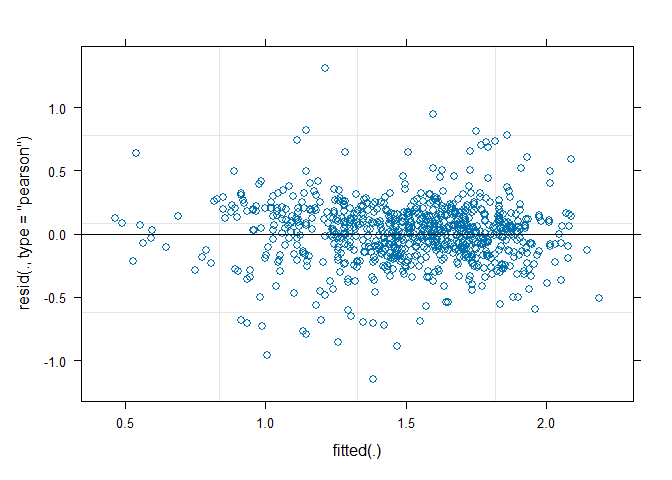

MA Fitness
================
Rutuja
2024-10-28

Analysis functions

``` r
spline.slope<-function(x, y, n=101, eps=1e-5, span=0.075){
  max(nderiv(loess(log(y) ~ x, degree=1, span=span), x), na.rm=TRUE)}
  
nderiv <- function(fit, x, eps=1e-5){
  (predict(fit, x + eps) - predict(fit, x - eps))/(2 * eps)}

loess.resid <- function(x, y, n=101, span=0.2){
    k <- loess(log(y) ~ x, degree=1, span=span)
    return(sum(k$residuals^2))
}
```

``` r
folder <-"data/"
l <- list.files(folder)
span = 0.075

dfs <- lapply(l[endsWith(l, '.csv')], function(r){
  d <- read.csv(paste0(folder,r))
  
  assay.name <- str_replace(str_replace(r, 'Ref', 'Rutuja'), '.csv', '.txt')
  assay.data <- read.delim(paste0(folder,assay.name))
  assay.data$Time<-seq(from=0.25,by=0.25,length.out=nrow(assay.data))

  ## Dates in a good format are nice

  d$date <- mdy(str_replace(str_replace(r, 'Ref ', ''), '.csv', ' 2023'))
  
  ## Check and note the initial OD

  d$initial <- sapply(c(1:nrow(d)), function(r){
    mean(assay.data[,which(names(assay.data)==d$well[r])][1:4])
  })
  
  ## Check and note the final OD

  d$final <- sapply(c(1:nrow(d)), function(r){
    temp <- assay.data[,which(names(assay.data)==d$well[r])]
    temp <- temp[!is.na(temp)]
    n <- length(temp)
    mean(temp[(n-3):n])
  })
  
  ## Subtracting the blanks

  blanks <- d[d$treatment == "Blank",]
  ## Find the good blanks
  good.blanks <- blanks %>% filter(final - initial < 0.05)
  blank.wells <- good.blanks$well
  ## Find the blank value for that day
  blank.val <- mean(unlist(assay.data[, blank.wells]), na.rm=TRUE)
  testcols <- colnames(assay.data)
  assay.data <- bind_cols(assay.data[,1:2], data.frame(sapply(c(1:nrow(d)), function(r){
    temp <- (assay.data[,which(names(assay.data)==d$well[r])]-blank.val)
    temp <- replace(temp, which(temp<=0), NA)
    temp
    })))
  colnames(assay.data) = c(testcols[1:2], d$well)
   
   ## Now doing the initial and final calculations again

  ## Check and note the initial OD

  d$initial <- sapply(c(1:nrow(d)), function(r){
    temp <- assay.data[,which(names(assay.data)==d$well[r])]
    temp <- temp[!is.na(temp)]
    n <- length(temp)
    mean(temp[1:4])
  })

  ## Check and note the final OD

  d$final <- sapply(c(1:nrow(d)), function(r){
    temp <- assay.data[,which(names(assay.data)==d$well[r])]
    temp <- temp[!is.na(temp)]
    n <- length(temp)
    if (n<8) return(NA)
    mean(temp[(n-7):n])
  })
  
  ### Using kind of the same template to calculate the final slope

  d$final.slope <- sapply(c(1:nrow(d)), function(r){
    temp <- assay.data[,which(names(assay.data)==d$well[r])]
    temp <- temp[!is.na(temp)]
    n <- length(temp)
    if (n<4) return(NA)
    return(temp[n] - temp[(n-3)])
  })
  
   ## Calculating the maximum slope mu_max
  ## We use this as a proxy for mu which is the inherent growth rate
  
  d$slope <- sapply(c(1:nrow(d)), function(r){
    y = assay.data[,which(names(assay.data)==d$well[r])]
    if (sum(is.na(y)) >= (length(y)-64)) {
      # print(y)
      return(NA)}
    else spline.slope(assay.data$Time, y, span=span)
  })
  
  d$resids <-  sapply(c(1:nrow(d)), function(r){
    y = assay.data[,which(names(assay.data)==d$well[r])]
    if (sum(is.na(y)) >= (length(y)-64)) {
      # print(y)
      return(NA)}
    else loess.resid(assay.data$Time, y)
  })
  
   d$double_time <- log(2)/d$slope
   
   ## Populations should not go down, at least that is the hope!
   
   d$monotone <- sapply(c(1:nrow(d)), function(r){
    y = assay.data[,which(names(assay.data)==d$well[r])]
    x = assay.data$Time
    if (sum(is.na(y)) >= (length(y)-64)) return(FALSE)
    return(sum(nderiv(loess(log(y) ~ x, degree=1, span=span), x) < 0, na.rm=TRUE))
  })
   
   # d$monotone <- sapply(c(1:nrow(d)), function(r){
   #   y = assay.data[,which(names(assay.data)==d$well[r])]
   #   sum(diff(y)<0,na.rm=TRUE)<=15
   # })
   
   d$OD.var <- sapply(c(1:nrow(d)), function(r){
     y = assay.data[,which(names(assay.data)==d$well[r])]
     var(diff(y),na.rm=TRUE)
   })
  
  return(d)
})

d <- do.call("rbind", dfs)

head(d)
```

    ##   well treatment       date      initial     final final.slope    slope
    ## 1   A1     Blank 2023-04-06           NA        NA          NA       NA
    ## 2   B1        H1 2023-04-06 0.0020535098 0.7116785       0.003 2.640040
    ## 3   C1        H2 2023-04-06 0.0020535098 0.7609285       0.001 2.797476
    ## 4   D1        H3 2023-04-06 0.0003035098 0.6650535       0.003 2.941911
    ## 5   E1        D1 2023-04-06 0.0015535098 0.5575535       0.001 2.865809
    ## 6   F1        D2 2023-04-06 0.0023035098 0.4620535       0.004 3.025559
    ##      resids double_time monotone       OD.var
    ## 1        NA          NA        0           NA
    ## 2 11.620289   0.2625517        0 4.899506e-05
    ## 3 12.634123   0.2477759        0 5.497615e-05
    ## 4 12.801175   0.2356112        0 3.603383e-05
    ## 5  9.877786   0.2418679        0 2.377293e-05
    ## 6 10.996090   0.2290972        0 7.162986e-06

``` r
dates.1 <- seq(mdy(04062023), mdy(04102023), 1)
dates.2 <- seq(mdy(04282023), mdy(11302023), 1)
dates.3 <- c(mdy(11022023))
ancestors <- c('H1', 'H2', 'H3', 'D1', 'C1', 'C2', 'D2', 'D3')
ancestors.haploid <- c('H1', 'H2', 'H3', 'C1', 'C3', 'D2', 'D3')
ancestors.diploid <- c('D1')


d$batch[d$date %in% dates.1] <- 1
d$batch[d$date %in% dates.2] <- 2
d$batch[d$date %in% dates.3] <- 3
# Labeling the dates
dates <- d %>% distinct(date)
# alphabet <- c('A', 'B')
alphabet <- c('1A', '1B', '1C', '1D', '2A', '2B', '2C', '2D', '3A')
dates <- dates %>% mutate(day = alphabet)
d <- d %>% left_join(dates, by='date') %>% select(-date)


d <- d %>% mutate(category = case_when(treatment == 'Blank' ~ 'Blank',
                              treatment %in% ancestors.haploid ~ 'Ctrl.H',
                              treatment %in% ancestors.diploid ~ 'Ctrl.D',
                              as.numeric(treatment) %% 2 == 0 ~ 'MA.D',
                              as.numeric(treatment) %% 2 == 1 ~ 'MA.H',
                              TRUE ~ 'DROPME'))


## Dropping criteria (which I swear has a purpose)
## Drop curves with too much variance. These are smooth curves with such as thing as reasonable variance
## Remove things with high initial OD. We started with blanks. Anything other that those cannot be a good sign.
## Drop curves with very high final slope. We are hoping to have observed saturation

d$category[(d$category=='Blank')] <- 'DROPME'
d$category[d$monotone>=13] <- 'DROPME'
d$category[d$OD.var>6e-04] <- 'DROPME'
d$category[d$initial>0.01] <- 'DROPME'
d$category[d$final.slope>=0.03] <- 'DROPME'
d$category[d$final.slope<=-0.03] <- 'DROPME'
d$category[d$final<0.15] <- 'DROPME'
## d$category[d$resids>15] <- 'DROPME'

data <- d[(d$category!='DROPME'),]

cat(data$well[data$day=="1A"], file = "1A.txt")
cat(data$well[data$day=="1B"], file = "1B.txt")
cat(data$well[data$day=="1C"], file = "1C.txt")
cat(data$well[data$day=="1D"], file = "1D.txt")
cat(data$well[data$day=="2A"], file = "2A.txt")
cat(data$well[data$day=="2B"], file = "2B.txt")
cat(data$well[data$day=="2C"], file = "2C.txt")
cat(data$well[data$day=="2D"], file = "2D.txt")
cat(data$well[data$day=="3A"], file = "3A.txt")
```

To show that I did not pick the filtering thresholds from thin air

``` r
d %>% ggplot() + geom_histogram(aes(initial)) + geom_vline(xintercept = 0.02, color='red')
```

    ## `stat_bin()` using `bins = 30`. Pick better value with `binwidth`.

<!-- -->

``` r
d %>% ggplot() + geom_histogram(aes(final)) + geom_vline(xintercept = 0.15, color='red')
```

    ## `stat_bin()` using `bins = 30`. Pick better value with `binwidth`.

<!-- -->

``` r
d %>% ggplot() + geom_histogram(aes(final.slope)) + geom_vline(xintercept = c(0.03,-0.03), color='red')
```

    ## `stat_bin()` using `bins = 30`. Pick better value with `binwidth`.

<!-- -->

``` r
d %>% ggplot() + geom_histogram(aes(OD.var)) + geom_vline(xintercept = 0.0006, color='red')
```

    ## `stat_bin()` using `bins = 30`. Pick better value with `binwidth`.

<!-- -->

``` r
d %>% ggplot() + geom_histogram(aes(monotone)) + geom_vline(xintercept = 13, color='red')
```

    ## `stat_bin()` using `bins = 30`. Pick better value with `binwidth`.

<!-- -->

Now time to include some more information about what happened and remove
more data.

``` r
data_trim <- data %>% 
  filter(!((treatment %in% c('D1', 'D2', 'D3')) & (batch == 1))) %>%
  filter(!((treatment %in% c('D2', 'D3')) & (batch == 2))) %>%
  # filter(!(batch == 3)) %>%
  filter(!(day=='2C')) %>%
  filter(slope < 2.5)
```

This plot is always something

``` r
data_trim %>% 
  filter(category %in% c('Ctrl.H', 'Ctrl.D')) %>%
  ggplot() +
  geom_point(aes(x=treatment, y=slope, color=treatment)) + 
  facet_grid(cols=vars(day)) +
  theme(axis.text.x = element_text(angle = 90, vjust = 0.5, hjust=1))
```

<!-- -->

Slope vs initial

``` r
data_trim %>% 
  ggplot() +
  geom_point(aes(x=initial, y=slope, color=category)) +
  facet_wrap(vars(day))
```

<!-- -->

``` r
data_trim %>% 
  filter(day == "3A") %>%
  ggplot() +
  geom_point(aes(x=initial, y=slope))
```

<!-- -->

Moment of truth, let’s visualize this stuff.

``` r
data_trim %>%
  ggplot() + geom_point(aes(x=category, y=slope, color=category)) + facet_grid(cols=vars(day)) +
  theme(axis.text.x = element_text(angle = 90, vjust = 0.5, hjust=1))
```

<!-- -->

``` r
df <- data_trim %>% select(treatment, initial, slope, resids, double_time, batch, day, category)

df <- df %>% rename('lineid' = 'treatment')

df$ploidy <- case_when(
  df$category %in% c('Ctrl.H', 'MA.H') ~ 'Haploid',
  df$category %in% c('Ctrl.D', 'MA.D') ~ 'Diploid'
)
 
df$MA <- case_when(
  df$category %in% c('MA.H', 'MA.D') ~ 'MA',
  df$category %in% c('Ctrl.H', 'Ctrl.D') ~ 'Ctrl',
)

df$initial_scaled <- df$initial/mean(df$initial)
df$resids_recip <- 1/df$resids

head(df) # MA lines
```

    ##   lineid    initial     slope     resids double_time batch day category  ploidy
    ## 1     H2 0.00605351 0.4948156  0.1201837   1.4008193     1  1A   Ctrl.H Haploid
    ## 2     H1 0.00130351 1.6075097 10.8106430   0.4311932     1  1A   Ctrl.H Haploid
    ## 3     H1 0.00880351 0.5844747  2.5708452   1.1859318     1  1A   Ctrl.H Haploid
    ## 4     H1 0.00330351 1.6086404  2.2740063   0.4308901     1  1A   Ctrl.H Haploid
    ## 5     H2 0.00380351 0.6811348  0.2677761   1.0176359     1  1A   Ctrl.H Haploid
    ## 6     H2 0.00530351 0.8506887  0.4886062   0.8148071     1  1A   Ctrl.H Haploid
    ##     MA initial_scaled resids_recip
    ## 1 Ctrl      1.4488263   8.32059561
    ## 2 Ctrl      0.3119776   0.09250144
    ## 3 Ctrl      2.1070019   0.38897713
    ## 4 Ctrl      0.7906507   0.43975252
    ## 5 Ctrl      0.9103190   3.73446262
    ## 6 Ctrl      1.2693239   2.04663800

``` r
null <- lmer(slope ~ MA + ploidy + initial + (1|day) + (1|lineid), df) 
full <- lmer(slope ~ MA * ploidy + initial + (1|day) + (1|lineid), df)

summary(full)
```

    ## Linear mixed model fit by REML ['lmerMod']
    ## Formula: slope ~ MA * ploidy + initial + (1 | day) + (1 | lineid)
    ##    Data: df
    ## 
    ## REML criterion at convergence: 1291.9
    ## 
    ## Scaled residuals: 
    ##     Min      1Q  Median      3Q     Max 
    ## -3.2035 -0.5645  0.0870  0.6747  2.7119 
    ## 
    ## Random effects:
    ##  Groups   Name        Variance Std.Dev.
    ##  lineid   (Intercept) 0.002005 0.04478 
    ##  day      (Intercept) 0.051325 0.22655 
    ##  Residual             0.196106 0.44284 
    ## Number of obs: 1034, groups:  lineid, 106; day, 8
    ## 
    ## Fixed effects:
    ##                     Estimate Std. Error t value
    ## (Intercept)          1.55549    0.10670  14.578
    ## MAMA                 0.20404    0.07156   2.851
    ## ploidyHaploid        0.03730    0.07478   0.499
    ## initial            -55.21890    6.89858  -8.004
    ## MAMA:ploidyHaploid   0.03188    0.08245   0.387
    ## 
    ## Correlation of Fixed Effects:
    ##             (Intr) MAMA   pldyHp initil
    ## MAMA        -0.570                     
    ## ploidyHapld -0.518  0.785              
    ## initial     -0.224 -0.037 -0.068       
    ## MAMA:pldyHp  0.476 -0.810 -0.900  0.017

``` r
anova(null, full)
```

    ## refitting model(s) with ML (instead of REML)

    ## Data: df
    ## Models:
    ## null: slope ~ MA + ploidy + initial + (1 | day) + (1 | lineid)
    ## full: slope ~ MA * ploidy + initial + (1 | day) + (1 | lineid)
    ##      npar    AIC    BIC  logLik deviance  Chisq Df Pr(>Chisq)
    ## null    7 1295.6 1330.2 -640.82   1281.6                     
    ## full    8 1297.5 1337.0 -640.72   1281.5 0.1888  1     0.6639

``` r
randoms <- lmer(slope ~ (1|day) + (1|lineid), df)
summary(randoms)
```

    ## Linear mixed model fit by REML ['lmerMod']
    ## Formula: slope ~ (1 | day) + (1 | lineid)
    ##    Data: df
    ## 
    ## REML criterion at convergence: 1365.9
    ## 
    ## Scaled residuals: 
    ##     Min      1Q  Median      3Q     Max 
    ## -3.0299 -0.4934  0.1051  0.6762  2.2466 
    ## 
    ## Random effects:
    ##  Groups   Name        Variance Std.Dev.
    ##  lineid   (Intercept) 0.00763  0.08735 
    ##  day      (Intercept) 0.03924  0.19809 
    ##  Residual             0.20797  0.45604 
    ## Number of obs: 1034, groups:  lineid, 106; day, 8
    ## 
    ## Fixed effects:
    ##             Estimate Std. Error t value
    ## (Intercept)  1.52739    0.07259   21.04

``` r
null <- lmer(slope ~ 1 + ploidy + initial + (1|day) + (1|lineid), df)
yay <- lmer(slope ~ MA + ploidy + initial + (1|day) + (1|lineid), df) ## day had low var so dropping it 

summary(yay)
```

    ## Linear mixed model fit by REML ['lmerMod']
    ## Formula: slope ~ MA + ploidy + initial + (1 | day) + (1 | lineid)
    ##    Data: df
    ## 
    ## REML criterion at convergence: 1288.9
    ## 
    ## Scaled residuals: 
    ##     Min      1Q  Median      3Q     Max 
    ## -3.2027 -0.5734  0.0869  0.6730  2.6871 
    ## 
    ## Random effects:
    ##  Groups   Name        Variance Std.Dev.
    ##  lineid   (Intercept) 0.001713 0.04139 
    ##  day      (Intercept) 0.051246 0.22638 
    ##  Residual             0.196161 0.44290 
    ## Number of obs: 1034, groups:  lineid, 106; day, 8
    ## 
    ## Fixed effects:
    ##                Estimate Std. Error t value
    ## (Intercept)     1.53555    0.09335  16.450
    ## MAMA            0.22685    0.04114   5.515
    ## ploidyHaploid   0.06292    0.03232   1.947
    ## initial       -55.24612    6.89468  -8.013
    ## 
    ## Correlation of Fixed Effects:
    ##             (Intr) MAMA   pldyHp
    ## MAMA        -0.348              
    ## ploidyHapld -0.229  0.222       
    ## initial     -0.265 -0.040 -0.123

``` r
anova(null, yay)
```

    ## refitting model(s) with ML (instead of REML)

    ## Data: df
    ## Models:
    ## null: slope ~ 1 + ploidy + initial + (1 | day) + (1 | lineid)
    ## yay: slope ~ MA + ploidy + initial + (1 | day) + (1 | lineid)
    ##      npar    AIC    BIC  logLik deviance  Chisq Df Pr(>Chisq)    
    ## null    6 1314.7 1344.3 -651.34   1302.7                         
    ## yay     7 1295.6 1330.2 -640.82   1281.6 21.034  1  4.513e-06 ***
    ## ---
    ## Signif. codes:  0 '***' 0.001 '**' 0.01 '*' 0.05 '.' 0.1 ' ' 1

``` r
null <- lmer(slope ~ MA + 1 + initial + (1|day) + (1|lineid), df)
full <- lmer(slope ~ MA + ploidy + initial + (1|day) + (1|lineid), df)

summary(full)
```

    ## Linear mixed model fit by REML ['lmerMod']
    ## Formula: slope ~ MA + ploidy + initial + (1 | day) + (1 | lineid)
    ##    Data: df
    ## 
    ## REML criterion at convergence: 1288.9
    ## 
    ## Scaled residuals: 
    ##     Min      1Q  Median      3Q     Max 
    ## -3.2027 -0.5734  0.0869  0.6730  2.6871 
    ## 
    ## Random effects:
    ##  Groups   Name        Variance Std.Dev.
    ##  lineid   (Intercept) 0.001713 0.04139 
    ##  day      (Intercept) 0.051246 0.22638 
    ##  Residual             0.196161 0.44290 
    ## Number of obs: 1034, groups:  lineid, 106; day, 8
    ## 
    ## Fixed effects:
    ##                Estimate Std. Error t value
    ## (Intercept)     1.53555    0.09335  16.450
    ## MAMA            0.22685    0.04114   5.515
    ## ploidyHaploid   0.06292    0.03232   1.947
    ## initial       -55.24612    6.89468  -8.013
    ## 
    ## Correlation of Fixed Effects:
    ##             (Intr) MAMA   pldyHp
    ## MAMA        -0.348              
    ## ploidyHapld -0.229  0.222       
    ## initial     -0.265 -0.040 -0.123

``` r
anova(null, full)
```

    ## refitting model(s) with ML (instead of REML)

    ## Data: df
    ## Models:
    ## null: slope ~ MA + 1 + initial + (1 | day) + (1 | lineid)
    ## full: slope ~ MA + ploidy + initial + (1 | day) + (1 | lineid)
    ##      npar    AIC    BIC  logLik deviance  Chisq Df Pr(>Chisq)  
    ## null    6 1297.4 1327.1 -642.72   1285.4                       
    ## full    7 1295.6 1330.2 -640.82   1281.6 3.8032  1    0.05115 .
    ## ---
    ## Signif. codes:  0 '***' 0.001 '**' 0.01 '*' 0.05 '.' 0.1 ' ' 1

``` r
null <- lmer(slope ~ 1 + resids_recip + initial + (1|day) + (1|lineid), df)
full <- lmer(slope ~ ploidy + resids_recip + initial + (1|day) + (1|lineid), df)

summary(full)
```

    ## Linear mixed model fit by REML ['lmerMod']
    ## Formula: slope ~ ploidy + resids_recip + initial + (1 | day) + (1 | lineid)
    ##    Data: df
    ## 
    ## REML criterion at convergence: 1160.9
    ## 
    ## Scaled residuals: 
    ##     Min      1Q  Median      3Q     Max 
    ## -3.3276 -0.5574  0.0638  0.6805  3.8457 
    ## 
    ## Random effects:
    ##  Groups   Name        Variance Std.Dev.
    ##  lineid   (Intercept) 0.006471 0.08044 
    ##  day      (Intercept) 0.051163 0.22619 
    ##  Residual             0.169130 0.41125 
    ## Number of obs: 1034, groups:  lineid, 106; day, 8
    ## 
    ## Fixed effects:
    ##                 Estimate Std. Error t value
    ## (Intercept)     1.764680   0.087403  20.190
    ## ploidyHaploid   0.033751   0.033561   1.006
    ## resids_recip   -0.091010   0.007109 -12.802
    ## initial       -36.856881   6.605641  -5.580
    ## 
    ## Correlation of Fixed Effects:
    ##             (Intr) pldyHp rsds_r
    ## ploidyHapld -0.179              
    ## resids_recp -0.029  0.004       
    ## initial     -0.269 -0.099 -0.212

``` r
anova(null, full)
```

    ## refitting model(s) with ML (instead of REML)

    ## Data: df
    ## Models:
    ## null: slope ~ 1 + resids_recip + initial + (1 | day) + (1 | lineid)
    ## full: slope ~ ploidy + resids_recip + initial + (1 | day) + (1 | lineid)
    ##      npar    AIC    BIC  logLik deviance  Chisq Df Pr(>Chisq)
    ## null    6 1163.2 1192.8 -575.59   1151.2                     
    ## full    7 1164.2 1198.8 -575.10   1150.2 0.9979  1     0.3178

There was a nice model up there. Time to check its assumptions.

``` r
plot(resid(yay),predict(yay))
```

<!-- -->

``` r
plot(resid(yay),df$slope)
```

<!-- -->

``` r
plot(yay)
```

<!-- -->

``` r
qqmath(yay, id=0.05)
```

<!-- -->

``` r
# trt <- df %>% filter(MA == "MA")
# # ancestor lines
# ctrl <- df %>% filter(MA == "Ctrl")
# 
# # model to predict the slope of the ancestors of each ploidy with date as a random effect
# mod <- lmer(slope ~ ploidy + (1|day), ctrl)
# 
# # making predictions for each date
# ctrl.predict <- data.frame(distinct(ctrl, day, ploidy))
# ctrl.predict$ctrl <- predict(mod, ctrl.predict)
# ctrl.predict
# 
# # combining with the MA line dateset
# trt <- left_join(trt, ctrl.predict, by=c('day', 'ploidy'))
# 
# # calculating relative fitness as the difference between the slope for the MA line and its ancestor
# trt$rel.fit <- trt$slope - trt$ctrl
# 
# # # grouping all the readings for the lines and summarizing by calculating the mean relative fitness
# # trt <- trt %>% group_by(ploidy, category) %>%
# #   summarize(rel.fit = mean(rel.fit, na.rm=TRUE)) %>%
# #   ungroup()
# 
# # mean and standard deviation for the diploids
# mu.dip <- mean(trt$rel.fit[trt$ploidy == 'Diploid'], na.rm=TRUE)
# sd.dip <- sd(trt$rel.fit[trt$ploidy == 'Diploid'], na.rm=TRUE)
# paste0("Diploids: ", mu.dip, " Deviation: ", sd.dip)
# 
# # mean and standard deviation for the haploids
# mu.hap <- mean(trt$rel.fit[trt$ploidy == 'Haploid'], na.rm=TRUE)
# sd.hap <- sd(trt$rel.fit[trt$ploidy == 'Haploid'], na.rm = TRUE)
# paste0("Haploids: ", mu.hap, " Deviation: ", sd.hap)
# 
# ```
# 
# 
# ```{r}
# trt %>% ggplot() +
#   geom_histogram(aes(x=rel.fit), fill='black') +
#   facet_grid(rows = vars(ploidy)) +
#   geom_vline(data = data.frame(ploidy = c('Haploid', 'Diploid'),
#                                mu = c(mu.hap, mu.dip)),
#              aes(xintercept = mu, color = ploidy)) +
#   geom_vline(xintercept = 0, color = 'black') +
#   xlab("Relative Fitness") +
#   ylab("Number of Lines") +
#   guides(color = guide_legend(title = "Ploidy"))
```
