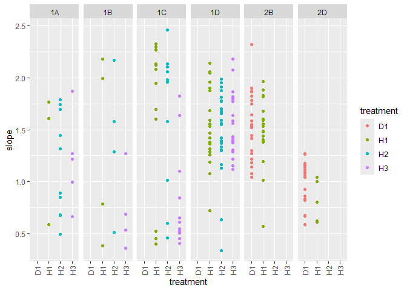
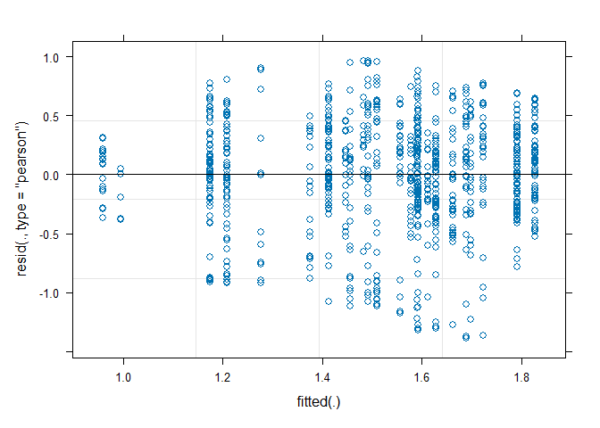

MA Fitness
================
Rutuja
2024-10-28

Analysis functions

``` r
spline.slope<-function(x, y, n=101, eps=1e-5, span=0.075){
  max(nderiv(loess(log(y) ~ x, degree=1, span=span), x), na.rm=TRUE)}
  
nderiv <- function(fit, x, eps=1e-5){
  (predict(fit, x + eps) - predict(fit, x - eps))/(2 * eps)}

loess.resid <- function(x, y, n=101, span=0.2){
    k <- loess(log(y) ~ x, degree=1, span=span)
    return(sum(k$residuals^2))
}

loess.resid.v2 <- function(x, y, n=101, span=0.2){
    k <- loess(log(y) ~ x, degree=1, span=span)
    return(sum(abs(k$residuals)))
}
```

``` r
folder <-"data/"
l <- list.files(folder)
span = 0.075

dfs <- lapply(l[endsWith(l, '.csv')], function(r){
  d <- read.csv(paste0(folder,r))
  
  assay.name <- str_replace(str_replace(r, 'Ref', 'Rutuja'), '.csv', '.txt')
  assay.data <- read.delim(paste0(folder,assay.name))
  assay.data$Time<-seq(from=0.25,by=0.25,length.out=nrow(assay.data))

  ## Dates in a good format are nice

  d$date <- mdy(str_replace(str_replace(r, 'Ref ', ''), '.csv', ' 2023'))
  
  ## Check and note the initial OD

  d$initial <- sapply(c(1:nrow(d)), function(r){
    mean(assay.data[,which(names(assay.data)==d$well[r])][1:4])
  })
  
  ## Check and note the final OD

  d$final <- sapply(c(1:nrow(d)), function(r){
    temp <- assay.data[,which(names(assay.data)==d$well[r])]
    temp <- temp[!is.na(temp)]
    n <- length(temp)
    mean(temp[(n-3):n])
  })
  
  ## Subtracting the blanks

  blanks <- d[d$treatment == "Blank",]
  ## Find the good blanks
  good.blanks <- blanks %>% filter(final - initial < 0.05)
  blank.wells <- good.blanks$well
  ## Find the blank value for that day
  blank.val <- mean(unlist(assay.data[, blank.wells]), na.rm=TRUE)
  d$blank.val <- blank.val
  blank.var <- sd(unlist(assay.data[, blank.wells]), na.rm=TRUE)
  d$blank.var <- sd(unlist(assay.data[, blank.wells]), na.rm=TRUE)
  testcols <- colnames(assay.data)
  assay.data <- bind_cols(assay.data[,1:2], data.frame(sapply(c(1:nrow(d)), function(r){
    temp <- (assay.data[,which(names(assay.data)==d$well[r])]-blank.val)
    temp <- replace(temp, which(temp<=0), NA)
    temp
    })))
  colnames(assay.data) = c(testcols[1:2], d$well)
   
   ## Now doing the initial and final calculations again

  ## Check and note the initial OD

  d$initial <- sapply(c(1:nrow(d)), function(r){
    temp <- assay.data[,which(names(assay.data)==d$well[r])]
    temp <- temp[!is.na(temp)]
    n <- length(temp)
    mean(temp[1:4])
  })

  ## Check and note the final OD

  d$final <- sapply(c(1:nrow(d)), function(r){
    temp <- assay.data[,which(names(assay.data)==d$well[r])]
    temp <- temp[!is.na(temp)]
    n <- length(temp)
    if (n<8) return(NA)
    mean(temp[(n-7):n])
  })
  
  ### Using kind of the same template to calculate the final slope

  d$final.slope <- sapply(c(1:nrow(d)), function(r){
    temp <- assay.data[,which(names(assay.data)==d$well[r])]
    temp <- temp[!is.na(temp)]
    n <- length(temp)
    if (n<4) return(NA)
    return(temp[n] - temp[(n-3)])
  })
  
   ## Calculating the maximum slope mu_max
  ## We use this as a proxy for mu which is the inherent growth rate
  
  d$slope <- sapply(c(1:nrow(d)), function(r){
    y = assay.data[,which(names(assay.data)==d$well[r])]
    if (sum(is.na(y)) >= (length(y)-64)) {
      return(NA)}
    else spline.slope(assay.data$Time, y, span=span)
  })
  
  d$resids <-  sapply(c(1:nrow(d)), function(r){
    y = assay.data[,which(names(assay.data)==d$well[r])]
    if (sum(is.na(y)) >= (length(y)-64)) {
      return(NA)}
    else loess.resid(assay.data$Time, y, span=span)
  })
  
  d$resids.abs <-  sapply(c(1:nrow(d)), function(r){
    y = assay.data[,which(names(assay.data)==d$well[r])]
    if (sum(is.na(y)) >= (length(y)-64)) {
      return(NA)}
    else loess.resid.v2(assay.data$Time, y, span=span)
  })
   d$double_time <- log(2)/d$slope
   
   ## Populations should not go down, at least that is the hope!
   
   d$monotone <- sapply(c(1:nrow(d)), function(r){
    y = assay.data[,which(names(assay.data)==d$well[r])]
    x = assay.data$Time
    if (sum(is.na(y)) >= (length(y)-64)) return(FALSE)
    return(sum(nderiv(loess(log(y) ~ x, degree=1, span=span), x) < 0, na.rm=TRUE))
  })
   
   # d$monotone <- sapply(c(1:nrow(d)), function(r){
   #   y = assay.data[,which(names(assay.data)==d$well[r])]
   #   sum(diff(y)<0,na.rm=TRUE)<=15
   # })
   
   d$OD.var <- sapply(c(1:nrow(d)), function(r){
     y = assay.data[,which(names(assay.data)==d$well[r])]
     var(diff(y),na.rm=TRUE)
   })
  
  return(d)
})

d <- do.call("rbind", dfs)

head(d)
```

    ##   well treatment       date      initial     final blank.val  blank.var
    ## 1   A1     Blank 2023-04-06           NA        NA 0.1799465 0.01301512
    ## 2   B1        H1 2023-04-06 0.0020535098 0.7116785 0.1799465 0.01301512
    ## 3   C1        H2 2023-04-06 0.0020535098 0.7609285 0.1799465 0.01301512
    ## 4   D1        H3 2023-04-06 0.0003035098 0.6650535 0.1799465 0.01301512
    ## 5   E1        D1 2023-04-06 0.0015535098 0.5575535 0.1799465 0.01301512
    ## 6   F1        D2 2023-04-06 0.0023035098 0.4620535 0.1799465 0.01301512
    ##   final.slope    slope   resids resids.abs double_time monotone       OD.var
    ## 1          NA       NA       NA         NA          NA        0           NA
    ## 2       0.003 2.640040 4.896382   4.922268   0.2625517        0 4.899506e-05
    ## 3       0.001 2.797476 4.667765   4.881267   0.2477759        0 5.497615e-05
    ## 4       0.003 2.941911 3.205453   4.779578   0.2356112        0 3.603383e-05
    ## 5       0.001 2.865809 3.705777   4.358252   0.2418679        0 2.377293e-05
    ## 6       0.004 3.025559 4.854013   4.589752   0.2290972        0 7.162986e-06

``` r
dates.1 <- seq(mdy(04062023), mdy(04102023), 1)
dates.2 <- seq(mdy(04282023), mdy(11302023), 1)
dates.3 <- c(mdy(11022023))
ancestors <- c('H1', 'H2', 'H3', 'D1', 'C1', 'C2', 'D2', 'D3')
ancestors.haploid <- c('H1', 'H2', 'H3', 'C1', 'C3', 'D2', 'D3')
ancestors.diploid <- c('D1')


d$batch[d$date %in% dates.1] <- 1
d$batch[d$date %in% dates.2] <- 2
d$batch[d$date %in% dates.3] <- 3
# Labeling the dates
dates <- d %>% distinct(date)
# alphabet <- c('A', 'B')
alphabet <- c('1A', '1B', '1C', '1D', '2A', '2B', '2C', '2D', '3A')
dates <- dates %>% mutate(day = alphabet)
d <- d %>% left_join(dates, by='date') %>% select(-date)


d <- d %>% mutate(category = case_when(treatment == 'Blank' ~ 'Blank',
                              treatment %in% ancestors.haploid ~ 'Ctrl.H',
                              treatment %in% ancestors.diploid ~ 'Ctrl.D',
                              as.numeric(treatment) %% 2 == 0 ~ 'MA.D',
                              as.numeric(treatment) %% 2 == 1 ~ 'MA.H',
                              TRUE ~ 'DROPME'))


## Dropping criteria (which I swear has a purpose)
## Drop curves with too much variance. These are smooth curves with such as thing as reasonable variance
## Remove things with high initial OD. We started with blanks. Anything other that those cannot be a good sign.
## Drop curves with very high final slope. We are hoping to have observed saturation

d$category[(d$category=='Blank')] <- 'DROPME'
d$category[d$monotone>=13] <- 'DROPME'
d$category[d$OD.var>6e-04] <- 'DROPME'
d$category[d$initial>0.01] <- 'DROPME'
d$category[d$final.slope>=0.03] <- 'DROPME'
d$category[d$final.slope<=-0.03] <- 'DROPME'
d$category[d$final<0.15] <- 'DROPME'
## d$category[d$resids>15] <- 'DROPME'

data <- d[(d$category!='DROPME'),]

cat(data$well[data$day=="1A"], file = "1A.txt")
cat(data$well[data$day=="1B"], file = "1B.txt")
cat(data$well[data$day=="1C"], file = "1C.txt")
cat(data$well[data$day=="1D"], file = "1D.txt")
cat(data$well[data$day=="2A"], file = "2A.txt")
cat(data$well[data$day=="2B"], file = "2B.txt")
cat(data$well[data$day=="2C"], file = "2C.txt")
cat(data$well[data$day=="2D"], file = "2D.txt")
cat(data$well[data$day=="3A"], file = "3A.txt")
```

To show that I did not pick the filtering thresholds from thin air

``` r
d %>% ggplot() + geom_histogram(aes(initial)) + geom_vline(xintercept = 0.02, color='red')
```

    ## `stat_bin()` using `bins = 30`. Pick better value with `binwidth`.

<!-- -->

``` r
d %>% ggplot() + geom_histogram(aes(final)) + geom_vline(xintercept = 0.15, color='red')
```

    ## `stat_bin()` using `bins = 30`. Pick better value with `binwidth`.

<!-- -->

``` r
d %>% ggplot() + geom_histogram(aes(final.slope)) + geom_vline(xintercept = c(0.03,-0.03), color='red')
```

    ## `stat_bin()` using `bins = 30`. Pick better value with `binwidth`.

<!-- -->

``` r
d %>% ggplot() + geom_histogram(aes(OD.var)) + geom_vline(xintercept = 0.0006, color='red')
```

    ## `stat_bin()` using `bins = 30`. Pick better value with `binwidth`.

<!-- -->

``` r
d %>% ggplot() + geom_histogram(aes(monotone)) + geom_vline(xintercept = 13, color='red')
```

    ## `stat_bin()` using `bins = 30`. Pick better value with `binwidth`.

<!-- -->

The blanks: Some extra information visualized

``` r
d %>% group_by(day) %>% summarize(blank.val=mean(blank.val)) %>% ggplot() + geom_col(aes(x=day,y=blank.val))
```

<!-- -->

``` r
d %>% group_by(day) %>% summarize(blank.sd=mean(blank.var)) %>% ggplot() + geom_col(aes(x=day,y=blank.sd))
```

<!-- -->

Now time to include some more information about what happened and remove
more data.

``` r
data_trim <- data %>% 
  
  ## The diploid controls on the 1st batch of plates were not actually diploids
  filter(!((treatment %in% c('D1', 'D2', 'D3')) & (batch == 1))) %>%
  
  ## There was only 1 diploid control on the 2nd batch of plates
  filter(!((treatment %in% c('D2', 'D3')) & (batch == 2))) %>%
  
  ## This is just a test assay for a sanity check. There were no MA lines in this batch
  filter(!(batch == 3)) %>%
  
  ## This entire plate just looks awful. I don't think I can trust anything from that plate.
  filter(!(day=='2C')) %>%
  
  ## A slope higher that that would mean a much lower doubling time and there is no reason to believe anything would grow that fast
  filter(slope < 2.5)
```

This plot is always something

``` r
data %>% 
  filter(category %in% c('Ctrl.H', 'Ctrl.D')) %>%
  ggplot() +
  geom_point(aes(x=treatment, y=slope, color=treatment)) + 
  facet_grid(cols=vars(day)) +
  theme(axis.text.x = element_text(angle = 90, vjust = 0.5, hjust=1))
```

<!-- -->

``` r
data_trim %>% 
  filter(category %in% c('Ctrl.H', 'Ctrl.D')) %>%
  ggplot() +
  geom_point(aes(x=treatment, y=slope, color=treatment)) + 
  facet_grid(cols=vars(day)) +
  theme(axis.text.x = element_text(angle = 90, vjust = 0.5, hjust=1))
```

<!-- -->

Slope vs initial

Story (that I will move a few lines above later): The cut off for
initial OD was set so that we do not consider lines where the slope is
too low because of a high initial OD. If the initial OD is too high,
then the max slope shows some relation to the initial OD and we do not
want to include that data. The ideal scenario would be having a cloud of
points in these plots.

``` r
d %>% 
  ggplot() +
  geom_point(aes(x=initial, y=slope, color=category)) +
  facet_wrap(vars(day))
```

<!-- -->

``` r
data_trim %>% 
  ggplot() +
  geom_point(aes(x=initial, y=slope, color=category)) +
  facet_wrap(vars(day))
```

<!-- -->

Moment of truth, let’s visualize this stuff.

``` r
data_trim %>%
  ggplot() + geom_point(aes(x=category, y=slope, color=category)) + facet_grid(cols=vars(day)) +
  theme(axis.text.x = element_text(angle = 90, vjust = 0.5, hjust=1))
```

<!-- -->

``` r
df <- data_trim %>% select(treatment, initial, slope, resids, resids.abs, double_time, batch, day, category)

df <- df %>% rename('lineid' = 'treatment')

df$ploidy <- case_when(
  df$category %in% c('Ctrl.H', 'MA.H') ~ 'Haploid',
  df$category %in% c('Ctrl.D', 'MA.D') ~ 'Diploid'
)
 
df$MA <- case_when(
  df$category %in% c('MA.H', 'MA.D') ~ 'MA',
  df$category %in% c('Ctrl.H', 'Ctrl.D') ~ 'Ctrl',
)

df$initial_scaled <- df$initial/mean(df$initial)
df$w1 <- 1/df$resids
df$w2 <- sqrt(1/df$resids)
df$w3 <- 1/df$resids.abs
df$w4 <- (1/df$resids.abs)^2
  
head(df) # MA lines
```

    ##   lineid    initial     slope     resids resids.abs double_time batch day
    ## 1     H2 0.00605351 0.4948156 0.01738990  0.6777870   1.4008193     1  1A
    ## 2     H1 0.00130351 1.6075097 8.68154652  5.9049549   0.4311932     1  1A
    ## 3     H1 0.00880351 0.5844747 0.16044992  2.0371671   1.1859318     1  1A
    ## 4     H1 0.00330351 1.6086404 0.24949367  1.6611321   0.4308901     1  1A
    ## 5     H2 0.00380351 0.6811348 0.03173643  0.8835029   1.0176359     1  1A
    ## 6     H2 0.00530351 0.8506887 0.11785417  1.1898344   0.8148071     1  1A
    ##   category  ploidy   MA initial_scaled         w1        w2        w3
    ## 1   Ctrl.H Haploid Ctrl      1.4253407 57.5046470 7.5831819 1.4753897
    ## 2   Ctrl.H Haploid Ctrl      0.3069204  0.1151869 0.3393919 0.1693493
    ## 3   Ctrl.H Haploid Ctrl      2.0728472  6.2324741 2.4964924 0.4908778
    ## 4   Ctrl.H Haploid Ctrl      0.7778342  4.0081178 2.0020284 0.6019991
    ## 5   Ctrl.H Haploid Ctrl      0.8955627 31.5095266 5.6133347 1.1318582
    ## 6   Ctrl.H Haploid Ctrl      1.2487480  8.4850628 2.9129131 0.8404531
    ##           w4
    ## 1 2.17677483
    ## 2 0.02867919
    ## 3 0.24096097
    ## 4 0.36240290
    ## 5 1.28110310
    ## 6 0.70636142

``` r
null1 <- lmer(slope ~ MA + ploidy + initial + (1|day) + (1|lineid), df, weights=w1)
summary(null1)
```

    ## Linear mixed model fit by REML ['lmerMod']
    ## Formula: slope ~ MA + ploidy + initial + (1 | day) + (1 | lineid)
    ##    Data: df
    ## Weights: w1
    ## 
    ## REML criterion at convergence: 1699.7
    ## 
    ## Scaled residuals: 
    ##     Min      1Q  Median      3Q     Max 
    ## -4.7532 -0.3933  0.1740  0.5770  5.1823 
    ## 
    ## Random effects:
    ##  Groups   Name        Variance Std.Dev.
    ##  lineid   (Intercept) 0.03283  0.1812  
    ##  day      (Intercept) 0.03756  0.1938  
    ##  Residual             1.02959  1.0147  
    ## Number of obs: 889, groups:  lineid, 104; day, 7
    ## 
    ## Fixed effects:
    ##                Estimate Std. Error t value
    ## (Intercept)     1.32765    0.13055  10.170
    ## MAMA            0.50465    0.09926   5.084
    ## ploidyHaploid   0.06963    0.05022   1.387
    ## initial       -75.80587    7.63157  -9.933
    ## 
    ## Correlation of Fixed Effects:
    ##             (Intr) MAMA   pldyHp
    ## MAMA        -0.747              
    ## ploidyHapld -0.248  0.120       
    ## initial     -0.273  0.057 -0.133

``` r
full1 <- lmer(slope ~ MA * ploidy + initial + (1|day) + (1|lineid), df, weights=w1)

summary(full1)
```

    ## Linear mixed model fit by REML ['lmerMod']
    ## Formula: slope ~ MA * ploidy + initial + (1 | day) + (1 | lineid)
    ##    Data: df
    ## Weights: w1
    ## 
    ## REML criterion at convergence: 1698.8
    ## 
    ## Scaled residuals: 
    ##     Min      1Q  Median      3Q     Max 
    ## -4.7443 -0.3885  0.1716  0.5733  5.2011 
    ## 
    ## Random effects:
    ##  Groups   Name        Variance Std.Dev.
    ##  lineid   (Intercept) 0.03210  0.1792  
    ##  day      (Intercept) 0.03753  0.1937  
    ##  Residual             1.02987  1.0148  
    ## Number of obs: 889, groups:  lineid, 104; day, 7
    ## 
    ## Fixed effects:
    ##                    Estimate Std. Error t value
    ## (Intercept)          1.5553     0.2076   7.493
    ## MAMA                 0.2676     0.1954   1.370
    ## ploidyHaploid       -0.2344     0.2222  -1.055
    ## initial            -75.2567     7.6392  -9.851
    ## MAMA:ploidyHaploid   0.3189     0.2270   1.405
    ## 
    ## Correlation of Fixed Effects:
    ##             (Intr) MAMA   pldyHp initil
    ## MAMA        -0.908                     
    ## ploidyHapld -0.795  0.856              
    ## initial     -0.129 -0.018 -0.083       
    ## MAMA:pldyHp  0.780 -0.864 -0.974  0.054

``` r
anova(null1, full1)
```

    ## refitting model(s) with ML (instead of REML)

    ## Data: df
    ## Models:
    ## null1: slope ~ MA + ploidy + initial + (1 | day) + (1 | lineid)
    ## full1: slope ~ MA * ploidy + initial + (1 | day) + (1 | lineid)
    ##       npar    AIC    BIC  logLik deviance  Chisq Df Pr(>Chisq)
    ## null1    7 1709.2 1742.8 -847.62   1695.2                     
    ## full1    8 1709.2 1747.5 -846.59   1693.2 2.0477  1     0.1524

``` r
null2 <- lmer(slope ~ MA + ploidy + initial + (1|day) + (1|lineid), df, weights=w2)
summary(null2)
```

    ## Linear mixed model fit by REML ['lmerMod']
    ## Formula: slope ~ MA + ploidy + initial + (1 | day) + (1 | lineid)
    ##    Data: df
    ## Weights: w2
    ## 
    ## REML criterion at convergence: 1288
    ## 
    ## Scaled residuals: 
    ##     Min      1Q  Median      3Q     Max 
    ## -3.6707 -0.4838  0.1759  0.6690  3.7250 
    ## 
    ## Random effects:
    ##  Groups   Name        Variance Std.Dev.
    ##  lineid   (Intercept) 0.007167 0.08466 
    ##  day      (Intercept) 0.048926 0.22119 
    ##  Residual             0.403176 0.63496 
    ## Number of obs: 889, groups:  lineid, 104; day, 7
    ## 
    ## Fixed effects:
    ##                Estimate Std. Error t value
    ## (Intercept)     1.43118    0.10718  13.353
    ## MAMA            0.37817    0.05655   6.687
    ## ploidyHaploid   0.07964    0.03769   2.113
    ## initial       -68.54276    7.67990  -8.925
    ## 
    ## Correlation of Fixed Effects:
    ##             (Intr) MAMA   pldyHp
    ## MAMA        -0.502              
    ## ploidyHapld -0.209  0.162       
    ## initial     -0.297  0.036 -0.158

``` r
full2 <- lmer(slope ~ MA * ploidy + initial + (1|day) + (1|lineid), df, weights=w2)

summary(full2)
```

    ## Linear mixed model fit by REML ['lmerMod']
    ## Formula: slope ~ MA * ploidy + initial + (1 | day) + (1 | lineid)
    ##    Data: df
    ## Weights: w2
    ## 
    ## REML criterion at convergence: 1288.3
    ## 
    ## Scaled residuals: 
    ##     Min      1Q  Median      3Q     Max 
    ## -3.7197 -0.4709  0.1774  0.6689  3.7651 
    ## 
    ## Random effects:
    ##  Groups   Name        Variance Std.Dev.
    ##  lineid   (Intercept) 0.006792 0.08241 
    ##  day      (Intercept) 0.048920 0.22118 
    ##  Residual             0.403217 0.63499 
    ## Number of obs: 889, groups:  lineid, 104; day, 7
    ## 
    ## Fixed effects:
    ##                     Estimate Std. Error t value
    ## (Intercept)          1.55180    0.13616  11.397
    ## MAMA                 0.24806    0.10702   2.318
    ## ploidyHaploid       -0.08524    0.12190  -0.699
    ## initial            -67.93073    7.68826  -8.836
    ## MAMA:ploidyHaploid   0.18016    0.12686   1.420
    ## 
    ## Correlation of Fixed Effects:
    ##             (Intr) MAMA   pldyHp initil
    ## MAMA        -0.733                     
    ## ploidyHapld -0.641  0.839              
    ## initial     -0.197 -0.030 -0.104       
    ## MAMA:pldyHp  0.621 -0.854 -0.952  0.058

``` r
anova(null2, full2)
```

    ## refitting model(s) with ML (instead of REML)

    ## Data: df
    ## Models:
    ## null2: slope ~ MA + ploidy + initial + (1 | day) + (1 | lineid)
    ## full2: slope ~ MA * ploidy + initial + (1 | day) + (1 | lineid)
    ##       npar    AIC    BIC  logLik deviance Chisq Df Pr(>Chisq)
    ## null2    7 1296.1 1329.6 -641.03   1282.1                    
    ## full2    8 1295.9 1334.2 -639.96   1279.9 2.142  1     0.1433

``` r
null3 <- lmer(slope ~ MA + ploidy + initial + (1|day) + (1|lineid), df, weights=w3)
summary(null3)
```

    ## Linear mixed model fit by REML ['lmerMod']
    ## Formula: slope ~ MA + ploidy + initial + (1 | day) + (1 | lineid)
    ##    Data: df
    ## Weights: w3
    ## 
    ## REML criterion at convergence: 1191
    ## 
    ## Scaled residuals: 
    ##     Min      1Q  Median      3Q     Max 
    ## -3.7141 -0.5744  0.0797  0.6602  3.5762 
    ## 
    ## Random effects:
    ##  Groups   Name        Variance Std.Dev.
    ##  lineid   (Intercept) 0.005697 0.07548 
    ##  day      (Intercept) 0.046665 0.21602 
    ##  Residual             0.104628 0.32346 
    ## Number of obs: 889, groups:  lineid, 104; day, 7
    ## 
    ## Fixed effects:
    ##                Estimate Std. Error t value
    ## (Intercept)     1.47378    0.10321  14.280
    ## MAMA            0.34457    0.05255   6.557
    ## ploidyHaploid   0.06102    0.03578   1.705
    ## initial       -57.98925    7.89474  -7.345
    ## 
    ## Correlation of Fixed Effects:
    ##             (Intr) MAMA   pldyHp
    ## MAMA        -0.479              
    ## ploidyHapld -0.203  0.170       
    ## initial     -0.300  0.015 -0.161

``` r
full3 <- lmer(slope ~ MA * ploidy + initial + (1|day) + (1|lineid), df, weights=w3)

summary(full3)
```

    ## Linear mixed model fit by REML ['lmerMod']
    ## Formula: slope ~ MA * ploidy + initial + (1 | day) + (1 | lineid)
    ##    Data: df
    ## Weights: w3
    ## 
    ## REML criterion at convergence: 1192.4
    ## 
    ## Scaled residuals: 
    ##     Min      1Q  Median      3Q     Max 
    ## -3.7335 -0.5755  0.0808  0.6477  3.6033 
    ## 
    ## Random effects:
    ##  Groups   Name        Variance Std.Dev.
    ##  lineid   (Intercept) 0.00580  0.07615 
    ##  day      (Intercept) 0.04682  0.21637 
    ##  Residual             0.10458  0.32339 
    ## Number of obs: 889, groups:  lineid, 104; day, 7
    ## 
    ## Fixed effects:
    ##                     Estimate Std. Error t value
    ## (Intercept)          1.55429    0.13059  11.902
    ## MAMA                 0.25749    0.10107   2.548
    ## ploidyHaploid       -0.04961    0.11510  -0.431
    ## initial            -57.64183    7.90205  -7.295
    ## MAMA:ploidyHaploid   0.12134    0.11994   1.012
    ## 
    ## Correlation of Fixed Effects:
    ##             (Intr) MAMA   pldyHp initil
    ## MAMA        -0.719                     
    ## ploidyHapld -0.630  0.838              
    ## initial     -0.211 -0.029 -0.092       
    ## MAMA:pldyHp  0.610 -0.853 -0.950  0.044

``` r
anova(null3, full3)
```

    ## refitting model(s) with ML (instead of REML)

    ## Data: df
    ## Models:
    ## null3: slope ~ MA + ploidy + initial + (1 | day) + (1 | lineid)
    ## full3: slope ~ MA * ploidy + initial + (1 | day) + (1 | lineid)
    ##       npar    AIC    BIC  logLik deviance  Chisq Df Pr(>Chisq)
    ## null3    7 1198.8 1232.3 -592.39   1184.8                     
    ## full3    8 1199.7 1238.0 -591.85   1183.7 1.0882  1     0.2969

``` r
null4 <- lmer(slope ~ MA + ploidy + initial + (1|day) + (1|lineid), df)
summary(null4)
```

    ## Linear mixed model fit by REML ['lmerMod']
    ## Formula: slope ~ MA + ploidy + initial + (1 | day) + (1 | lineid)
    ##    Data: df
    ## 
    ## REML criterion at convergence: 1112.7
    ## 
    ## Scaled residuals: 
    ##     Min      1Q  Median      3Q     Max 
    ## -3.1895 -0.5749  0.0803  0.6925  2.5262 
    ## 
    ## Random effects:
    ##  Groups   Name        Variance  Std.Dev.
    ##  lineid   (Intercept) 0.0001373 0.01172 
    ##  day      (Intercept) 0.0569575 0.23866 
    ##  Residual             0.1982765 0.44528 
    ## Number of obs: 889, groups:  lineid, 104; day, 7
    ## 
    ## Fixed effects:
    ##                Estimate Std. Error t value
    ## (Intercept)     1.53066    0.10199  15.008
    ## MAMA            0.22924    0.03615   6.342
    ## ploidyHaploid   0.06704    0.03199   2.096
    ## initial       -51.84161    7.70871  -6.725
    ## 
    ## Correlation of Fixed Effects:
    ##             (Intr) MAMA   pldyHp
    ## MAMA        -0.288              
    ## ploidyHapld -0.185  0.227       
    ## initial     -0.271 -0.054 -0.149

``` r
full4 <- lmer(slope ~ MA * ploidy + initial + (1|day) + (1|lineid), df)

summary(full4)
```

    ## Linear mixed model fit by REML ['lmerMod']
    ## Formula: slope ~ MA * ploidy + initial + (1 | day) + (1 | lineid)
    ##    Data: df
    ## 
    ## REML criterion at convergence: 1115.9
    ## 
    ## Scaled residuals: 
    ##     Min      1Q  Median      3Q     Max 
    ## -3.1861 -0.5740  0.0745  0.6895  2.5593 
    ## 
    ## Random effects:
    ##  Groups   Name        Variance  Std.Dev.
    ##  lineid   (Intercept) 0.0005647 0.02376 
    ##  day      (Intercept) 0.0569887 0.23872 
    ##  Residual             0.1981341 0.44512 
    ## Number of obs: 889, groups:  lineid, 104; day, 7
    ## 
    ## Fixed effects:
    ##                     Estimate Std. Error t value
    ## (Intercept)          1.53332    0.11392  13.460
    ## MAMA                 0.22632    0.06842   3.308
    ## ploidyHaploid        0.06154    0.07699   0.799
    ## initial            -51.84470    7.71931  -6.716
    ## MAMA:ploidyHaploid   0.00618    0.08385   0.074
    ## 
    ## Correlation of Fixed Effects:
    ##             (Intr) MAMA   pldyHp initil
    ## MAMA        -0.513                     
    ## ploidyHapld -0.465  0.808              
    ## initial     -0.226 -0.061 -0.096       
    ## MAMA:pldyHp  0.434 -0.834 -0.907  0.038

``` r
anova(null4, full4)
```

    ## refitting model(s) with ML (instead of REML)

    ## Data: df
    ## Models:
    ## null4: slope ~ MA + ploidy + initial + (1 | day) + (1 | lineid)
    ## full4: slope ~ MA * ploidy + initial + (1 | day) + (1 | lineid)
    ##       npar    AIC    BIC  logLik deviance  Chisq Df Pr(>Chisq)
    ## null4    7 1119.7 1153.2 -552.84   1105.7                     
    ## full4    8 1121.7 1160.0 -552.83   1105.7 0.0011  1      0.974

``` r
null <- lmer(slope ~ 1 + ploidy + (1|day) + (1|lineid), df, weights=)
summary(null)
```

    ## Linear mixed model fit by REML ['lmerMod']
    ## Formula: slope ~ 1 + ploidy + (1 | day) + (1 | lineid)
    ##    Data: df
    ## 
    ## REML criterion at convergence: 1178.7
    ## 
    ## Scaled residuals: 
    ##      Min       1Q   Median       3Q      Max 
    ## -3.02276 -0.50731  0.07233  0.68116  2.18925 
    ## 
    ## Random effects:
    ##  Groups   Name        Variance Std.Dev.
    ##  lineid   (Intercept) 0.008266 0.09092 
    ##  day      (Intercept) 0.040457 0.20114 
    ##  Residual             0.207117 0.45510 
    ## Number of obs: 889, groups:  lineid, 104; day, 7
    ## 
    ## Fixed effects:
    ##               Estimate Std. Error t value
    ## (Intercept)    1.54555    0.08095  19.092
    ## ploidyHaploid  0.01268    0.03788   0.335
    ## 
    ## Correlation of Fixed Effects:
    ##             (Intr)
    ## ploidyHapld -0.241

``` r
yay <- lmer(slope ~ MA + ploidy + (1|day) + (1|lineid), df) 
```

    ## boundary (singular) fit: see help('isSingular')

``` r
summary(yay)
```

    ## Linear mixed model fit by REML ['lmerMod']
    ## Formula: slope ~ MA + ploidy + (1 | day) + (1 | lineid)
    ##    Data: df
    ## 
    ## REML criterion at convergence: 1162.5
    ## 
    ## Scaled residuals: 
    ##      Min       1Q   Median       3Q      Max 
    ## -3.03909 -0.53919  0.06491  0.68476  2.10946 
    ## 
    ## Random effects:
    ##  Groups   Name        Variance Std.Dev.
    ##  lineid   (Intercept) 0.00000  0.0000  
    ##  day      (Intercept) 0.04225  0.2055  
    ##  Residual             0.20870  0.4568  
    ## Number of obs: 889, groups:  lineid, 104; day, 7
    ## 
    ## Fixed effects:
    ##               Estimate Std. Error t value
    ## (Intercept)    1.34560    0.08701  15.465
    ## MAMA           0.21506    0.03648   5.896
    ## ploidyHaploid  0.03493    0.03227   1.082
    ## 
    ## Correlation of Fixed Effects:
    ##             (Intr) MAMA  
    ## MAMA        -0.357       
    ## ploidyHapld -0.273  0.223
    ## optimizer (nloptwrap) convergence code: 0 (OK)
    ## boundary (singular) fit: see help('isSingular')

``` r
anova(null, yay)
```

    ## refitting model(s) with ML (instead of REML)

    ## Data: df
    ## Models:
    ## null: slope ~ 1 + ploidy + (1 | day) + (1 | lineid)
    ## yay: slope ~ MA + ploidy + (1 | day) + (1 | lineid)
    ##      npar    AIC    BIC  logLik deviance  Chisq Df Pr(>Chisq)    
    ## null    5 1180.7 1204.6 -585.33   1170.7                         
    ## yay     6 1161.3 1190.1 -574.66   1149.3 21.342  1  3.842e-06 ***
    ## ---
    ## Signif. codes:  0 '***' 0.001 '**' 0.01 '*' 0.05 '.' 0.1 ' ' 1

``` r
null <- lmer(slope ~ MA + 1 + initial + (1|day) + (1|lineid), df)
full <- lmer(slope ~ MA + ploidy + initial + (1|day) + (1|lineid), df)

summary(full)
```

    ## Linear mixed model fit by REML ['lmerMod']
    ## Formula: slope ~ MA + ploidy + initial + (1 | day) + (1 | lineid)
    ##    Data: df
    ## 
    ## REML criterion at convergence: 1112.7
    ## 
    ## Scaled residuals: 
    ##     Min      1Q  Median      3Q     Max 
    ## -3.1895 -0.5749  0.0803  0.6925  2.5262 
    ## 
    ## Random effects:
    ##  Groups   Name        Variance  Std.Dev.
    ##  lineid   (Intercept) 0.0001373 0.01172 
    ##  day      (Intercept) 0.0569575 0.23866 
    ##  Residual             0.1982765 0.44528 
    ## Number of obs: 889, groups:  lineid, 104; day, 7
    ## 
    ## Fixed effects:
    ##                Estimate Std. Error t value
    ## (Intercept)     1.53066    0.10199  15.008
    ## MAMA            0.22924    0.03615   6.342
    ## ploidyHaploid   0.06704    0.03199   2.096
    ## initial       -51.84161    7.70871  -6.725
    ## 
    ## Correlation of Fixed Effects:
    ##             (Intr) MAMA   pldyHp
    ## MAMA        -0.288              
    ## ploidyHapld -0.185  0.227       
    ## initial     -0.271 -0.054 -0.149

``` r
anova(null, full)
```

    ## refitting model(s) with ML (instead of REML)

    ## Data: df
    ## Models:
    ## null: slope ~ MA + 1 + initial + (1 | day) + (1 | lineid)
    ## full: slope ~ MA + ploidy + initial + (1 | day) + (1 | lineid)
    ##      npar    AIC    BIC  logLik deviance  Chisq Df Pr(>Chisq)  
    ## null    6 1122.1 1150.8 -555.03   1110.1                       
    ## full    7 1119.7 1153.2 -552.84   1105.7 4.3992  1    0.03596 *
    ## ---
    ## Signif. codes:  0 '***' 0.001 '**' 0.01 '*' 0.05 '.' 0.1 ' ' 1

``` r
# null <- lmer(slope ~ 1 + resids_recip + initial + (1|day) + (1|lineid), df)
# full <- lmer(slope ~ ploidy + resids_recip + initial + (1|day) + (1|lineid), df)
# 
# summary(full)
# 
# anova(null, full)
```

``` r
null <- lmer(initial ~ ploidy + MA + (1|day) + (1|lineid), df)
full <- lmer(initial ~ ploidy * MA + (1|day) + (1|lineid), df)

summary(null)
```

    ## Linear mixed model fit by REML ['lmerMod']
    ## Formula: initial ~ ploidy + MA + (1 | day) + (1 | lineid)
    ##    Data: df
    ## 
    ## REML criterion at convergence: -8513.4
    ## 
    ## Scaled residuals: 
    ##     Min      1Q  Median      3Q     Max 
    ## -2.2745 -0.7414 -0.1155  0.5613  3.5686 
    ## 
    ## Random effects:
    ##  Groups   Name        Variance  Std.Dev. 
    ##  lineid   (Intercept) 2.218e-08 0.0001489
    ##  day      (Intercept) 6.001e-07 0.0007747
    ##  Residual             3.760e-06 0.0019389
    ## Number of obs: 889, groups:  lineid, 104; day, 7
    ## 
    ## Fixed effects:
    ##                Estimate Std. Error t value
    ## (Intercept)   0.0035996  0.0003464  10.391
    ## ploidyHaploid 0.0006022  0.0001425   4.226
    ## MAMA          0.0002500  0.0001735   1.441
    ## 
    ## Correlation of Fixed Effects:
    ##             (Intr) pldyHp
    ## ploidyHapld -0.303       
    ## MAMA        -0.441  0.209

``` r
summary(full)
```

    ## Linear mixed model fit by REML ['lmerMod']
    ## Formula: initial ~ ploidy * MA + (1 | day) + (1 | lineid)
    ##    Data: df
    ## 
    ## REML criterion at convergence: -8500.6
    ## 
    ## Scaled residuals: 
    ##     Min      1Q  Median      3Q     Max 
    ## -2.2484 -0.7326 -0.1257  0.5744  3.5482 
    ## 
    ## Random effects:
    ##  Groups   Name        Variance  Std.Dev. 
    ##  lineid   (Intercept) 1.236e-08 0.0001112
    ##  day      (Intercept) 5.995e-07 0.0007743
    ##  Residual             3.767e-06 0.0019408
    ## Number of obs: 889, groups:  lineid, 104; day, 7
    ## 
    ## Fixed effects:
    ##                      Estimate Std. Error t value
    ## (Intercept)         0.0033454  0.0004079   8.202
    ## ploidyHaploid       0.0009551  0.0003370   2.834
    ## MAMA                0.0005332  0.0003003   1.775
    ## ploidyHaploid:MAMA -0.0004157  0.0003681  -1.129
    ## 
    ## Correlation of Fixed Effects:
    ##             (Intr) pldyHp MAMA  
    ## ploidyHapld -0.600              
    ## MAMA        -0.649  0.808       
    ## pldyHp:MAMA  0.545 -0.909 -0.834

``` r
anova(null, full)
```

    ## refitting model(s) with ML (instead of REML)

    ## Data: df
    ## Models:
    ## null: initial ~ ploidy + MA + (1 | day) + (1 | lineid)
    ## full: initial ~ ploidy * MA + (1 | day) + (1 | lineid)
    ##      npar     AIC     BIC logLik deviance  Chisq Df Pr(>Chisq)
    ## null    6 -8547.4 -8518.6 4279.7  -8559.4                     
    ## full    7 -8546.9 -8513.3 4280.4  -8560.9 1.5221  1     0.2173

There was a nice model up there. Time to check its assumptions.

``` r
plot(fitted(yay),resid(yay))
```

<!-- -->

``` r
plot(resid(yay),df$slope)
```

<!-- -->

``` r
plot(yay)
```

<!-- -->

``` r
qqmath(yay, id=0.05)
```

<!-- -->
