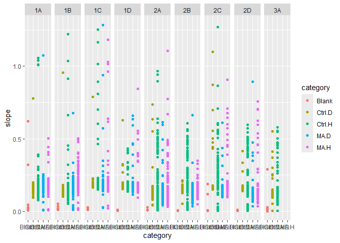
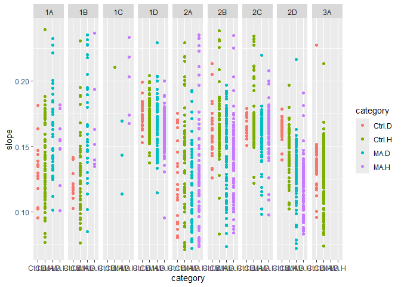

MA Fitness FA24
================
Rutuja
2024-09-23

# Setup functions

### This fits a spline to y=OD versus x=time, and then finds the maximum slope

``` r
spline.slope<-function(x, y, n=101, eps=1e-5, span=0.075){
  max(nderiv(loess(log(y) ~ x, degree=1, span=span), x), na.rm=TRUE)
}
```

### Used by the function above to get a local (linear) slope around a point

``` r
nderiv <- function(fit, x, eps=1e-5){
  (predict(fit, x + eps) - predict(fit, x - eps))/(2 * eps)}
```

## Spline fitting:

First we start by converting everything to log scale. During the
exponential growth phase, log(N) is proportional to t where N is the
population and t is time. There is noise in the original data. We remove
the noise and try to obtain the underlying curve using loess. It gives a
smooth curve. Then we use that curve to find local slopes. nderiv gives
precise estimate of the local linear slope at every point.

- this fits a spline to y=OD versus x=time, and then finds the
  time-stamp for maximum slope

``` r
spline.time<-function(x, y, n=101, eps=1e-5, span=0.075){
  estimates <- loess(log(y) ~ x, degree=1, span=span)
  slopes <- nderiv(estimates, x)
  return(which.max(slopes))
}
```

**Note that the unit of the time stamp is the number of 15 minute
intervals from the beginning of measurement.**

## Figuring out the parameters for the splines

``` r
d.test <- read.csv("data/Ref 04 06.csv")
assay.testdata <- read.delim("data/Rutuja 04 06.txt")
```

``` r
well <- assay.testdata$A23
time <- seq(1, length(well))


ggplot() + 
  geom_point(aes(x=time, y=well))
```

    ## Warning: Removed 43 rows containing missing values or values outside the scale range
    ## (`geom_point()`).

<!-- -->

``` r
## Now trying to smooth 
smoothed <- predict(loess(log(well) ~ time, degree=1, span=0.05), time)
```

    ## Warning in simpleLoess(y, x, w, span, degree = degree, parametric = parametric,
    ## : k-d tree limited by memory. ncmax= 200

``` r
ggplot() + 
  geom_point(aes(x=time, y=smoothed), color="red") +
  geom_point(aes(x=time, y=log(well)))
```

    ## Warning: Removed 43 rows containing missing values or values outside the scale range
    ## (`geom_point()`).
    ## Removed 43 rows containing missing values or values outside the scale range
    ## (`geom_point()`).

<!-- -->

``` r
# slopes <- nderiv(log(well), time)
# fitted.slopes <- nderiv(log(well), time)
```

## Reading and cleaning the data

Load all files and setup variables

This is just some information from the experiment. Using the info to
make sure everything is labelled right and is categorized right
downstream.

``` r
dates.1 <- seq(mdy(04062023), mdy(04102023), 1)
dates.2 <- seq(mdy(04282023), mdy(11302023), 1)
dates.3 <- c(mdy(11022023))
# dates.2 <- c(dates.2, mdy(11022023))

ancestors <- c('H1', 'H2', 'H3', 'D1', 'D2', 'D3')

# these are all the haploid ancestors including the diploids that are found to haploids
ancestors.haploid <- c('H1', 'H2', 'H3', 'D2', 'D3', 'C1', 'C3')

# these are haploids that were intended to be haploids
anc.hap.og <- c('H1', 'H2', 'H3', 'C1', 'C2')

# these are haploids that were intended to be diploids
anc.hap.fake <- c('D2', 'D3')

# this is the only actual diploid control that was diploid
ancestors.diploid <- c('D1')

# this MA line started out as a haploid but ended up as a diploid
fake.haploids <- c(81)

# these MA lines started out as diploids but ended up as haploids
fake.diploids <- c(20, 28, 48, 52, 54, 84, 100)

# these have an aneuploidy of chromosome 3
aneuploids <- c(45, 68, 98)
```

Adding additional information for categorization. Excluding MA lines
that changed ploidy. For now I am excluding the lines that changed
ploidy. Originally I was categorizing them as whatever their final
ploidy was but I need to rethink that.

``` r
d$batch[d$date %in% dates.1] <- 1
d$batch[d$date %in% dates.2] <- 2
d$batch[d$date %in% dates.3] <- 3


d$label <- d$treatment
d$label[d$treatment == 'Blank'] <- '0'
d$label[d$treatment == 'H1'] <- '101'
d$label[d$treatment == 'D1'] <- '102'
d$label[d$treatment == 'H2'] <- '103'
d$label[d$treatment == 'D2'] <- '104'
d$label[d$treatment == 'H3'] <- '105'
d$label[d$treatment == 'D3'] <- '106'
d$label[d$treatment == 'C1'] <- '107'
d$label[d$treatment == 'C3'] <- '109'
d$label <- as.numeric(d$label)

d <- d %>% mutate(category = case_when(label == 0 ~ 'Blank',
                              label > 100 & treatment %in% ancestors.haploid ~ 'Ctrl.H',
                              label > 100 & treatment %in% ancestors.diploid ~ 'Ctrl.D',
                              label %% 2 == 0 ~ 'MA.D',
                              label %% 2 == 1 ~ 'MA.H'))


# 
# d <- d %>% mutate(category = ifelse(label %in% fake.diploids, 'MA.H', category))
# d <- d %>% mutate(category = ifelse(label %in% fake.haploids, 'MA.D', category))

# d <- d %>% filter(!(label %in% fake.diploids))
# d <- d %>% filter(!(label %in% fake.haploids))

# Labeling the dates
dates <- d %>% distinct(date)
alphabet <- c('1A', '1B', '1C', '1D', '2A', '2B', '2C', '2D', '3A')
dates <- dates %>% mutate(day = alphabet)
d <- d %>% left_join(dates, by='date') %>% select(-date)

head(d)
```

    ##   well treatment       slope initial     final monotone final_slope time batch
    ## 1   A1     Blank 0.008556741 0.16275 0.1664968        1  0.00143824   22     1
    ## 2   B1        H1 0.177044571 0.17475 0.6231032        0  0.04391984   56     1
    ## 3   C1        H2 0.181338943 0.17300 0.6569032        0  0.04570547   52     1
    ## 4   D1        H3 0.179039043 0.17825 0.5738387        0  0.04193645   56     1
    ## 5   E1        D1 0.163659261 0.17000 0.4803484        0  0.03961091   67     1
    ## 6   F1        D2 0.132832780 0.17175 0.3771548        1  0.03524914   67     1
    ##   label category day
    ## 1     0    Blank  1A
    ## 2   101   Ctrl.H  1A
    ## 3   103   Ctrl.H  1A
    ## 4   105   Ctrl.H  1A
    ## 5   102   Ctrl.D  1A
    ## 6   104   Ctrl.H  1A

``` r
d %>%
  # filter(category == 'Ctrl.H' | category == 'Ctrl.D') %>% 
  ggplot() + geom_point(aes(x=category, y=slope, color=category)) + facet_grid(cols=vars(day)) +
  theme(axis.text.x = element_text(angle = 90, vjust = 0.5, hjust=1))
```

<!-- -->

### Additional information about the days

An additional assay was conducted that compared only the control lines
with frozen lab stocks. The ancestors used for the experiment were
replicates of the frozen lab stocks. However, they demonstrated
considerable variance from the lab stocks. This was a cause for concern
which led to the conduction of the supplemental assay. The supplemental
assay demonstrated that the control lines used for the original assay
behaved similar to the lab stocks. Thus it is reasonable to add these
values to the dataset before trimming for reasonable values.

# Preliminary exploration

Plot ancestors across all days to visually check for day effects
<!-- -->

Plotting the distribution of the slope values

``` r
# ci <- c(quantile(d$slope, 0.25) - 1.5* IQR(d$slope),
# quantile(d$slope, 0.75) + 1.5* IQR(d$slope))

ci <- c(0.04, 0.27)

d %>% ggplot() +
  geom_density(aes(x=slope)) +
  geom_vline(xintercept = ci, color='red', linetype='dashed')
```

<!-- -->

``` r
d %>%
  # filter(category == 'Ctrl.H' | category == 'Ctrl.D') %>% 
  ggplot() + geom_point(aes(x=category, y=slope, color=category)) + facet_grid(cols=vars(day)) +
  theme(axis.text.x = element_text(angle = 90, vjust = 0.5, hjust=1)) +
  geom_hline(yintercept = ci, color="red")
```

<!-- -->

``` r
blanks <-  d %>% filter(category == 'Blank')
```

Plotting the distribution of the final OD values

``` r
d %>% ggplot() +
  geom_density(aes(x=final))
```

<!-- -->

visualize the blanks

    ## `stat_bin()` using `bins = 30`. Pick better value with `binwidth`.

<!-- -->

Setting cutoff for blanks around 0.06 and using the good blanks to make
blank predictions for each day.

``` r
bad.blanks <- blanks %>% filter(slope > 0.06)
good.blanks <- blanks %>% filter(slope < 0.06)

model <- lmer(slope~(1|day), data = good.blanks)
dates.predict <- data.frame(date=distinct(d, day))
dates.predict$null = predict(model, dates.predict)
```

Checking for effects of time (time taken to attain maximum growth rate).
Each time stamp is of 15 minutes.

Plotting the low values of time

    ## `stat_bin()` using `bins = 30`. Pick better value with `binwidth`.

<!-- -->

Samples with time \< 10 were identified to be erroneous.

Looking to see if they reached saturation or not

``` r
sat <- c(-0.01, 0.045)

d %>% ggplot() +
  geom_density(aes(x=final_slope)) +
  geom_vline(xintercept = sat, color='red', linetype='dashed')
```

<!-- -->

## Error removal

Accounting for experimental error by removing lines according to the
following rules:  
1. Remove unreasonable slope values  
2. Remove the bad blanks.  
3. Remove lines where the initial optical density was more than the
final optical density since the optical density should not decrease
unless there was an error.  
4. Remove the diploid ancestors that were found to be haploids.  
5. Remove the lines that reach saturation within the first 2 hours which
is too soon to reach saturation.

``` r
data <- d %>%
  # filter(slope > ci[1] & slope < ci[2]) %>%
  anti_join(bad.blanks) %>%
  filter(initial <= final) %>%
  # filter(final_slope > sat[1] & final_slope < sat[2]) %>%
  # filter(!(batch == 1 & treatment == "D1")) %>%
  # filter(!(treatment %in% anc.hap.fake)) %>%
  # filter(time > 10) %>%
  filter(monotone == 0)
```

    ## Joining with `by = join_by(well, treatment, slope, initial, final, monotone,
    ## final_slope, time, batch, label, category, day)`

``` r
data %>%
  # filter(category == 'Ctrl.H' | category == 'Ctrl.D') %>% 
  ggplot() + geom_point(aes(x=category, y=slope, color=category)) + facet_grid(cols=vars(day)) +
  theme(axis.text.x = element_text(angle = 90, vjust = 0.5, hjust=1))
```

<!-- -->

``` r
cat(data$well[data$day=="1A"])
```

    ## B1 C1 D1 E1 G1 H1 I1 J1 K1 L1 M1 N1 B2 C2 D2 E2 F2 G2 H2 I2 J2 K2 L2 M2 N2 O2 P2 B3 E3 F3 G3 H3 I3 J3 K3 L3 M3 N3 O3 B4 C4 D4 E4 F4 G4 H4 L4 M4 O4 B5 C5 D5 E5 F5 G5 I5 J5 K5 L5 M5 N5 O5 P5 B6 C6 D6 E6 F6 G6 H6 I6 K6 M6 O6 P6 A7 B7 C7 D7 E7 F7 G7 H7 I7 J7 K7 L7 M7 N7 O7 A8 B8 C8 D8 E8 F8 G8 H8 I8 J8 K8 L8 M8 N8 O8 P8 B9 C9 D9 E9 F9 G9 H9 I9 J9 K9 L9 M9 N9 O9 P9 B10 C10 D10 E10 F10 G10 H10 I10 J10 K10 L10 M10 N10 O10 P10 A11 B11 C11 D11 F11 G11 H11 K11 M11 N11 O11 P11 A12 B12 C12 D12 E12 F12 G12 H12 I12 J12 K12 L12 M12 N12 O12 D13 E13 F13 G13 H13 I13 K13 L13 M13 N13 O13 A14 B14 C14 D14 E14 F14 H14 J14 L14 M14 O14 P14 B15 C15 D15 E15 F15 G15 I15 J15 K15 M15 O15 P15 A16 B16 C16 D16 E16 G16 H16 I16 J16 K16 M16 O16 P16 A17 B17 C17 E17 G17 H17 I17 J17 K17 M17 N17 O17 P17 A18 B18 C18 D18 E18 F18 G18 H18 I18 K18 M18 O18 P18 A19 B19 C19 E19 F19 G19 I19 J19 K19 L19 M19 N19 O19 P19 A20 B20 C20 D20 E20 F20 G20 H20 I20 J20 K20 L20 N20 O20 P20 A21 C21 D21 F21 G21 H21 M21 N21 O21 P21 A22 D22 F22 G22 H22 I22 J22 K22 L22 M22 N22 P22 A23 B23 C23 D23 E23 F23 G23 H23 J23 K23 L23 D24 E24 F24 J24 K24 L24 M24 N24 O24

``` r
print("")
```

    ## [1] ""

``` r
cat(data$well[data$day=="1B"])
```

    ## B1 C1 D1 E1 F1 G1 H1 L1 N1 A2 B2 C2 D2 I2 K2 L2 A3 B3 D3 F3 G3 H3 N3 O3 P3 A4 B4 I4 J4 L4 M4 N4 O4 P4 A5 C5 D5 E5 F5 G5 H5 I5 O5 P5 A6 C6 D6 E6 F6 G6 H6 I6 K6 M6 O6 A7 C7 E7 F7 G7 H7 I7 J7 K7 M7 N7 O7 P7 A8 C8 F8 G8 H8 I8 J8 K8 L8 O8 A9 B9 C9 D9 E9 F9 G9 K9 O9 A10 C10 D10 E10 G10 H10 J10 K10 M10 N10 A11 C11 D11 E11 F11 J11 K11 L11 M11 O11 A12 B12 C12 D12 E12 N12 O12 B13 C13 J13 O13 A14 B14 C14 D14 E14 F14 O14 A15 B15 C15 E15 O15 A16 B16 C16 E16 J16 O16 P16 A17 B17 I17 K17 L17 M17 O17 A18 B18 F18 A19 E19 K19 P19 A20 D20 E20 G20 H20 J20 L20 O20 A21 B21 J21 A22 B22 C22 D22 E22 F22 G22 J22 A23 B23 D23 E23 F23 G23 H23 K23 L23 N23 F24 G24

``` r
print("")
```

    ## [1] ""

``` r
cat(data$well[data$day=="1C"])
```

    ## B1 C1 D1 E1 F1 G1 H1 I1 J1 K1 L1 M1 N1 O1 A2 B2 C2 D2 E2 F2 G2 H2 I2 J2 K2 L2 M2 N2 O2 P2 A3 B3 C3 D3 E3 F3 G3 H3 I3 J3 K3 L3 M3 N3 O3 P3 A4 B4 C4 D4 E4 F4 G4 H4 I4 J4 K4 L4 M4 N4 O4 P4 A5 B5 C5 E5 G5 H5 I5 J5 K5 L5 M5 N5 O5 P5 B6 C6 D6 E6 F6 G6 H6 I6 J6 K6 L6 M6 N6 O6 P6 A7 B7 C7 D7 F7 G7 H7 I7 J7 K7 L7 M7 N7 O7 P7 A8 B8 C8 D8 E8 F8 G8 H8 I8 J8 K8 L8 M8 N8 O8 P8 A9 B9 D9 E9 F9 G9 H9 I9 J9 K9 L9 M9 N9 O9 P9 A10 B10 G10 H10 I10 J10 K10 L10 N10 O10 P10 A11 B11 D11 E11 F11 G11 H11 M11 N11 O11 P11 A12 B12 C12 D12 F12 G12 H12 I12 J12 K12 L12 M12 N12 O12 P12 A13 C13 D13 E13 F13 G13 H13 J13 K13 L13 O13 P13 A14 B14 C14 D14 E14 F14 G14 H14 I14 J14 K14 L14 M14 N14 O14 P14 A15 B15 C15 E15 G15 H15 I15 J15 K15 M15 N15 O15 P15 A16 B16 C16 D16 E16 F16 G16 H16 I16 K16 L16 M16 N16 O16 P16 A17 B17 C17 D17 F17 G17 H17 I17 J17 K17 M17 O17 P17 A18 B18 C18 D18 E18 F18 G18 H18 J18 K18 M18 N18 O18 P18 A19 B19 C19 E19 F19 G19 H19 J19 K19 L19 M19 N19 O19 P19 A20 B20 C20 E20 F20 G20 H20 J20 K20 L20 M20 O20 P20 A21 B21 C21 D21 F21 G21 H21 K21 L21 M21 N21 O21 P21 A22 B22 C22 D22 E22 F22 G22 H22 I22 J22 L22 M22 N22 O22 P22 A23 B23 C23 D23 E23 F23 G23 H23 I23 J23 K23 L23 M23 N23 O23 P23 B24 D24 E24 F24 I24 J24 O24

``` r
print("")
```

    ## [1] ""

``` r
cat(data$well[data$day=="1D"])
```

    ## D1 E1 F1 G1 H1 K1 M1 O1 P1 B2 D2 H2 I2 J2 K2 M2 P2 A3 B3 C3 E3 F3 G3 H3 I3 J3 K3 M3 N3 O3 A4 B4 G4 H4 I4 J4 K4 L4 M4 N4 O4 P4 A5 B5 D5 E5 F5 G5 H5 I5 J5 K5 L5 M5 N5 O5 A6 C6 D6 E6 F6 G6 H6 I6 J6 K6 L6 M6 O6 P6 A7 B7 C7 D7 E7 F7 G7 H7 I7 J7 K7 L7 M7 N7 P7 A8 B8 C8 D8 F8 G8 H8 I8 J8 K8 L8 M8 N8 A9 B9 C9 D9 E9 F9 G9 H9 I9 K9 L9 M9 N9 O9 P9 A10 B10 C10 D10 E10 F10 G10 H10 I10 J10 K10 L10 M10 N10 O10 P10 A11 B11 C11 D11 E11 F11 G11 H11 J11 K11 L11 M11 N11 O11 B12 C12 D12 F12 G12 H12 I12 J12 K12 L12 O12 B13 C13 D13 E13 F13 G13 H13 I13 J13 K13 L13 M13 N13 O13 A14 B14 C14 D14 E14 F14 G14 H14 I14 J14 L14 M14 N14 A15 B15 C15 D15 E15 F15 G15 H15 I15 J15 K15 L15 M15 N15 O15 A16 B16 C16 D16 E16 F16 G16 H16 I16 J16 K16 L16 M16 N16 O16 A17 B17 C17 D17 E17 F17 G17 H17 I17 J17 K17 M17 N17 O17 P17 A18 B18 C18 D18 E18 F18 G18 H18 I18 J18 K18 L18 M18 N18 O18 A19 C19 D19 E19 F19 G19 H19 I19 J19 L19 M19 N19 O19 A20 B20 C20 D20 E20 F20 G20 H20 O20 A21 B21 E21 F21 G21 H21 O21 P21 A22 B22 C22 D22 F22 G22 H22 I22 J22 L22 M22 O22 P22 B23 C23 D23 F23 G23 H23 J23 K23 L23 M23 N23 O23 F24 K24 M24

``` r
print("")
```

    ## [1] ""

``` r
cat(data$well[data$day=="2A"])
```

    ## B1 C1 G1 I1 M1 N1 P1 A2 D2 F2 I2 J2 K2 L2 P2 A3 B3 C3 E3 F3 G3 H3 I3 M3 N3 P3 A4 C4 E4 F4 H4 O4 P4 C5 F5 H5 I5 J5 L5 M5 O5 P5 B6 F6 H6 L6 N6 P6 B7 F7 H7 J7 O7 A8 B8 L8 N8 A9 F9 N9 P9 A10 H10 N10 P10 A11 N11 P11 B12 M12 P12 D13 E13 F13 J13 B14 L14 N14 A15 B15 P15 A16 L16 P16 F17 J17 K17 L17 M17 P18 D19 F19 O19 F20 A21 B21 G21 M21 C22 F22 I22 J22 K22 L22 O22 P22 C23 F23 I23 L23 C24 F24 I24 K24 L24 P24

``` r
print("")
```

    ## [1] ""

``` r
cat(data$well[data$day=="2B"])
```

    ## B1 C1 F1 G1 H1 I1 L1 M1 N1 A2 D2 E2 F2 L2 O2 P2 A3 C3 F3 G3 H3 L3 M3 N3 P3 A4 C4 D4 E4 F4 G4 H4 I4 J4 K4 L4 M4 N4 O4 P4 C5 D5 E5 F5 G5 I5 J5 K5 M5 N5 O5 P5 B6 C6 D6 E6 F6 H6 I6 J6 K6 L6 N6 O6 C7 E7 F7 H7 I7 J7 K7 L7 M7 N7 O7 A8 B8 D8 E8 G8 H8 I8 J8 K8 L8 N8 C9 D9 E9 F9 G9 H9 I9 M9 N9 P9 A10 C10 D10 E10 F10 G10 H10 I10 J10 K10 L10 M10 N10 O10 P10 A11 C11 D11 E11 F11 G11 H11 I11 J11 K11 L11 M11 N11 O11 P11 D12 E12 F12 G12 I12 J12 K12 L12 M12 O12 P12 D13 E13 G13 J13 L13 N13 A14 B14 F14 L14 M14 A15 B15 D15 F15 G15 H15 J15 L15 N15 P15 A16 B16 C16 D16 H16 I16 J16 L16 N16 O16 P16 E17 F17 H17 J17 K17 L17 O17 P17 B18 F18 I18 J18 K18 L18 M18 N18 O18 P18 A19 B19 E19 F19 G19 H19 K19 L19 N19 O19 A20 B20 F20 G20 H20 J20 L20 M20 N20 A21 B21 D21 E21 F21 G21 H21 I21 J21 K21 L21 N21 P21 C22 D22 E22 F22 I22 J22 K22 L22 O22 P22 A23 C23 F23 G23 H23 I23 M23 N23 O23 P23 E24 I24 J24 K24 L24 O24

``` r
print("")
```

    ## [1] ""

``` r
cat(data$well[data$day=="2C"])
```

    ## C1 F1 G1 H1 I1 L1 M1 N1 A2 C2 D2 E2 F2 J2 L2 O2 P2 A3 F3 G3 H3 L3 M3 N3 A4 D4 E4 F4 G4 H4 J4 K4 L4 M4 N4 O4 A5 D5 E5 F5 G5 H5 I5 J5 K5 L5 M5 N5 O5 C6 D6 E6 F6 G6 H6 I6 J6 K6 L6 M6 N6 O6 P6 C7 D7 E7 F7 G7 H7 I7 J7 K7 L7 M7 N7 O7 A8 B8 C8 D8 E8 F8 G8 H8 I8 J8 K8 L8 M8 N8 A9 B9 C9 D9 E9 F9 G9 H9 J9 L9 M9 N9 P9 A10 C10 D10 E10 F10 G10 H10 I10 J10 K10 L10 M10 N10 O10 P10 C11 D11 E11 F11 G11 H11 J11 K11 L11 M11 N11 O11 P11 B12 C12 D12 E12 F12 G12 J12 K12 L12 M12 O12 P12 B13 E13 F13 G13 J13 K13 L13 N13 O13 B14 C14 D14 E14 F14 H14 J14 K14 L14 M14 N14 A15 C15 D15 E15 F15 G15 H15 I15 J15 K15 L15 M15 N15 P15 A16 C16 D16 E16 F16 G16 H16 I16 J16 K16 L16 M16 N16 O16 P16 A17 C17 D17 E17 F17 G17 H17 I17 L17 M17 O17 P17 C18 D18 E18 F18 G18 H18 I18 J18 L18 M18 N18 O18 P18 C19 D19 E19 F19 G19 H19 I19 N19 O19 C20 D20 E20 F20 G20 H20 J20 K20 L20 M20 N20 B21 G21 H21 J21 K21 M21 N21 P21 O22 P22 C23 F23 G23 H23 L23 M23 N23 O23 P23 A24 D24 I24 J24 K24 L24 O24

``` r
print("")
```

    ## [1] ""

``` r
cat(data$well[data$day=="2D"])
```

    ## B1 F1 G1 H1 I1 L1 M1 N1 A2 C2 D2 E2 F2 I2 J2 K2 L2 O2 P2 A3 B3 C3 F3 G3 H3 I3 L3 M3 N3 P3 A4 D4 E4 F4 G4 H4 L4 M4 N4 O4 P4 A5 C5 D5 E5 F5 G5 H5 I5 J5 K5 L5 M5 N5 O5 P5 B6 C6 D6 E6 F6 H6 I6 J6 K6 L6 M6 N6 O6 P6 B7 D7 F7 G7 H7 J7 K7 L7 M7 N7 O7 A8 B8 C8 G8 H8 K8 L8 A9 B9 C9 D9 E9 F9 G9 H9 I9 J9 K9 L9 M9 N9 P9 A10 C10 D10 E10 F10 G10 H10 I10 J10 K10 L10 M10 N10 O10 P10 A11 D11 E11 F11 G11 H11 I11 J11 K11 L11 M11 N11 O11 P11 B12 C12 D12 F12 K12 L12 M12 O12 P12 B13 E13 F13 G13 J13 K13 L13 N13 O13 A14 B14 C14 D14 E14 F14 G14 H14 I14 J14 K14 M14 N14 A15 B15 C15 D15 E15 F15 G15 H15 I15 J15 K15 L15 M15 N15 P15 C16 F16 G16 H16 I16 J16 K16 L16 M16 N16 O16 P16 A17 D17 G17 H17 I17 J17 K17 M17 N17 O17 P17 C18 H18 I18 J18 L18 M18 O18 P18 B19 C19 D19 E19 F19 G19 H19 I19 J19 K19 L19 M19 N19 O19 A20 B20 C20 E20 F20 G20 H20 I20 J20 K20 L20 N20 A21 B21 E21 F21 G21 H21 I21 J21 K21 L21 M21 N21 P21 A22 C22 D22 E22 F22 I22 J22 K22 L22 O22 P22 A23 C23 F23 G23 H23 I23 L23 M23 N23 O23 P23 C24 D24 E24 F24 I24 J24 K24 L24 O24

``` r
print("")
```

    ## [1] ""

``` r
cat(data$well[data$day=="3A"])
```

    ## B1 C1 D1 E1 F1 G1 H1 I1 K1 L1 M1 N1 O1 B2 C2 E2 F2 G2 H2 I2 L2 M2 N2 O2 B3 C3 D3 E3 F3 H3 K3 L3 M3 N3 O3 P3 A4 B4 C4 D4 E4 F4 I4 J4 K4 L4 M4 N4 O4 P4 A5 B5 C5 D5 E5 F5 G5 H5 I5 J5 K5 L5 M5 N5 O5 P5 A6 B6 C6 K6 M6 N6 O6 P6 A7 B7 C7 N7 O7 P7 A8 B8 C8 N8 O8 P8 D9 E9 F9 G9 H9 I9 J9 K9 L9 P9 A10 B10 C10 D10 E10 F10 G10 H10 I10 J10 K10 L10 M10 N10 O10 P10 A11 B11 C11 D11 E11 F11 G11 I11 J11 K11 M11 N11 O11 P11 B12 C12 D12 E12 F12 G12 H12 I12 J12 K12 L12 M12 N12 O12 P12 B13 C13 D13 E13 F13 G13 H13 I13 J13 K13 L13 M13 N13 O13 P13 B14 C14 D14 E14 F14 G14 H14 I14 J14 L14 N14 O14 P14 A15 B15 C15 D15 E15 F15 K15 L15 M15 N15 O15 A16 B16 C16 N16 O16 P16 B17 C17 E17 H17 M17 N17 O17 P17 A18 B18 C18 N18 O18 P18 A19 B19 C19 D19 E19 F19 G19 H19 I19 J19 K19 L19 M19 O19 P19 A20 B20 C20 D20 E20 F20 G20 I20 J20 K20 L20 M20 N20 O20 P20 P21 A22 B22 C22 D22 E22 F22 H22 I22 K22 O22 A23 B23 C23 D23 E23 F23 H23 I23 M23 O23 H24 J24

``` r
print("")
```

    ## [1] ""

Plotting the ancestors again
<!-- --><!-- --><!-- --><!-- -->

## Preparing for data analysis

``` r
df <- data %>%
  select(treatment, label, slope, initial, day, category, time) %>%
  filter(category != 'Blank')

df <- df %>% rename('lineid' = 'treatment')

df$ploidy <- case_when(
  df$category %in% c('Ctrl.H', 'MA.H') ~ 'Haploid',
  df$category %in% c('Ctrl.D', 'MA.D') ~ 'Diploid'
)

df$MA <- case_when(
  df$category %in% c('MA.H', 'MA.D') ~ 'MA',
  df$category %in% c('Ctrl.H', 'Ctrl.D') ~ 'Ctrl',
)

head(df)
```

    ##   lineid label     slope initial day category time  ploidy   MA
    ## 1     H1   101 0.1770446 0.17475  1A   Ctrl.H   56 Haploid Ctrl
    ## 2     H2   103 0.1813389 0.17300  1A   Ctrl.H   52 Haploid Ctrl
    ## 3     H3   105 0.1790390 0.17825  1A   Ctrl.H   56 Haploid Ctrl
    ## 4     D1   102 0.1636593 0.17000  1A   Ctrl.D   67 Diploid Ctrl
    ## 5     D3   106 0.1762426 0.16800  1A   Ctrl.H   65 Haploid Ctrl
    ## 6     H1   101 0.1262669 0.17575  1A   Ctrl.H   55 Haploid Ctrl

# Data Analysis

### Calculating relative fitness

``` r
# MA lines
trt <- df %>% filter(label > 0 & label <= 100)
# ancestor lines
ctrl <- df %>% filter(label > 100)

# model to predict the slope of the ancestors of each ploidy with date as a random effect
mod <- lmer(slope ~ ploidy + (1|day), ctrl)

# making predictions for each date
ctrl.predict <- data.frame(distinct(ctrl, day, ploidy))
ctrl.predict$ctrl <- predict(mod, ctrl.predict)

# combining with the MA line dateset
trt <- left_join(trt, ctrl.predict, by=c('day', 'ploidy'))

# calculating relative fitness as the difference between the slope for the MA line and its ancestor
trt$rel.fit <- trt$slope - trt$ctrl

# grouping all the readings for the lines and summarizing by calculating the mean relative fitness
trt <- trt %>% group_by(ploidy, label) %>%
  summarize(rel.fit = mean(rel.fit, na.rm=TRUE)) %>%
  ungroup()
```

    ## `summarise()` has grouped output by 'ploidy'. You can override using the
    ## `.groups` argument.

``` r
# mean and standard deviation for the diploids
mu.dip <- mean(trt$rel.fit[trt$ploidy == 'Diploid'], na.rm=TRUE)
sd.dip <- sd(trt$rel.fit[trt$ploidy == 'Diploid'])
paste0("Diploids: ", mu.dip, " Deviation: ", sd.dip)
```

    ## [1] "Diploids: -0.00681226234944281 Deviation: 0.012366249612529"

``` r
# mean and standard deviation for the haploids
mu.hap <- mean(trt$rel.fit[trt$ploidy == 'Haploid'], na.rm=TRUE)
sd.hap <- sd(trt$rel.fit[trt$ploidy == 'Haploid'])
paste0("Haploids: ", mu.hap, " Deviation: ", sd.dip)
```

    ## [1] "Haploids: -0.00507048890245114 Deviation: 0.012366249612529"

    ## `stat_bin()` using `bins = 30`. Pick better value with `binwidth`.

<!-- -->

Black line is the 0 line. The haploid MA lines performed worse than the
diploid MA lines.

### Using lmer models to test for any differences between the ancestors

``` r
null <- lmer(slope ~ 1 + (1|day), ctrl)
full <- lmer(slope ~ ploidy + (1|day), ctrl)
summary(full)
```

    ## Linear mixed model fit by REML ['lmerMod']
    ## Formula: slope ~ ploidy + (1 | day)
    ##    Data: ctrl
    ## 
    ## REML criterion at convergence: -4162.6
    ## 
    ## Scaled residuals: 
    ##     Min      1Q  Median      3Q     Max 
    ## -3.1668 -0.4965 -0.0274  0.4654  7.2441 
    ## 
    ## Random effects:
    ##  Groups   Name        Variance  Std.Dev.
    ##  day      (Intercept) 0.0005954 0.02440 
    ##  Residual             0.0015011 0.03874 
    ## Number of obs: 1150, groups:  day, 9
    ## 
    ## Fixed effects:
    ##               Estimate Std. Error t value
    ## (Intercept)   0.157987   0.008535  18.511
    ## ploidyHaploid 0.004479   0.002868   1.562
    ## 
    ## Correlation of Fixed Effects:
    ##             (Intr)
    ## ploidyHapld -0.268

``` r
mod <- anova(null, full)
```

    ## refitting model(s) with ML (instead of REML)

``` r
mod
```

    ## Data: ctrl
    ## Models:
    ## null: slope ~ 1 + (1 | day)
    ## full: slope ~ ploidy + (1 | day)
    ##      npar     AIC     BIC logLik deviance Chisq Df Pr(>Chisq)
    ## null    3 -4171.9 -4156.7 2088.9  -4177.9                    
    ## full    4 -4172.3 -4152.1 2090.2  -4180.3 2.438  1     0.1184

Ploidy does not have a significant effect on fitness in the ancestors.

### Using lmer models with lineid and date as random effects.

##### Looking for MA-ploidy interaction:

``` r
null <- lmer(slope ~ MA + ploidy + (1|day) + (1|lineid), df)
summary(null)
```

    ## Linear mixed model fit by REML ['lmerMod']
    ## Formula: slope ~ MA + ploidy + (1 | day) + (1 | lineid)
    ##    Data: df
    ## 
    ## REML criterion at convergence: -8219.5
    ## 
    ## Scaled residuals: 
    ##     Min      1Q  Median      3Q     Max 
    ## -4.3768 -0.4326  0.0614  0.4110 11.6286 
    ## 
    ## Random effects:
    ##  Groups   Name        Variance  Std.Dev.
    ##  lineid   (Intercept) 5.475e-05 0.007399
    ##  day      (Intercept) 2.688e-04 0.016397
    ##  Residual             1.478e-03 0.038445
    ## Number of obs: 2263, groups:  lineid, 108; day, 9
    ## 
    ## Fixed effects:
    ##                Estimate Std. Error t value
    ## (Intercept)    0.155357   0.006627  23.443
    ## MAMA          -0.003867   0.003545  -1.091
    ## ploidyHaploid  0.004344   0.002620   1.658
    ## 
    ## Correlation of Fixed Effects:
    ##             (Intr) MAMA  
    ## MAMA        -0.486       
    ## ploidyHapld -0.337  0.269

``` r
full <- lmer(slope ~ MA*ploidy + (1|day) + (1|lineid), df)
summary(full)
```

    ## Linear mixed model fit by REML ['lmerMod']
    ## Formula: slope ~ MA * ploidy + (1 | day) + (1 | lineid)
    ##    Data: df
    ## 
    ## REML criterion at convergence: -8212.1
    ## 
    ## Scaled residuals: 
    ##     Min      1Q  Median      3Q     Max 
    ## -4.3783 -0.4323  0.0627  0.4105 11.6211 
    ## 
    ## Random effects:
    ##  Groups   Name        Variance  Std.Dev.
    ##  lineid   (Intercept) 5.707e-05 0.007555
    ##  day      (Intercept) 2.680e-04 0.016371
    ##  Residual             1.478e-03 0.038441
    ## Number of obs: 2263, groups:  lineid, 108; day, 9
    ## 
    ## Fixed effects:
    ##                      Estimate Std. Error t value
    ## (Intercept)         0.1581975  0.0096667  16.365
    ## MAMA               -0.0068584  0.0082360  -0.833
    ## ploidyHaploid       0.0009857  0.0085998   0.115
    ## MAMA:ploidyHaploid  0.0037083  0.0090325   0.411
    ## 
    ## Correlation of Fixed Effects:
    ##             (Intr) MAMA   pldyHp
    ## MAMA        -0.801              
    ## ploidyHapld -0.762  0.892       
    ## MAMA:pldyHp  0.726 -0.900 -0.952

``` r
mod <- anova(null, full)
```

    ## refitting model(s) with ML (instead of REML)

``` r
mod
```

    ## Data: df
    ## Models:
    ## null: slope ~ MA + ploidy + (1 | day) + (1 | lineid)
    ## full: slope ~ MA * ploidy + (1 | day) + (1 | lineid)
    ##      npar     AIC     BIC logLik deviance  Chisq Df Pr(>Chisq)
    ## null    6 -8235.7 -8201.4 4123.9  -8247.7                     
    ## full    7 -8233.9 -8193.8 4123.9  -8247.9 0.1773  1     0.6737

No significant MA-ploidy interaction

##### Exploring effect of MA on the slope

``` r
# lmer for effect of MA
null <- lmer(slope ~ 1 + ploidy + (1|day) + (1|lineid), df)
full <- lmer(slope ~ MA + ploidy + (1|day) + (1|lineid), df)
summary(full)
```

    ## Linear mixed model fit by REML ['lmerMod']
    ## Formula: slope ~ MA + ploidy + (1 | day) + (1 | lineid)
    ##    Data: df
    ## 
    ## REML criterion at convergence: -8219.5
    ## 
    ## Scaled residuals: 
    ##     Min      1Q  Median      3Q     Max 
    ## -4.3768 -0.4326  0.0614  0.4110 11.6286 
    ## 
    ## Random effects:
    ##  Groups   Name        Variance  Std.Dev.
    ##  lineid   (Intercept) 5.475e-05 0.007399
    ##  day      (Intercept) 2.688e-04 0.016397
    ##  Residual             1.478e-03 0.038445
    ## Number of obs: 2263, groups:  lineid, 108; day, 9
    ## 
    ## Fixed effects:
    ##                Estimate Std. Error t value
    ## (Intercept)    0.155357   0.006627  23.443
    ## MAMA          -0.003867   0.003545  -1.091
    ## ploidyHaploid  0.004344   0.002620   1.658
    ## 
    ## Correlation of Fixed Effects:
    ##             (Intr) MAMA  
    ## MAMA        -0.486       
    ## ploidyHapld -0.337  0.269

``` r
mod <- anova(null, full)
```

    ## refitting model(s) with ML (instead of REML)

``` r
mod
```

    ## Data: df
    ## Models:
    ## null: slope ~ 1 + ploidy + (1 | day) + (1 | lineid)
    ## full: slope ~ MA + ploidy + (1 | day) + (1 | lineid)
    ##      npar     AIC     BIC logLik deviance  Chisq Df Pr(>Chisq)
    ## null    5 -8236.5 -8207.9 4123.3  -8246.5                     
    ## full    6 -8235.7 -8201.4 4123.9  -8247.7 1.1851  1     0.2763

The MA lines have different slopes than the ancestors

##### Exploring effect of ploidy on the slope

``` r
null <- lmer(slope ~ 1 + MA + (1|day) + (1|lineid), df)
full <- lmer(slope ~ ploidy + MA + (1|day) + (1|lineid), df)
summary(full)
```

    ## Linear mixed model fit by REML ['lmerMod']
    ## Formula: slope ~ ploidy + MA + (1 | day) + (1 | lineid)
    ##    Data: df
    ## 
    ## REML criterion at convergence: -8219.5
    ## 
    ## Scaled residuals: 
    ##     Min      1Q  Median      3Q     Max 
    ## -4.3768 -0.4326  0.0614  0.4110 11.6286 
    ## 
    ## Random effects:
    ##  Groups   Name        Variance  Std.Dev.
    ##  lineid   (Intercept) 5.475e-05 0.007399
    ##  day      (Intercept) 2.688e-04 0.016397
    ##  Residual             1.478e-03 0.038445
    ## Number of obs: 2263, groups:  lineid, 108; day, 9
    ## 
    ## Fixed effects:
    ##                Estimate Std. Error t value
    ## (Intercept)    0.155357   0.006627  23.443
    ## ploidyHaploid  0.004344   0.002620   1.658
    ## MAMA          -0.003867   0.003545  -1.091
    ## 
    ## Correlation of Fixed Effects:
    ##             (Intr) pldyHp
    ## ploidyHapld -0.337       
    ## MAMA        -0.486  0.269

``` r
mod <- anova(null, full)
```

    ## refitting model(s) with ML (instead of REML)

``` r
mod
```

    ## Data: df
    ## Models:
    ## null: slope ~ 1 + MA + (1 | day) + (1 | lineid)
    ## full: slope ~ ploidy + MA + (1 | day) + (1 | lineid)
    ##      npar     AIC     BIC logLik deviance  Chisq Df Pr(>Chisq)  
    ## null    5 -8234.9 -8206.3 4122.5  -8244.9                       
    ## full    6 -8235.7 -8201.4 4123.9  -8247.7 2.7789  1    0.09552 .
    ## ---
    ## Signif. codes:  0 '***' 0.001 '**' 0.01 '*' 0.05 '.' 0.1 ' ' 1

Haploids and diploids may have different slopes

##### Combining information from the mutation rate dataset

``` r
# read the files
mut <- read_delim("pombe_MA_data.txt")
```

    ## Rows: 100 Columns: 10
    ## ── Column specification ────────────────────────────────────────────────────────
    ## Delimiter: "\t"
    ## chr (2): ploidy, ploidy_final
    ## dbl (8): line, transfers, shared_ancestry, generations, chr_gens1, chr_gens2...
    ## 
    ## ℹ Use `spec()` to retrieve the full column specification for this data.
    ## ℹ Specify the column types or set `show_col_types = FALSE` to quiet this message.

``` r
# combine with the relative fitness data
trt2 <- trt %>%
  left_join(mut, by=c('label'='line'))
trt2 <- trt2 %>% select(ploidy.x, label, rel.fit, ploidy.y, ploidy_final,
                        n.SNM, n.indel)
trt2 <- trt2 %>% mutate(mutations = n.SNM + n.indel)
```

<!-- -->

Some diploids have a relative fitness that is greater than 0. Diploids
have more mutations than haploids.

##### Using a linear model to explore mutation rate and ploidy interaction

``` r
mod <- lm(rel.fit ~ ploidy.x*mutations + ploidy.x + mutations, trt2)
summary(mod)
```

    ## 
    ## Call:
    ## lm(formula = rel.fit ~ ploidy.x * mutations + ploidy.x + mutations, 
    ##     data = trt2)
    ## 
    ## Residuals:
    ##       Min        1Q    Median        3Q       Max 
    ## -0.053414 -0.007284  0.000681  0.007325  0.034065 
    ## 
    ## Coefficients:
    ##                             Estimate Std. Error t value Pr(>|t|)
    ## (Intercept)               -6.755e-03  4.682e-03  -1.443    0.152
    ## ploidy.xHaploid            6.652e-03  6.385e-03   1.042    0.300
    ## mutations                 -2.944e-06  2.182e-04  -0.013    0.989
    ## ploidy.xHaploid:mutations -1.063e-03  8.533e-04  -1.246    0.216
    ## 
    ## Residual standard error: 0.01427 on 96 degrees of freedom
    ## Multiple R-squared:  0.02083,    Adjusted R-squared:  -0.009768 
    ## F-statistic: 0.6808 on 3 and 96 DF,  p-value: 0.5659

``` r
qqnorm(resid(mod))
```

<!-- -->

##### Linear model with no mutation rate and ploidy interactions

``` r
mod <- lm(rel.fit ~ ploidy.x + mutations, trt2)
summary(mod)
```

    ## 
    ## Call:
    ## lm(formula = rel.fit ~ ploidy.x + mutations, data = trt2)
    ## 
    ## Residuals:
    ##       Min        1Q    Median        3Q       Max 
    ## -0.055739 -0.007670  0.000893  0.007740  0.033727 
    ## 
    ## Coefficients:
    ##                   Estimate Std. Error t value Pr(>|t|)
    ## (Intercept)     -5.409e-03  4.569e-03  -1.184    0.239
    ## ploidy.xHaploid  6.765e-04  4.227e-03   0.160    0.873
    ## mutations       -7.247e-05  2.116e-04  -0.343    0.733
    ## 
    ## Residual standard error: 0.01431 on 97 degrees of freedom
    ## Multiple R-squared:  0.005003,   Adjusted R-squared:  -0.01551 
    ## F-statistic: 0.2439 on 2 and 97 DF,  p-value: 0.7841

``` r
qqnorm(resid(mod))
```

<!-- -->

##### Linear model with only the mutations

``` r
mod <- lm(rel.fit ~ mutations, trt2)
summary(mod)
```

    ## 
    ## Call:
    ## lm(formula = rel.fit ~ mutations, data = trt2)
    ## 
    ## Residuals:
    ##       Min        1Q    Median        3Q       Max 
    ## -0.055526 -0.007687  0.000842  0.007873  0.033891 
    ## 
    ## Coefficients:
    ##               Estimate Std. Error t value Pr(>|t|)  
    ## (Intercept) -4.772e-03  2.227e-03  -2.143   0.0346 *
    ## mutations   -9.739e-05  1.425e-04  -0.683   0.4961  
    ## ---
    ## Signif. codes:  0 '***' 0.001 '**' 0.01 '*' 0.05 '.' 0.1 ' ' 1
    ## 
    ## Residual standard error: 0.01424 on 98 degrees of freedom
    ## Multiple R-squared:  0.00474,    Adjusted R-squared:  -0.005416 
    ## F-statistic: 0.4667 on 1 and 98 DF,  p-value: 0.4961

``` r
qqnorm(resid(mod))
```

<!-- -->

##### Combining the mutation dataset with the entire assay data

``` r
mut_join <- trt2 %>% select(label, mutations)
df <- df %>% left_join(mut_join) %>%
  mutate(mutations = ifelse(is.na(mutations), 0, mutations))
```

    ## Joining with `by = join_by(label)`

##### Mutation rate - ploidy interaction

``` r
null <- lmer(slope ~ mutations + ploidy + (1|day) + (1|lineid), df)
summary(null)
```

    ## Linear mixed model fit by REML ['lmerMod']
    ## Formula: slope ~ mutations + ploidy + (1 | day) + (1 | lineid)
    ##    Data: df
    ## 
    ## REML criterion at convergence: -8213.1
    ## 
    ## Scaled residuals: 
    ##     Min      1Q  Median      3Q     Max 
    ## -4.3683 -0.4287  0.0591  0.4088 11.6163 
    ## 
    ## Random effects:
    ##  Groups   Name        Variance  Std.Dev.
    ##  lineid   (Intercept) 5.637e-05 0.007508
    ##  day      (Intercept) 2.636e-04 0.016237
    ##  Residual             1.478e-03 0.038442
    ## Number of obs: 2263, groups:  lineid, 108; day, 9
    ## 
    ## Fixed effects:
    ##                 Estimate Std. Error t value
    ## (Intercept)    0.1545355  0.0066140  23.365
    ## mutations     -0.0001484  0.0001808  -0.821
    ## ploidyHaploid  0.0029068  0.0036855   0.789
    ## 
    ## Correlation of Fixed Effects:
    ##             (Intr) muttns
    ## mutations   -0.495       
    ## ploidyHapld -0.507  0.725

``` r
full <- lmer(slope ~ mutations*ploidy + (1|day) + (1|lineid), df)
summary(full)
```

    ## Linear mixed model fit by REML ['lmerMod']
    ## Formula: slope ~ mutations * ploidy + (1 | day) + (1 | lineid)
    ##    Data: df
    ## 
    ## REML criterion at convergence: -8200.8
    ## 
    ## Scaled residuals: 
    ##     Min      1Q  Median      3Q     Max 
    ## -4.3744 -0.4301  0.0599  0.4094 11.6450 
    ## 
    ## Random effects:
    ##  Groups   Name        Variance  Std.Dev.
    ##  lineid   (Intercept) 5.603e-05 0.007485
    ##  day      (Intercept) 2.666e-04 0.016329
    ##  Residual             1.478e-03 0.038445
    ## Number of obs: 2263, groups:  lineid, 108; day, 9
    ## 
    ## Fixed effects:
    ##                           Estimate Std. Error t value
    ## (Intercept)              1.536e-01  6.733e-03  22.809
    ## mutations               -9.895e-05  1.897e-04  -0.522
    ## ploidyHaploid            5.468e-03  4.739e-03   1.154
    ## mutations:ploidyHaploid -5.198e-04  6.051e-04  -0.859
    ## 
    ## Correlation of Fixed Effects:
    ##             (Intr) muttns pldyHp
    ## mutations   -0.514              
    ## ploidyHapld -0.493  0.729       
    ## mttns:pldyH  0.168 -0.306 -0.630

``` r
mod <- anova(null, full)
```

    ## refitting model(s) with ML (instead of REML)

``` r
mod
```

    ## Data: df
    ## Models:
    ## null: slope ~ mutations + ploidy + (1 | day) + (1 | lineid)
    ## full: slope ~ mutations * ploidy + (1 | day) + (1 | lineid)
    ##      npar     AIC     BIC logLik deviance  Chisq Df Pr(>Chisq)
    ## null    6 -8235.2 -8200.9 4123.6  -8247.2                     
    ## full    7 -8234.0 -8193.9 4124.0  -8248.0 0.7562  1     0.3845

No significant interaction in number of mutations and ploidy

##### Effect of mutations

``` r
null <- lmer(slope ~ 1 + ploidy + (1|day) + (1|lineid), df)
full <- lmer(slope ~ mutations + ploidy + (1|day) + (1|lineid), df)
summary(full)
```

    ## Linear mixed model fit by REML ['lmerMod']
    ## Formula: slope ~ mutations + ploidy + (1 | day) + (1 | lineid)
    ##    Data: df
    ## 
    ## REML criterion at convergence: -8213.1
    ## 
    ## Scaled residuals: 
    ##     Min      1Q  Median      3Q     Max 
    ## -4.3683 -0.4287  0.0591  0.4088 11.6163 
    ## 
    ## Random effects:
    ##  Groups   Name        Variance  Std.Dev.
    ##  lineid   (Intercept) 5.637e-05 0.007508
    ##  day      (Intercept) 2.636e-04 0.016237
    ##  Residual             1.478e-03 0.038442
    ## Number of obs: 2263, groups:  lineid, 108; day, 9
    ## 
    ## Fixed effects:
    ##                 Estimate Std. Error t value
    ## (Intercept)    0.1545355  0.0066140  23.365
    ## mutations     -0.0001484  0.0001808  -0.821
    ## ploidyHaploid  0.0029068  0.0036855   0.789
    ## 
    ## Correlation of Fixed Effects:
    ##             (Intr) muttns
    ## mutations   -0.495       
    ## ploidyHapld -0.507  0.725

``` r
mod <- anova(null, full)
```

    ## refitting model(s) with ML (instead of REML)

``` r
mod
```

    ## Data: df
    ## Models:
    ## null: slope ~ 1 + ploidy + (1 | day) + (1 | lineid)
    ## full: slope ~ mutations + ploidy + (1 | day) + (1 | lineid)
    ##      npar     AIC     BIC logLik deviance Chisq Df Pr(>Chisq)
    ## null    5 -8236.5 -8207.9 4123.3  -8246.5                    
    ## full    6 -8235.2 -8200.9 4123.6  -8247.2 0.682  1     0.4089

No significant fitness effects of number of mutations.

###### Effect of ploidy

``` r
null <- lmer(slope ~ 1 + mutations + (1|day) + (1|lineid), df)
full <- lmer(slope ~ ploidy + mutations + (1|day) + (1|lineid), df)
summary(full)
```

    ## Linear mixed model fit by REML ['lmerMod']
    ## Formula: slope ~ ploidy + mutations + (1 | day) + (1 | lineid)
    ##    Data: df
    ## 
    ## REML criterion at convergence: -8213.1
    ## 
    ## Scaled residuals: 
    ##     Min      1Q  Median      3Q     Max 
    ## -4.3683 -0.4287  0.0591  0.4088 11.6163 
    ## 
    ## Random effects:
    ##  Groups   Name        Variance  Std.Dev.
    ##  lineid   (Intercept) 5.637e-05 0.007508
    ##  day      (Intercept) 2.636e-04 0.016237
    ##  Residual             1.478e-03 0.038442
    ## Number of obs: 2263, groups:  lineid, 108; day, 9
    ## 
    ## Fixed effects:
    ##                 Estimate Std. Error t value
    ## (Intercept)    0.1545355  0.0066140  23.365
    ## ploidyHaploid  0.0029068  0.0036855   0.789
    ## mutations     -0.0001484  0.0001808  -0.821
    ## 
    ## Correlation of Fixed Effects:
    ##             (Intr) pldyHp
    ## ploidyHapld -0.507       
    ## mutations   -0.495  0.725

``` r
mod <- anova(null, full)
```

    ## refitting model(s) with ML (instead of REML)

``` r
mod
```

    ## Data: df
    ## Models:
    ## null: slope ~ 1 + mutations + (1 | day) + (1 | lineid)
    ## full: slope ~ ploidy + mutations + (1 | day) + (1 | lineid)
    ##      npar     AIC     BIC logLik deviance  Chisq Df Pr(>Chisq)
    ## null    5 -8236.6 -8208.0 4123.3  -8246.6                     
    ## full    6 -8235.2 -8200.9 4123.6  -8247.2 0.6294  1     0.4276
