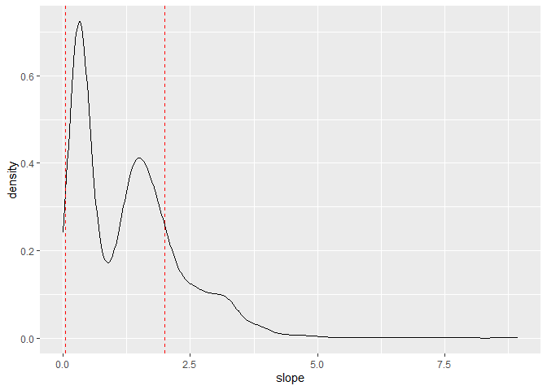
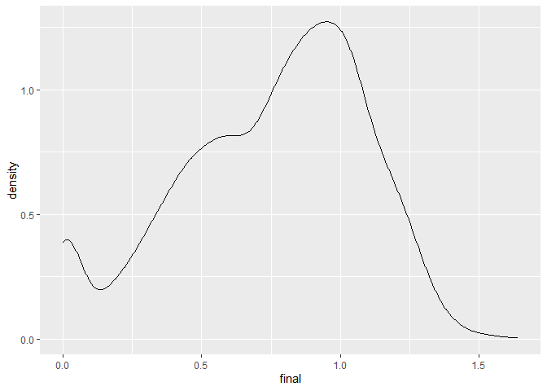

MA Fitness FA24
================
Rutuja
2024-09-23

# Setup functions

### This fits a spline to y=OD versus x=time, and then finds the maximum slope

``` r
spline.slope<-function(x, y, n=101, eps=1e-5, span=0.075){
  max(nderiv(loess(log(y) ~ x, degree=1, span=span), x), na.rm=TRUE)
}
```

### Used by the function above to get a local (linear) slope around a point

``` r
nderiv <- function(fit, x, eps=1e-5){
  (predict(fit, x + eps) - predict(fit, x - eps))/(2 * eps)}
```

## Spline fitting:

First we start by converting everything to log scale. During the
exponential growth phase, log(N) is proportional to t where N is the
population and t is time. There is noise in the original data. We remove
the noise and try to obtain the underlying curve using loess. It gives a
smooth curve. Then we use that curve to find local slopes. nderiv gives
precise estimate of the local linear slope at every point.

- this fits a spline to y=OD versus x=time, and then finds the
  time-stamp for maximum slope

``` r
spline.time<-function(x, y, n=101, eps=1e-5, span=0.075){
  estimates <- loess(log(y) ~ x, degree=1, span=span)
  slopes <- nderiv(estimates, x)
  return(which.max(slopes))
}
```

**Note that the unit of the time stamp is the number of 15 minute
intervals from the beginning of measurement.**

## Figuring out the parameters for the splines

``` r
d <- read.csv("data/Ref 04 06.csv")
assay.data <- read.delim("data/Rutuja 04 06.txt")
```

``` r
well <- assay.data$B19
time <- seq(1, length(well))


ggplot() + 
  geom_point(aes(x=time, y=well))
```

    ## Warning: Removed 43 rows containing missing values or values outside the scale range
    ## (`geom_point()`).

<!-- -->

``` r
## Now trying to smooth 
smoothed <- predict(loess(log(well) ~ time, degree=1, span=0.05), time)
```

    ## Warning in simpleLoess(y, x, w, span, degree = degree, parametric = parametric,
    ## : k-d tree limited by memory. ncmax= 200

``` r
ggplot() + 
  geom_point(aes(x=time, y=smoothed), color="red") +
  geom_point(aes(x=time, y=log(well)))
```

    ## Warning: Removed 43 rows containing missing values or values outside the scale range
    ## (`geom_point()`).
    ## Removed 43 rows containing missing values or values outside the scale range
    ## (`geom_point()`).

<!-- -->

``` r
# slopes <- nderiv(log(well), time)
# fitted.slopes <- nderiv(log(well), time)
```

## Reading and cleaning the data

Load all files and setup variables

This is just some information from the experiment. Using the info to
make sure everything is labelled right and is categorized right
downstream.

``` r
dates.1 <- seq(mdy(04062023), mdy(04102023), 1)
dates.2 <- seq(mdy(04282023), mdy(11302023), 1)
dates.2 <- c(dates.2, mdy(11022023))

ancestors <- c('H1', 'H2', 'H3', 'D1', 'D2', 'D3')

# these are all the haploid ancestors including the diploids that are found to haploids
ancestors.haploid <- c('H1', 'H2', 'H3', 'D2', 'D3', 'C1', 'C3')

# these are haploids that were intended to be haploids
anc.hap.og <- c('H1', 'H2', 'H3', 'C1', 'C2')

# these are haploids that were intended to be diploids
anc.hap.fake <- c('D2', 'D3')

# this is the only actual diploid control that was diploid
ancestors.diploid <- c('D1')

# this MA line started out as a haploid but ended up as a diploid
fake.haploids <- c(81)

# these MA lines started out as diploids but ended up as haploids
fake.diploids <- c(20, 28, 48, 52, 54, 84, 100)

# these have an aneuploidy of chromosome 3
aneuploids <- c(45, 68, 98)
```

Adding additional information for categorization. Excluding MA lines
that changed ploidy. Excluding batch 1 due to lack of diploid controls.

``` r
d$batch[d$date %in% dates.1] <- 1
d$batch[d$date %in% dates.2] <- 2

d <- d %>% filter(batch == 2)

d$label <- d$treatment
d$label[d$treatment == 'Blank'] <- '0'
d$label[d$treatment == 'H1'] <- '101'
d$label[d$treatment == 'D1'] <- '102'
d$label[d$treatment == 'H2'] <- '103'
d$label[d$treatment == 'D2'] <- '104'
d$label[d$treatment == 'H3'] <- '105'
d$label[d$treatment == 'D3'] <- '106'
d$label[d$treatment == 'C1'] <- '107'
d$label[d$treatment == 'C3'] <- '109'
d$label <- as.numeric(d$label)

d <- d %>% mutate(category = case_when(label == 0 ~ 'Blank',
                              label > 100 & treatment %in% ancestors.haploid ~ 'Ctrl.H',
                              label > 100 & treatment %in% ancestors.diploid ~ 'Ctrl.D',
                              label %% 2 == 0 ~ 'MA.D',
                              label %% 2 == 1 ~ 'MA.H'))


d <- d %>% mutate(category = ifelse(label %in% fake.diploids, 'MA.H', category))
d <- d %>% mutate(category = ifelse(label %in% fake.haploids, 'MA.D', category))

# Labeling the dates
dates <- d %>% distinct(date)
alphabet <- c('A', 'B', 'C', 'D', 'E')
dates <- dates %>% mutate(day = alphabet)
d <- d %>% left_join(dates, by='date') %>% select(-date)

head(d)
```

    ##   well treatment      slope initial     final monotone time batch label
    ## 1   A1     Blank 0.01190268 0.19525 0.2028966        0   17     2     0
    ## 2   B1        D3 0.16205402 0.22850 0.6973506        0   62     2   106
    ## 3   C1        H1 0.24591168 0.25875 0.9610287        0   31     2   101
    ## 4   D1        H2 0.02848045 0.24225 0.2147241       72    8     2   103
    ## 5   E1        H3 0.47864236 0.23025 1.0269483        9   22     2   105
    ## 6   F1        D1 0.13472608 0.24650 0.5693218       15   62     2   102
    ##   category day
    ## 1    Blank   A
    ## 2   Ctrl.H   A
    ## 3   Ctrl.H   A
    ## 4   Ctrl.H   A
    ## 5   Ctrl.H   A
    ## 6   Ctrl.D   A

### Additional information about the days

An additional assay was conducted that compared only the control lines
with frozen lab stocks. The ancestors used for the experiment were
replicates of the frozen lab stocks. However, they demonstrated
considerable variance from the lab stocks. This was a cause for concern
which led to the conduction of the supplemental assay. The supplemental
assay demonstrated that the control lines used for the original assay
behaved similar to the lab stocks. Thus it is reasonable to add these
values to the dataset before trimming for reasonable values.

# Preliminary exploration

Plot ancestors across all days to visually check for day effects
<!-- -->

Plotting the distribution of the slope values

``` r
# ci <- c(quantile(d$slope, 0.25) - 1.5* IQR(d$slope),
        # quantile(d$slope, 0.75) + 1.5* IQR(d$slope))

ci <- c(0.05, 0.22)

d %>% ggplot() +
  geom_density(aes(x=slope)) +
  geom_vline(xintercept = ci, color='red', linetype='dashed')
```

<!-- -->

``` r
blanks <-  d %>% filter(category == 'Blank')
```

visualize the blanks

    ## `stat_bin()` using `bins = 30`. Pick better value with `binwidth`.

<!-- -->

Setting cutoff for blanks around 0.05 and using the good blanks to make
blank predictions for each day.

``` r
bad.blanks <- blanks %>% filter(slope > 0.05)
good.blanks <- blanks %>% filter(slope < 0.05)

model <- lmer(slope~(1|day), data = good.blanks)
dates.predict <- data.frame(date=distinct(d, day))
dates.predict$null = predict(model, dates.predict)
```

Checking for effects of time (time taken to attain maximum growth rate).
Each time stamp is of 15 minutes.

Plotting the low values of time

    ## `stat_bin()` using `bins = 30`. Pick better value with `binwidth`.

<!-- -->

Samples with time \< 20 were identified to be erroneous. 20 timestamps
(4 hours) was a reasonable cutoff since the samples beyond that were
more likely to be good.

## Error removal

Accounting for experimental error by removing lines according to the
following rules:  
1. Remove unreasonable slope values  
2. Remove the bad blanks.  
3. Remove lines where the initial optical density was less than the
final optical density since the optical density should not decrease
unless there was an error.  
4. Remove the diploid ancestors that were found to be haploids.  
5. Remove the lines that reach saturation within the first 4 hours which
is too soon to reach saturation.

``` r
data <- d %>%
  filter(slope > ci[1] & slope < ci[2]) %>%
  anti_join(bad.blanks) %>%
  filter(initial <= final) %>%
  filter(!(treatment %in% anc.hap.fake)) %>%
  filter(time > 20)
```

    ## Joining with `by = join_by(well, treatment, slope, initial, final, monotone,
    ## time, batch, label, category, day)`

Plotting the ancestors again
<!-- --><!-- -->

## Preparing for data analysis

``` r
# df <- data %>%
#   select(treatment, label, slope, initial, day, category, time) %>%
#   filter(category != 'Blank') 
# 
# df <- df %>% rename('lineid' = 'treatment')
# 
# df$ploidy <- case_when(
#   df$category %in% c('Ctrl.H', 'MA.H') ~ 'Haploid',
#   df$category %in% c('Ctrl.D', 'MA.D') ~ 'Diploid'
# )
# 
# df$MA <- case_when(
#   df$category %in% c('MA.H', 'MA.D') ~ 'MA',
#   df$category %in% c('Ctrl.H', 'Ctrl.D') ~ 'Ctrl',
# )
```

# Data Analysis

### Calculating relative fitness

``` r
# # MA lines
# trt <- df %>% filter(label > 0 & label <= 100)
# # ancestor lines
# ctrl <- df %>% filter(label > 100)
# 
# # model to predict the slope of the ancestors of each ploidy with date as a random effect
# mod <- lmer(slope ~ ploidy + (1|day), ctrl)
# 
# # making predictions for each date
# ctrl.predict <- data.frame(distinct(ctrl, day, ploidy))
# ctrl.predict$ctrl <- predict(mod, ctrl.predict)
# 
# # combining with the MA line dateset
# trt <- left_join(trt, ctrl.predict, by=c('day', 'ploidy'))
# 
# # calculating relative fitness as the difference between the slope for the MA line and its ancestor
# trt$rel.fit <- trt$slope - trt$ctrl
# 
# # grouping all the readings for the lines and summarizing by calculating the mean relative fitness
# trt <- trt %>% group_by(ploidy, label) %>%
#   summarize(rel.fit = mean(rel.fit)) %>%
#   ungroup()
# 
# # mean and standard deviation for the diploids
# mu.dip <- mean(trt$rel.fit[trt$ploidy == 'Diploid'])
# sd.dip <- sd(trt$rel.fit[trt$ploidy == 'Diploid'])
# 
# # mean and standard deviation for the haploids 
# mu.hap <- mean(trt$rel.fit[trt$ploidy == 'Haploid'])
# sd.hap <- sd(trt$rel.fit[trt$ploidy == 'Haploid'])
```

Black line is the 0 line. The haploid MA lines performed worse than the
diploid MA lines.

### Using lmer models to test for any differences between the ancestors

``` r
# null <- lmer(slope ~ 1 + (1|day), ctrl)
# full <- lmer(slope ~ ploidy + (1|day), ctrl)
# summary(full)
# 
# mod <- anova(null, full)
# mod
```

Ploidy does not have a significant effect on fitness in the ancestors.

### Using lmer models with lineid and date as random effects.

##### Looking for MA-ploidy interaction:

``` r
# null <- lmer(slope ~ MA + ploidy + (1|day) + (1|lineid), df)
# summary(null)
# full <- lmer(slope ~ MA*ploidy + (1|day) + (1|lineid), df)
# summary(full)
# 
# mod <- anova(null, full)
# mod
```

No significant MA-ploidy interaction

##### Exploring effect of MA on the slope

``` r
# # lmer for effect of MA
# null <- lmer(slope ~ 1 + ploidy + (1|day) + (1|lineid), df)
# full <- lmer(slope ~ MA + ploidy + (1|day) + (1|lineid), df)
# summary(full)
# 
# mod <- anova(null, full)
# mod
```

The MA lines have different slopes than the ancestors

##### Exploring effect of ploidy on the slope

``` r
# null <- lmer(slope ~ 1 + MA + (1|day) + (1|lineid), df)
# full <- lmer(slope ~ ploidy + MA + (1|day) + (1|lineid), df)
# summary(full)
# 
# mod <- anova(null, full)
# mod
```

Haploids and diploids do not have different slopes

##### Combining information from the mutation rate dataset

``` r
# # read the files
# mut <- read_delim("pombe_MA_data.txt")
# 
# # combine with the relative fitness data
# trt2 <- trt %>%
#   left_join(mut, by=c('label'='line'))
# trt2 <- trt2 %>% select(ploidy.x, label, rel.fit, ploidy.y, ploidy_final,
#                         n.SNM, n.indel)
# trt2 <- trt2 %>% mutate(mutations = n.SNM + n.indel)
```

Some diploids have a relative fitness that is greater than 0. Diploids
have more mutations than haploids.

##### Using a linear model to explore mutation rate and ploidy interaction

``` r
# mod <- lm(rel.fit ~ ploidy.x*mutations + ploidy.x + mutations, trt2)
# summary(mod)
# qqnorm(resid(mod))
```

##### Linear model with no mutation rate and ploidy interactions

``` r
# mod <- lm(rel.fit ~ ploidy.x + mutations, trt2)
# summary(mod)
# qqnorm(resid(mod))
```

##### Linear model with only the mutations

``` r
# mod <- lm(rel.fit ~ mutations, trt2)
# summary(mod)
# qqnorm(resid(mod))
```

##### Combining the mutation dataset with the entire assay data

``` r
# mut_join <- trt2 %>% select(label, mutations)
# df <- df %>% left_join(mut_join) %>% 
#   mutate(mutations = ifelse(is.na(mutations), 0, mutations))
```

##### Mutation rate - ploidy interaction

``` r
# null <- lmer(slope ~ mutations + ploidy + (1|day) + (1|lineid), df)
# summary(null)
# full <- lmer(slope ~ mutations*ploidy + (1|day) + (1|lineid), df)
# summary(full)
# 
# mod <- anova(null, full)
# mod
```

No significant interaction in number of mutations and ploidy

##### Effect of mutations

``` r
# null <- lmer(slope ~ 1 + ploidy + (1|day) + (1|lineid), df)
# full <- lmer(slope ~ mutations + ploidy + (1|day) + (1|lineid), df)
# summary(full)
# 
# mod <- anova(null, full)
# mod
```

No significant fitness effects of number of mutations.

###### Effect of ploidy

``` r
# null <- lmer(slope ~ 1 + mutations + (1|day) + (1|lineid), df)
# full <- lmer(slope ~ ploidy + mutations + (1|day) + (1|lineid), df)
# summary(full)
# 
# mod <- anova(null, full)
# mod
```
