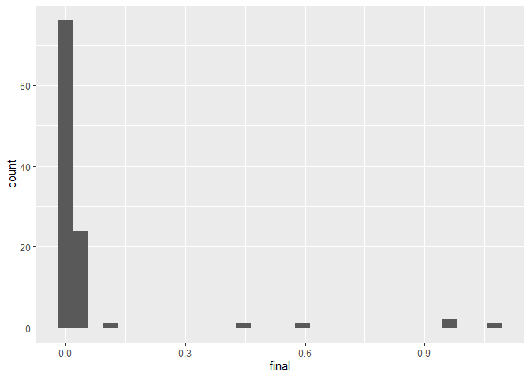
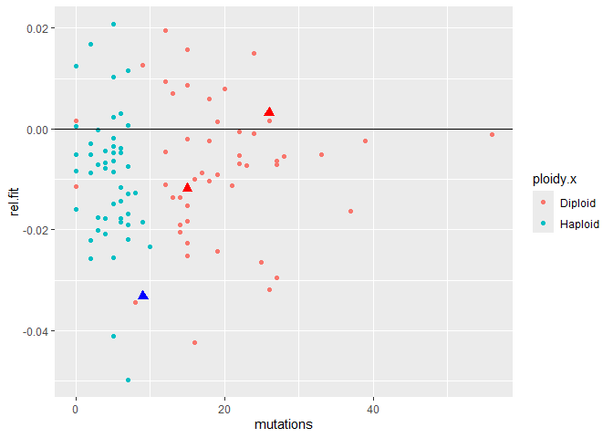

MA Fitness FA24
================
Rutuja
2024-09-23

# Setup functions

### This fits a spline to y=OD versus x=time, and then finds the maximum slope

``` r
spline.slope<-function(x, y, n=101, eps=1e-5, span=0.075){
  max(nderiv(loess(log(y) ~ x, degree=1, span=span), x), na.rm=TRUE)
}
```

### Used by the function above to get a local (linear) slope around a point

``` r
nderiv <- function(fit, x, eps=1e-5){
  (predict(fit, x + eps) - predict(fit, x - eps))/(2 * eps)}
```

## Spline fitting:

First we start by converting everything to log scale. During the
exponential growth phase, log(N) is proportional to t where N is the
population and t is time. There is noise in the original data. We remove
the noise and try to obtain the underlying curve using loess. It gives a
smooth curve. Then we use that curve to find local slopes. nderiv gives
precise estimate of the local linear slope at every point.

- this fits a spline to y=OD versus x=time, and then finds the
  time-stamp for maximum slope

``` r
spline.time<-function(x, y, n=101, eps=1e-5, span=0.075){
  estimates <- loess(log(y) ~ x, degree=1, span=span)
  slopes <- nderiv(estimates, x)
  return(which.max(slopes))
}
```

**Note that the unit of the time stamp is the number of 15 minute
intervals from the beginning of measurement.**

## Figuring out the parameters for the splines (I am just playing around)

``` r
d.test <- read.csv("data/Ref 04 10.csv")
assay.testdata <- read.delim("data/Rutuja 04 10.txt")
```

``` r
well <- assay.testdata$K12
time <- seq(1, length(well))


ggplot() + 
  geom_point(aes(x=time, y=well))
```

<!-- -->

``` r
## Now trying to smooth 
smoothed <- predict(loess(log(well) ~ time, degree=1, span=0.075), time)

ggplot() + 
  geom_point(aes(x=time, y=smoothed), color="red") +
  geom_point(aes(x=time, y=log(well)))
```

<!-- -->

``` r
# slopes <- nderiv(log(well), time)
# fitted.slopes <- nderiv(log(well), time)
```

## Reading and cleaning the data

Load all files and setup variables

This is just some information from the experiment. Using the info to
make sure everything is labelled right and is categorized right
downstream.

``` r
dates.1 <- seq(mdy(04062023), mdy(04102023), 1)
dates.2 <- seq(mdy(04282023), mdy(11302023), 1)
dates.3 <- c(mdy(11022023))
# dates.2 <- c(dates.2, mdy(11022023))

ancestors <- c('H1', 'H2', 'H3', 'D1', 'D2', 'D3')

# these are all the haploid ancestors including the diploids that are found to haploids
ancestors.haploid <- c('H1', 'H2', 'H3', 'D2', 'D3', 'C1', 'C3')

# these are haploids that were intended to be haploids
anc.hap.og <- c('H1', 'H2', 'H3', 'C1', 'C2')

# these are haploids that were intended to be diploids
anc.hap.fake <- c('D2', 'D3')

# this is the only actual diploid control that was diploid
ancestors.diploid <- c('D1')

# this MA line started out as a haploid but ended up as a diploid
fake.haploids <- c(81)

# these MA lines started out as diploids but ended up as haploids
fake.diploids <- c(20, 28, 48, 52, 54, 84, 100)

# these have an aneuploidy of chromosome 3
aneuploids <- c(45, 68, 98)
```

Adding additional information for categorization. Excluding MA lines
that changed ploidy. For now I am excluding the lines that changed
ploidy. Originally I was categorizing them as whatever their final
ploidy was but I need to rethink that.

``` r
d$batch[d$date %in% dates.1] <- 1
d$batch[d$date %in% dates.2] <- 2
d$batch[d$date %in% dates.3] <- 3


d$label <- d$treatment
d$label[d$treatment == 'Blank'] <- '0'
d$label[d$treatment == 'H1'] <- '101'
d$label[d$treatment == 'D1'] <- '102'
d$label[d$treatment == 'H2'] <- '103'
d$label[d$treatment == 'D2'] <- '104'
d$label[d$treatment == 'H3'] <- '105'
d$label[d$treatment == 'D3'] <- '106'
d$label[d$treatment == 'C1'] <- '107'
d$label[d$treatment == 'C3'] <- '109'
d$label <- as.numeric(d$label)

d <- d %>% mutate(category = case_when(label == 0 ~ 'Blank',
                              label > 100 & treatment %in% ancestors.haploid ~ 'Ctrl.H',
                              label > 100 & treatment %in% ancestors.diploid ~ 'Ctrl.D',
                              label %% 2 == 0 ~ 'MA.D',
                              label %% 2 == 1 ~ 'MA.H'))


# 
# d <- d %>% mutate(category = ifelse(label %in% fake.diploids, 'MA.H', category))
# d <- d %>% mutate(category = ifelse(label %in% fake.haploids, 'MA.D', category))

# d <- d %>% filter(!(label %in% fake.diploids))
# d <- d %>% filter(!(label %in% fake.haploids))

# Labeling the dates
dates <- d %>% distinct(date)
alphabet <- c('1A', '1B', '1C', '1D', '2A', '2B', '2C', '2D', '3A')
dates <- dates %>% mutate(day = alphabet)
d <- d %>% left_join(dates, by='date') %>% select(-date)

head(d)
```

    ##   well treatment initial     final       slope monotone final_slope time batch
    ## 1   A1     Blank 0.16275 0.1664968 0.006873357        7  0.00146783   81     1
    ## 2   B1        H1 0.17475 0.6231032 0.174031549        0  0.04396843   57     1
    ## 3   C1        H2 0.17300 0.6569032 0.180485167        0  0.04575788   53     1
    ## 4   D1        H3 0.17825 0.5738387 0.177495892        0  0.04193429   57     1
    ## 5   E1        D1 0.17000 0.4803484 0.160080758        0  0.03960327   67     1
    ## 6   F1        D2 0.17175 0.3771548 0.126360761        2  0.03524252   67     1
    ##   label category day
    ## 1     0    Blank  1A
    ## 2   101   Ctrl.H  1A
    ## 3   103   Ctrl.H  1A
    ## 4   105   Ctrl.H  1A
    ## 5   102   Ctrl.D  1A
    ## 6   104   Ctrl.H  1A

``` r
d %>%
  # filter(category == 'Ctrl.H' | category == 'Ctrl.D') %>% 
  ggplot() + geom_point(aes(x=category, y=slope, color=category)) + facet_grid(cols=vars(day)) +
  theme(axis.text.x = element_text(angle = 90, vjust = 0.5, hjust=1))
```

<!-- -->

Who are these outliers????

``` r
d %>% filter(slope > 1) %>% select(well, day)
```

    ## [1] well day 
    ## <0 rows> (or 0-length row.names)

### Additional information about the days

An additional assay was conducted that compared only the control lines
with frozen lab stocks. The ancestors used for the experiment were
replicates of the frozen lab stocks. However, they demonstrated
considerable variance from the lab stocks. This was a cause for concern
which led to the conduction of the supplemental assay. The supplemental
assay demonstrated that the control lines used for the original assay
behaved similar to the lab stocks. Thus it is reasonable to add these
values to the dataset before trimming for reasonable values.

# Preliminary exploration

Plot ancestors across all days to visually check for day effects
<!-- -->

Plotting the distribution of the slope values

``` r
# ci <- c(quantile(d$slope, 0.25) - 1.5* IQR(d$slope),
# quantile(d$slope, 0.75) + 1.5* IQR(d$slope))

# ci <- c(0.04, 0.27)

ci <- c(quantile(d$slope, 0.025), quantile(d$slope, 0.975))

d %>% ggplot() +
  geom_density(aes(x=slope)) +
  geom_vline(xintercept = ci, color='red', linetype='dashed')
```

<!-- -->

``` r
d %>%
  # filter(category == 'Ctrl.H' | category == 'Ctrl.D') %>% 
  ggplot() + geom_point(aes(x=category, y=slope, color=category)) + facet_grid(cols=vars(day)) +
  theme(axis.text.x = element_text(angle = 90, vjust = 0.5, hjust=1)) +
  geom_hline(yintercept = ci, color="red")
```

<!-- -->

``` r
blanks <-  d %>% filter(category == 'Blank')
```

Plotting the distribution of the final OD values

``` r
d %>% ggplot() +
  geom_density(aes(x=final))
```

<!-- -->

visualize the blanks

    ## `stat_bin()` using `bins = 30`. Pick better value with `binwidth`.

<!-- -->

    ## `stat_bin()` using `bins = 30`. Pick better value with `binwidth`.

<!-- -->

    ## `stat_bin()` using `bins = 30`. Pick better value with `binwidth`.

<!-- -->

    ## `stat_bin()` using `bins = 30`. Pick better value with `binwidth`.

<!-- -->

Setting cutoff for blanks around 0.06 and using the good blanks to make
blank predictions for each day.

``` r
# bad.blanks <- blanks %>% filter(slope > 0.06)
# good.blanks <- blanks %>% filter(slope < 0.06)
# 
# model <- lmer(slope~(1|day), data = good.blanks)
# dates.predict <- data.frame(date=distinct(d, day))
# dates.predict$null = predict(model, dates.predict)

bad.blanks <- blanks %>% filter(final - initial >= 0.05)
good.blanks <- blanks %>% filter(final - initial < 0.05)
```

``` r
media.od <- good.blanks %>% group_by(day) %>%
  summarize(avg.init = mean(initial))

good.blanks %>% ggplot() +
  geom_histogram(aes(x=initial)) +
  facet_wrap(vars(day))
```

    ## `stat_bin()` using `bins = 30`. Pick better value with `binwidth`.

<!-- -->

``` r
d3 <- d %>% left_join(media.od, by=c("day"))
head(d3)
```

    ##   well treatment initial     final       slope monotone final_slope time batch
    ## 1   A1     Blank 0.16275 0.1664968 0.006873357        7  0.00146783   81     1
    ## 2   B1        H1 0.17475 0.6231032 0.174031549        0  0.04396843   57     1
    ## 3   C1        H2 0.17300 0.6569032 0.180485167        0  0.04575788   53     1
    ## 4   D1        H3 0.17825 0.5738387 0.177495892        0  0.04193429   57     1
    ## 5   E1        D1 0.17000 0.4803484 0.160080758        0  0.03960327   67     1
    ## 6   F1        D2 0.17175 0.3771548 0.126360761        2  0.03524252   67     1
    ##   label category day  avg.init
    ## 1     0    Blank  1A 0.1747727
    ## 2   101   Ctrl.H  1A 0.1747727
    ## 3   103   Ctrl.H  1A 0.1747727
    ## 4   105   Ctrl.H  1A 0.1747727
    ## 5   102   Ctrl.D  1A 0.1747727
    ## 6   104   Ctrl.H  1A 0.1747727

``` r
# d3$slope.val <- d3$slope-
```

Checking for effects of time (time taken to attain maximum growth rate).
Each time stamp is of 15 minutes.

Plotting the low values of time

    ## `stat_bin()` using `bins = 30`. Pick better value with `binwidth`.

<!-- -->

Samples with time \< 10 were identified to be erroneous.

Looking to see if they reached saturation or not

``` r
# sat <- c(0.2, 1.1)
daily_cutoff <- d %>% group_by(day) %>%
  summarize(lower = quantile(final, 0.05))

d2 <- d %>% left_join(daily_cutoff, by=c("day"))

d2 %>% ggplot() +
  geom_density(aes(x=final)) +
  geom_vline(aes(xintercept=lower), color='red', linetype='dashed') +
  facet_wrap(vars(day))
```

<!-- -->

``` r
daily_cutoff <- d %>% group_by(day) %>%
  summarize(upper = quantile(initial, 0.95))

d2 <- d2 %>% left_join(daily_cutoff, by=c("day"))

d2 %>% ggplot() +
  geom_density(aes(x=initial)) +
  geom_vline(aes(xintercept=upper), color='red', linetype='dashed') +
  facet_wrap(vars(day))
```

<!-- -->

## Error removal

Accounting for experimental error by removing lines according to the
following rules:  
Rules need to be updated

1.  Remove unreasonable slope values  
2.  Remove the bad blanks.  
3.  Remove lines where the initial optical density was more than the
    final optical density since the optical density should not decrease
    unless there was an error.  
4.  Remove the diploid ancestors that were found to be haploids.  
5.  Remove the lines that reach saturation within the first 2 hours
    which is too soon to reach saturation.

These were not the current rules

``` r
data <- d2 %>%
  anti_join(bad.blanks) %>%
  filter(initial <= final) %>%
  filter(final >= lower) %>%
  filter(initial <= upper) %>%
  filter(monotone == 0) # %>%
```

    ## Joining with `by = join_by(well, treatment, initial, final, slope, monotone,
    ## final_slope, time, batch, label, category, day)`

``` r
  # filter(!(batch == 1 & treatment %in% c("D1", "D2", "D3"))) %>%
  # filter(!(batch == 2 & treatment %in% c("H1", "H2", "H3", "D2", "D3"))) %>%
  # filter(!(batch == 1 & category == "MA.D")) %>%
  # filter(!(batch == 2 & category == "MA.H"))

data %>%
  # filter(category == 'Ctrl.H' | category == 'Ctrl.D') %>% 
  ggplot() + geom_point(aes(x=category, y=slope, color=category)) + facet_grid(cols=vars(day)) +
  theme(axis.text.x = element_text(angle = 90, vjust = 0.5, hjust=1))
```

<!-- -->

``` r
data %>% filter(slope > 0.3) %>% select(well, day)
```

    ##   well day
    ## 1  K15  1A
    ## 2  M15  1A
    ## 3  M10  1B
    ## 4  I17  1B
    ## 5   E3  2A
    ## 6   M5  2B

``` r
data %>%
  filter(category == 'Ctrl.H' | category == 'Ctrl.D') %>% 
  ggplot() + geom_point(aes(x=treatment, y=slope, color=treatment)) + facet_grid(cols=vars(day)) +
  theme(axis.text.x = element_text(angle = 90, vjust = 0.5, hjust=1))
```

<!-- -->

``` r
cat(data$well[data$day=="1A"], file = "1A.txt")
cat(data$well[data$day=="1B"], file = "1B.txt")
cat(data$well[data$day=="1C"], file = "1C.txt")
cat(data$well[data$day=="1D"], file = "1D.txt")
cat(data$well[data$day=="2A"], file = "2A.txt")
cat(data$well[data$day=="2B"], file = "2B.txt")
cat(data$well[data$day=="2C"], file = "2C.txt")
cat(data$well[data$day=="2D"], file = "2D.txt")
cat(data$well[data$day=="3A"], file = "3A.txt")
```

## Preparing for data analysis

``` r
df <- data %>%
  select(treatment, slope, initial, time, batch, label, category, day) %>%
  filter(category != 'Blank')

df <- df %>% rename('lineid' = 'treatment')

df$ploidy <- case_when(
  df$category %in% c('Ctrl.H', 'MA.H') ~ 'Haploid',
  df$category %in% c('Ctrl.D', 'MA.D') ~ 'Diploid'
)

df$MA <- case_when(
  df$category %in% c('MA.H', 'MA.D') ~ 'MA',
  df$category %in% c('Ctrl.H', 'Ctrl.D') ~ 'Ctrl',
)

head(df)
```

    ##   lineid     slope initial time batch label category day  ploidy   MA
    ## 1     H1 0.1740315 0.17475   57     1   101   Ctrl.H  1A Haploid Ctrl
    ## 2     H2 0.1804852 0.17300   53     1   103   Ctrl.H  1A Haploid Ctrl
    ## 3     H3 0.1774959 0.17825   57     1   105   Ctrl.H  1A Haploid Ctrl
    ## 4     D1 0.1600808 0.17000   67     1   102   Ctrl.D  1A Diploid Ctrl
    ## 5     D3 0.1716952 0.16800   65     1   106   Ctrl.H  1A Haploid Ctrl
    ## 6     H1 0.1261628 0.17575   57     1   101   Ctrl.H  1A Haploid Ctrl

# Data Analysis

### Calculating relative fitness

``` r
# MA lines
trt <- df %>% filter(MA == "MA")
# ancestor lines
ctrl <- df %>% filter(MA == "Ctrl")

# model to predict the slope of the ancestors of each ploidy with date as a random effect
mod <- lmer(slope ~ ploidy + (1|day), ctrl)

# making predictions for each date
ctrl.predict <- data.frame(distinct(ctrl, day, ploidy))
ctrl.predict$ctrl <- predict(mod, ctrl.predict)
ctrl.predict
```

    ##    day  ploidy      ctrl
    ## 1   1A Haploid 0.1596233
    ## 2   1A Diploid 0.1522682
    ## 3   1B Haploid 0.1283802
    ## 4   1B Diploid 0.1210250
    ## 5   1C Haploid 0.1771876
    ## 6   1C Diploid 0.1698324
    ## 7   1D Haploid 0.1711019
    ## 8   1D Diploid 0.1637468
    ## 9   2A Haploid 0.1743718
    ## 10  2A Diploid 0.1670167
    ## 11  2B Haploid 0.1799303
    ## 12  2B Diploid 0.1725751
    ## 13  2C Diploid 0.1514771
    ## 14  2C Haploid 0.1588322
    ## 15  2D Haploid 0.1795228
    ## 16  2D Diploid 0.1721677
    ## 17  3A Haploid 0.1298845
    ## 18  3A Diploid 0.1225294

``` r
# combining with the MA line dateset
trt <- left_join(trt, ctrl.predict, by=c('day', 'ploidy'))

# calculating relative fitness as the difference between the slope for the MA line and its ancestor
trt$rel.fit <- trt$slope - trt$ctrl

# grouping all the readings for the lines and summarizing by calculating the mean relative fitness
trt <- trt %>% group_by(ploidy, label) %>%
  summarize(rel.fit = mean(rel.fit, na.rm=TRUE)) %>%
  ungroup()
```

    ## `summarise()` has grouped output by 'ploidy'. You can override using the
    ## `.groups` argument.

``` r
# mean and standard deviation for the diploids
mu.dip <- mean(trt$rel.fit[trt$ploidy == 'Diploid'], na.rm=TRUE)
sd.dip <- sd(trt$rel.fit[trt$ploidy == 'Diploid'])
paste0("Diploids: ", mu.dip, " Deviation: ", sd.dip)
```

    ## [1] "Diploids: -0.00767221608403206 Deviation: 0.0134507229830801"

``` r
# mean and standard deviation for the haploids
mu.hap <- mean(trt$rel.fit[trt$ploidy == 'Haploid'], na.rm=TRUE)
sd.hap <- sd(trt$rel.fit[trt$ploidy == 'Haploid'])
paste0("Haploids: ", mu.hap, " Deviation: ", sd.dip)
```

    ## [1] "Haploids: -0.0101986787141774 Deviation: 0.0134507229830801"

    ## `stat_bin()` using `bins = 30`. Pick better value with `binwidth`.

<!-- -->

Black line is the 0 line. The haploid MA lines performed worse than the
diploid MA lines.

### Using lmer models to test for any differences between the ancestors

``` r
null <- lmer(slope ~ 1 + (1|lineid) + (1|batch), ctrl)
full <- lmer(slope ~ ploidy + (1|lineid) + (1|batch), ctrl)
summary(full)
```

    ## Linear mixed model fit by REML ['lmerMod']
    ## Formula: slope ~ ploidy + (1 | lineid) + (1 | batch)
    ##    Data: ctrl
    ## 
    ## REML criterion at convergence: -4038.4
    ## 
    ## Scaled residuals: 
    ##     Min      1Q  Median      3Q     Max 
    ## -6.4148 -0.5199  0.0462  0.6059  7.0950 
    ## 
    ## Random effects:
    ##  Groups   Name        Variance  Std.Dev.
    ##  lineid   (Intercept) 0.0003474 0.01864 
    ##  batch    (Intercept) 0.0003848 0.01962 
    ##  Residual             0.0010301 0.03210 
    ## Number of obs: 1012, groups:  lineid, 8; batch, 3
    ## 
    ## Fixed effects:
    ##               Estimate Std. Error t value
    ## (Intercept)   0.148772   0.021927   6.785
    ## ploidyHaploid 0.005419   0.020103   0.270
    ## 
    ## Correlation of Fixed Effects:
    ##             (Intr)
    ## ploidyHapld -0.800

``` r
mod <- anova(null, full)
```

    ## refitting model(s) with ML (instead of REML)

``` r
mod
```

    ## Data: ctrl
    ## Models:
    ## null: slope ~ 1 + (1 | lineid) + (1 | batch)
    ## full: slope ~ ploidy + (1 | lineid) + (1 | batch)
    ##      npar     AIC     BIC logLik deviance  Chisq Df Pr(>Chisq)
    ## null    4 -4043.4 -4023.7 2025.7  -4051.4                     
    ## full    5 -4041.5 -4016.9 2025.7  -4051.5 0.0877  1     0.7671

``` r
t.test(ctrl$slope[ctrl$batch == 3 & ctrl$ploidy == "Haploid"],
       ctrl$slope[ctrl$batch == 3 & ctrl$ploidy == "Diploid"])
```

    ## 
    ##  Welch Two Sample t-test
    ## 
    ## data:  ctrl$slope[ctrl$batch == 3 & ctrl$ploidy == "Haploid"] and ctrl$slope[ctrl$batch == 3 & ctrl$ploidy == "Diploid"]
    ## t = -1.626, df = 91.016, p-value = 0.1074
    ## alternative hypothesis: true difference in means is not equal to 0
    ## 95 percent confidence interval:
    ##  -0.010956863  0.001092968
    ## sample estimates:
    ## mean of x mean of y 
    ## 0.1270407 0.1319727

Ploidy does not have a significant effect on fitness in the ancestors.

### Ancestor-MA comparisons

At the moment, this is the analysis that I know I can do for sure.

``` r
hap <- df %>% filter(ploidy == "Haploid", batch == 1)
dip <- df %>% filter(ploidy == "Diploid", batch == 2)

## isSingular when including lineid

null <- lmer(slope ~ 1 + (1|day), hap)
summary(null)
```

    ## Linear mixed model fit by REML ['lmerMod']
    ## Formula: slope ~ 1 + (1 | day)
    ##    Data: hap
    ## 
    ## REML criterion at convergence: -2571.5
    ## 
    ## Scaled residuals: 
    ##     Min      1Q  Median      3Q     Max 
    ## -3.2607 -0.5115  0.0331  0.4496 10.2839 
    ## 
    ## Random effects:
    ##  Groups   Name        Variance Std.Dev.
    ##  day      (Intercept) 0.000267 0.01634 
    ##  Residual             0.000967 0.03110 
    ## Number of obs: 632, groups:  day, 4
    ## 
    ## Fixed effects:
    ##             Estimate Std. Error t value
    ## (Intercept) 0.162033   0.008267    19.6

``` r
full <- lmer(slope ~ MA + (1|day), hap)
summary(full)
```

    ## Linear mixed model fit by REML ['lmerMod']
    ## Formula: slope ~ MA + (1 | day)
    ##    Data: hap
    ## 
    ## REML criterion at convergence: -2577.7
    ## 
    ## Scaled residuals: 
    ##     Min      1Q  Median      3Q     Max 
    ## -3.1531 -0.5546  0.0818  0.5043 10.2283 
    ## 
    ## Random effects:
    ##  Groups   Name        Variance  Std.Dev.
    ##  day      (Intercept) 0.0002584 0.01608 
    ##  Residual             0.0009438 0.03072 
    ## Number of obs: 632, groups:  day, 4
    ## 
    ## Fixed effects:
    ##             Estimate Std. Error t value
    ## (Intercept) 0.157790   0.008201  19.241
    ## MAMA        0.010111   0.002483   4.072
    ## 
    ## Correlation of Fixed Effects:
    ##      (Intr)
    ## MAMA -0.127

``` r
mod <- anova(null, full)
```

    ## refitting model(s) with ML (instead of REML)

``` r
mod
```

    ## Data: hap
    ## Models:
    ## null: slope ~ 1 + (1 | day)
    ## full: slope ~ MA + (1 | day)
    ##      npar     AIC     BIC logLik deviance  Chisq Df Pr(>Chisq)    
    ## null    3 -2573.4 -2560.1 1289.7  -2579.4                         
    ## full    4 -2587.8 -2570.0 1297.9  -2595.8 16.424  1  5.063e-05 ***
    ## ---
    ## Signif. codes:  0 '***' 0.001 '**' 0.01 '*' 0.05 '.' 0.1 ' ' 1

``` r
null <- lmer(slope ~ 1 + (1|day), dip)
summary(null)
```

    ## Linear mixed model fit by REML ['lmerMod']
    ## Formula: slope ~ 1 + (1 | day)
    ##    Data: dip
    ## 
    ## REML criterion at convergence: -1549.6
    ## 
    ## Scaled residuals: 
    ##     Min      1Q  Median      3Q     Max 
    ## -3.7029 -0.4939  0.1962  0.6342  2.2952 
    ## 
    ## Random effects:
    ##  Groups   Name        Variance  Std.Dev.
    ##  day      (Intercept) 0.0002216 0.01489 
    ##  Residual             0.0005470 0.02339 
    ## Number of obs: 336, groups:  day, 4
    ## 
    ## Fixed effects:
    ##             Estimate Std. Error t value
    ## (Intercept) 0.138945   0.007596   18.29

``` r
full <- lmer(slope ~ MA + (1|day), dip)
summary(full)
```

    ## Linear mixed model fit by REML ['lmerMod']
    ## Formula: slope ~ MA + (1 | day)
    ##    Data: dip
    ## 
    ## REML criterion at convergence: -1589.5
    ## 
    ## Scaled residuals: 
    ##     Min      1Q  Median      3Q     Max 
    ## -3.7523 -0.4915  0.1571  0.6488  2.4279 
    ## 
    ## Random effects:
    ##  Groups   Name        Variance  Std.Dev.
    ##  day      (Intercept) 0.0003210 0.01792 
    ##  Residual             0.0004706 0.02169 
    ## Number of obs: 336, groups:  day, 4
    ## 
    ## Fixed effects:
    ##              Estimate Std. Error t value
    ## (Intercept)  0.153142   0.009276  16.509
    ## MAMA        -0.020448   0.002784  -7.346
    ## 
    ## Correlation of Fixed Effects:
    ##      (Intr)
    ## MAMA -0.210

``` r
mod <- anova(null, full)
```

    ## refitting model(s) with ML (instead of REML)

``` r
mod
```

    ## Data: dip
    ## Models:
    ## null: slope ~ 1 + (1 | day)
    ## full: slope ~ MA + (1 | day)
    ##      npar     AIC     BIC logLik deviance  Chisq Df Pr(>Chisq)    
    ## null    3 -1551.7 -1540.2 778.84  -1557.7                         
    ## full    4 -1599.2 -1583.9 803.59  -1607.2 49.505  1  1.978e-12 ***
    ## ---
    ## Signif. codes:  0 '***' 0.001 '**' 0.01 '*' 0.05 '.' 0.1 ' ' 1

# Pause reading here for now. Everything before this needs a sanity check first.

### Using lmer models with lineid and date as random effects.

##### Looking for MA-ploidy interaction:

``` r
null <- lmer(slope ~ MA + ploidy + (1|day) + (1|lineid), df)
summary(null)
```

    ## Linear mixed model fit by REML ['lmerMod']
    ## Formula: slope ~ MA + ploidy + (1 | day) + (1 | lineid)
    ##    Data: df
    ## 
    ## REML criterion at convergence: -7870.5
    ## 
    ## Scaled residuals: 
    ##     Min      1Q  Median      3Q     Max 
    ## -6.5162 -0.4636  0.0683  0.4572  9.9599 
    ## 
    ## Random effects:
    ##  Groups   Name        Variance  Std.Dev.
    ##  lineid   (Intercept) 9.759e-05 0.009879
    ##  day      (Intercept) 2.004e-04 0.014158
    ##  Residual             9.506e-04 0.030832
    ## Number of obs: 1945, groups:  lineid, 108; day, 9
    ## 
    ## Fixed effects:
    ##                Estimate Std. Error t value
    ## (Intercept)    0.154944   0.006477  23.923
    ## MAMA          -0.006068   0.004210  -1.441
    ## ploidyHaploid  0.002715   0.002757   0.984
    ## 
    ## Correlation of Fixed Effects:
    ##             (Intr) MAMA  
    ## MAMA        -0.609       
    ## ploidyHapld -0.367  0.236

``` r
full <- lmer(slope ~ MA*ploidy + (1|day) + (1|lineid), df)
summary(full)
```

    ## Linear mixed model fit by REML ['lmerMod']
    ## Formula: slope ~ MA * ploidy + (1 | day) + (1 | lineid)
    ##    Data: df
    ## 
    ## REML criterion at convergence: -7863.4
    ## 
    ## Scaled residuals: 
    ##     Min      1Q  Median      3Q     Max 
    ## -6.5185 -0.4631  0.0676  0.4559  9.9547 
    ## 
    ## Random effects:
    ##  Groups   Name        Variance  Std.Dev.
    ##  lineid   (Intercept) 9.975e-05 0.009987
    ##  day      (Intercept) 2.002e-04 0.014150
    ##  Residual             9.506e-04 0.030831
    ## Number of obs: 1945, groups:  lineid, 108; day, 9
    ## 
    ## Fixed effects:
    ##                      Estimate Std. Error t value
    ## (Intercept)         0.1547654  0.0112580  13.747
    ## MAMA               -0.0058785  0.0104387  -0.563
    ## ploidyHaploid       0.0028988  0.0109706   0.264
    ## MAMA:ploidyHaploid -0.0002023  0.0113353  -0.018
    ## 
    ## Correlation of Fixed Effects:
    ##             (Intr) MAMA   pldyHp
    ## MAMA        -0.890              
    ## ploidyHapld -0.844  0.908       
    ## MAMA:pldyHp  0.816 -0.913 -0.968

``` r
mod <- anova(null, full)
```

    ## refitting model(s) with ML (instead of REML)

``` r
mod
```

    ## Data: df
    ## Models:
    ## null: slope ~ MA + ploidy + (1 | day) + (1 | lineid)
    ## full: slope ~ MA * ploidy + (1 | day) + (1 | lineid)
    ##      npar     AIC     BIC logLik deviance Chisq Df Pr(>Chisq)
    ## null    6 -7886.5 -7853.0 3949.2  -7898.5                    
    ## full    7 -7884.5 -7845.5 3949.2  -7898.5 4e-04  1     0.9848

No significant MA-ploidy interaction

##### Exploring effect of MA on the slope

``` r
# lmer for effect of MA
null <- lmer(slope ~ 1 + ploidy + (1|day) + (1|lineid), df)
full <- lmer(slope ~ MA + ploidy + (1|day) + (1|lineid), df)
summary(full)
```

    ## Linear mixed model fit by REML ['lmerMod']
    ## Formula: slope ~ MA + ploidy + (1 | day) + (1 | lineid)
    ##    Data: df
    ## 
    ## REML criterion at convergence: -7870.5
    ## 
    ## Scaled residuals: 
    ##     Min      1Q  Median      3Q     Max 
    ## -6.5162 -0.4636  0.0683  0.4572  9.9599 
    ## 
    ## Random effects:
    ##  Groups   Name        Variance  Std.Dev.
    ##  lineid   (Intercept) 9.759e-05 0.009879
    ##  day      (Intercept) 2.004e-04 0.014158
    ##  Residual             9.506e-04 0.030832
    ## Number of obs: 1945, groups:  lineid, 108; day, 9
    ## 
    ## Fixed effects:
    ##                Estimate Std. Error t value
    ## (Intercept)    0.154944   0.006477  23.923
    ## MAMA          -0.006068   0.004210  -1.441
    ## ploidyHaploid  0.002715   0.002757   0.984
    ## 
    ## Correlation of Fixed Effects:
    ##             (Intr) MAMA  
    ## MAMA        -0.609       
    ## ploidyHapld -0.367  0.236

``` r
mod <- anova(null, full)
```

    ## refitting model(s) with ML (instead of REML)

``` r
mod
```

    ## Data: df
    ## Models:
    ## null: slope ~ 1 + ploidy + (1 | day) + (1 | lineid)
    ## full: slope ~ MA + ploidy + (1 | day) + (1 | lineid)
    ##      npar     AIC     BIC logLik deviance  Chisq Df Pr(>Chisq)
    ## null    5 -7886.4 -7858.6 3948.2  -7896.4                     
    ## full    6 -7886.5 -7853.0 3949.2  -7898.5 2.0525  1      0.152

The MA lines have different slopes than the ancestors

##### Exploring effect of ploidy on the slope

``` r
null <- lmer(slope ~ 1 + MA + (1|day) + (1|lineid), df)
full <- lmer(slope ~ ploidy + MA + (1|day) + (1|lineid), df)
summary(full)
```

    ## Linear mixed model fit by REML ['lmerMod']
    ## Formula: slope ~ ploidy + MA + (1 | day) + (1 | lineid)
    ##    Data: df
    ## 
    ## REML criterion at convergence: -7870.5
    ## 
    ## Scaled residuals: 
    ##     Min      1Q  Median      3Q     Max 
    ## -6.5162 -0.4636  0.0683  0.4572  9.9599 
    ## 
    ## Random effects:
    ##  Groups   Name        Variance  Std.Dev.
    ##  lineid   (Intercept) 9.759e-05 0.009879
    ##  day      (Intercept) 2.004e-04 0.014158
    ##  Residual             9.506e-04 0.030832
    ## Number of obs: 1945, groups:  lineid, 108; day, 9
    ## 
    ## Fixed effects:
    ##                Estimate Std. Error t value
    ## (Intercept)    0.154944   0.006477  23.923
    ## ploidyHaploid  0.002715   0.002757   0.984
    ## MAMA          -0.006068   0.004210  -1.441
    ## 
    ## Correlation of Fixed Effects:
    ##             (Intr) pldyHp
    ## ploidyHapld -0.367       
    ## MAMA        -0.609  0.236

``` r
mod <- anova(null, full)
```

    ## refitting model(s) with ML (instead of REML)

``` r
mod
```

    ## Data: df
    ## Models:
    ## null: slope ~ 1 + MA + (1 | day) + (1 | lineid)
    ## full: slope ~ ploidy + MA + (1 | day) + (1 | lineid)
    ##      npar     AIC     BIC logLik deviance  Chisq Df Pr(>Chisq)
    ## null    5 -7887.5 -7859.6 3948.7  -7897.5                     
    ## full    6 -7886.5 -7853.0 3949.2  -7898.5 0.9848  1      0.321

Haploids and diploids may have different slopes

##### Combining information from the mutation rate dataset

``` r
# read the files
mut <- read_delim("pombe_MA_data.txt")
```

    ## Rows: 100 Columns: 10
    ## ── Column specification ────────────────────────────────────────────────────────
    ## Delimiter: "\t"
    ## chr (2): ploidy, ploidy_final
    ## dbl (8): line, transfers, shared_ancestry, generations, chr_gens1, chr_gens2...
    ## 
    ## ℹ Use `spec()` to retrieve the full column specification for this data.
    ## ℹ Specify the column types or set `show_col_types = FALSE` to quiet this message.

``` r
# combine with the relative fitness data
trt2 <- trt %>%
  left_join(mut, by=c('label'='line'))
trt2 <- trt2 %>% select(ploidy.x, label, rel.fit, ploidy.y, ploidy_final,
                        n.SNM, n.indel)
trt2 <- trt2 %>% mutate(mutations = n.SNM + n.indel)
```

<!-- -->

Some diploids have a relative fitness that is greater than 0. Diploids
have more mutations than haploids.

##### Using a linear model to explore mutation rate and ploidy interaction

``` r
mod <- lm(rel.fit ~ ploidy.x*mutations + ploidy.x + mutations, trt2)
summary(mod)
```

    ## 
    ## Call:
    ## lm(formula = rel.fit ~ ploidy.x * mutations + ploidy.x + mutations, 
    ##     data = trt2)
    ## 
    ## Residuals:
    ##       Min        1Q    Median        3Q       Max 
    ## -0.035882 -0.006529  0.000674  0.007249  0.031484 
    ## 
    ## Coefficients:
    ##                             Estimate Std. Error t value Pr(>|t|)  
    ## (Intercept)               -7.868e-03  4.371e-03  -1.800   0.0749 .
    ## ploidy.xHaploid            4.863e-03  5.960e-03   0.816   0.4166  
    ## mutations                  1.014e-05  2.037e-04   0.050   0.9604  
    ## ploidy.xHaploid:mutations -1.554e-03  7.965e-04  -1.951   0.0540 .
    ## ---
    ## Signif. codes:  0 '***' 0.001 '**' 0.01 '*' 0.05 '.' 0.1 ' ' 1
    ## 
    ## Residual standard error: 0.01332 on 96 degrees of freedom
    ## Multiple R-squared:  0.04875,    Adjusted R-squared:  0.01902 
    ## F-statistic:  1.64 on 3 and 96 DF,  p-value: 0.1852

``` r
qqnorm(resid(mod))
```

<!-- -->

##### Linear model with no mutation rate and ploidy interactions

``` r
mod <- lm(rel.fit ~ ploidy.x + mutations, trt2)
summary(mod)
```

    ## 
    ## Call:
    ## lm(formula = rel.fit ~ ploidy.x + mutations, data = trt2)
    ## 
    ## Residuals:
    ##       Min        1Q    Median        3Q       Max 
    ## -0.039279 -0.007654  0.001388  0.007427  0.030990 
    ## 
    ## Coefficients:
    ##                   Estimate Std. Error t value Pr(>|t|)
    ## (Intercept)     -5.901e-03  4.314e-03  -1.368    0.174
    ## ploidy.xHaploid -3.871e-03  3.991e-03  -0.970    0.334
    ## mutations       -9.148e-05  1.998e-04  -0.458    0.648
    ## 
    ## Residual standard error: 0.01351 on 97 degrees of freedom
    ## Multiple R-squared:  0.01105,    Adjusted R-squared:  -0.00934 
    ## F-statistic: 0.542 on 2 and 97 DF,  p-value: 0.5834

``` r
qqnorm(resid(mod))
```

<!-- -->

##### Linear model with only the mutations

``` r
mod <- lm(rel.fit ~ mutations, trt2)
summary(mod)
```

    ## 
    ## Call:
    ## lm(formula = rel.fit ~ mutations, data = trt2)
    ## 
    ## Residuals:
    ##       Min        1Q    Median        3Q       Max 
    ## -0.040501 -0.008593  0.001165  0.007401  0.030054 
    ## 
    ## Coefficients:
    ##               Estimate Std. Error t value Pr(>|t|)    
    ## (Intercept) -9.549e-03  2.112e-03  -4.521 1.73e-05 ***
    ## mutations    5.111e-05  1.352e-04   0.378    0.706    
    ## ---
    ## Signif. codes:  0 '***' 0.001 '**' 0.01 '*' 0.05 '.' 0.1 ' ' 1
    ## 
    ## Residual standard error: 0.01351 on 98 degrees of freedom
    ## Multiple R-squared:  0.001456,   Adjusted R-squared:  -0.008733 
    ## F-statistic: 0.1429 on 1 and 98 DF,  p-value: 0.7063

``` r
qqnorm(resid(mod))
```

<!-- -->

##### Combining the mutation dataset with the entire assay data

``` r
mut_join <- trt2 %>% select(label, mutations)
df <- df %>% left_join(mut_join) %>%
  mutate(mutations = ifelse(is.na(mutations), 0, mutations))
```

    ## Joining with `by = join_by(label)`

##### Mutation rate - ploidy interaction

``` r
null <- lmer(slope ~ mutations + ploidy + (1|day) + (1|lineid), df)
summary(null)
```

    ## Linear mixed model fit by REML ['lmerMod']
    ## Formula: slope ~ mutations + ploidy + (1 | day) + (1 | lineid)
    ##    Data: df
    ## 
    ## REML criterion at convergence: -7862.8
    ## 
    ## Scaled residuals: 
    ##     Min      1Q  Median      3Q     Max 
    ## -6.5046 -0.4669  0.0705  0.4545  9.9361 
    ## 
    ## Random effects:
    ##  Groups   Name        Variance  Std.Dev.
    ##  lineid   (Intercept) 0.0001009 0.01004 
    ##  day      (Intercept) 0.0001942 0.01394 
    ##  Residual             0.0009507 0.03083 
    ## Number of obs: 1945, groups:  lineid, 108; day, 9
    ## 
    ## Fixed effects:
    ##                 Estimate Std. Error t value
    ## (Intercept)    0.1516250  0.0062655  24.200
    ## mutations     -0.0001277  0.0001986  -0.643
    ## ploidyHaploid  0.0017416  0.0039922   0.436
    ## 
    ## Correlation of Fixed Effects:
    ##             (Intr) muttns
    ## mutations   -0.586       
    ## ploidyHapld -0.593  0.736

``` r
full <- lmer(slope ~ mutations*ploidy + (1|day) + (1|lineid), df)
summary(full)
```

    ## Linear mixed model fit by REML ['lmerMod']
    ## Formula: slope ~ mutations * ploidy + (1 | day) + (1 | lineid)
    ##    Data: df
    ## 
    ## REML criterion at convergence: -7852.6
    ## 
    ## Scaled residuals: 
    ##     Min      1Q  Median      3Q     Max 
    ## -6.5129 -0.4657  0.0674  0.4569  9.9618 
    ## 
    ## Random effects:
    ##  Groups   Name        Variance  Std.Dev.
    ##  lineid   (Intercept) 9.801e-05 0.00990 
    ##  day      (Intercept) 1.986e-04 0.01409 
    ##  Residual             9.505e-04 0.03083 
    ## Number of obs: 1945, groups:  lineid, 108; day, 9
    ## 
    ## Fixed effects:
    ##                           Estimate Std. Error t value
    ## (Intercept)              1.496e-01  6.407e-03  23.346
    ## mutations               -2.402e-05  2.074e-04  -0.116
    ## ploidyHaploid            7.345e-03  5.249e-03   1.399
    ## mutations:ploidyHaploid -1.068e-03  6.565e-04  -1.627
    ## 
    ## Correlation of Fixed Effects:
    ##             (Intr) muttns pldyHp
    ## mutations   -0.601              
    ## ploidyHapld -0.564  0.732       
    ## mttns:pldyH  0.197 -0.311 -0.656

``` r
mod <- anova(null, full)
```

    ## refitting model(s) with ML (instead of REML)

``` r
mod
```

    ## Data: df
    ## Models:
    ## null: slope ~ mutations + ploidy + (1 | day) + (1 | lineid)
    ## full: slope ~ mutations * ploidy + (1 | day) + (1 | lineid)
    ##      npar     AIC     BIC logLik deviance  Chisq Df Pr(>Chisq)
    ## null    6 -7884.8 -7851.4 3948.4  -7896.8                     
    ## full    7 -7885.5 -7846.5 3949.7  -7899.5 2.6594  1     0.1029

No significant interaction in number of mutations and ploidy

##### Effect of mutations

``` r
null <- lmer(slope ~ 1 + ploidy + (1|day) + (1|lineid), df)
full <- lmer(slope ~ mutations + ploidy + (1|day) + (1|lineid), df)
summary(full)
```

    ## Linear mixed model fit by REML ['lmerMod']
    ## Formula: slope ~ mutations + ploidy + (1 | day) + (1 | lineid)
    ##    Data: df
    ## 
    ## REML criterion at convergence: -7862.8
    ## 
    ## Scaled residuals: 
    ##     Min      1Q  Median      3Q     Max 
    ## -6.5046 -0.4669  0.0705  0.4545  9.9361 
    ## 
    ## Random effects:
    ##  Groups   Name        Variance  Std.Dev.
    ##  lineid   (Intercept) 0.0001009 0.01004 
    ##  day      (Intercept) 0.0001942 0.01394 
    ##  Residual             0.0009507 0.03083 
    ## Number of obs: 1945, groups:  lineid, 108; day, 9
    ## 
    ## Fixed effects:
    ##                 Estimate Std. Error t value
    ## (Intercept)    0.1516250  0.0062655  24.200
    ## mutations     -0.0001277  0.0001986  -0.643
    ## ploidyHaploid  0.0017416  0.0039922   0.436
    ## 
    ## Correlation of Fixed Effects:
    ##             (Intr) muttns
    ## mutations   -0.586       
    ## ploidyHapld -0.593  0.736

``` r
mod <- anova(null, full)
```

    ## refitting model(s) with ML (instead of REML)

``` r
mod
```

    ## Data: df
    ## Models:
    ## null: slope ~ 1 + ploidy + (1 | day) + (1 | lineid)
    ## full: slope ~ mutations + ploidy + (1 | day) + (1 | lineid)
    ##      npar     AIC     BIC logLik deviance  Chisq Df Pr(>Chisq)
    ## null    5 -7886.4 -7858.6 3948.2  -7896.4                     
    ## full    6 -7884.8 -7851.4 3948.4  -7896.8 0.4195  1     0.5172

No significant fitness effects of number of mutations.

###### Effect of ploidy

``` r
null <- lmer(slope ~ 1 + mutations + (1|day) + (1|lineid), df)
full <- lmer(slope ~ ploidy + mutations + (1|day) + (1|lineid), df)
summary(full)
```

    ## Linear mixed model fit by REML ['lmerMod']
    ## Formula: slope ~ ploidy + mutations + (1 | day) + (1 | lineid)
    ##    Data: df
    ## 
    ## REML criterion at convergence: -7862.8
    ## 
    ## Scaled residuals: 
    ##     Min      1Q  Median      3Q     Max 
    ## -6.5046 -0.4669  0.0705  0.4545  9.9361 
    ## 
    ## Random effects:
    ##  Groups   Name        Variance  Std.Dev.
    ##  lineid   (Intercept) 0.0001009 0.01004 
    ##  day      (Intercept) 0.0001942 0.01394 
    ##  Residual             0.0009507 0.03083 
    ## Number of obs: 1945, groups:  lineid, 108; day, 9
    ## 
    ## Fixed effects:
    ##                 Estimate Std. Error t value
    ## (Intercept)    0.1516250  0.0062655  24.200
    ## ploidyHaploid  0.0017416  0.0039922   0.436
    ## mutations     -0.0001277  0.0001986  -0.643
    ## 
    ## Correlation of Fixed Effects:
    ##             (Intr) pldyHp
    ## ploidyHapld -0.593       
    ## mutations   -0.586  0.736

``` r
mod <- anova(null, full)
```

    ## refitting model(s) with ML (instead of REML)

``` r
mod
```

    ## Data: df
    ## Models:
    ## null: slope ~ 1 + mutations + (1 | day) + (1 | lineid)
    ## full: slope ~ ploidy + mutations + (1 | day) + (1 | lineid)
    ##      npar     AIC     BIC logLik deviance  Chisq Df Pr(>Chisq)
    ## null    5 -7886.6 -7858.8 3948.3  -7896.6                     
    ## full    6 -7884.8 -7851.4 3948.4  -7896.8 0.1929  1     0.6606
