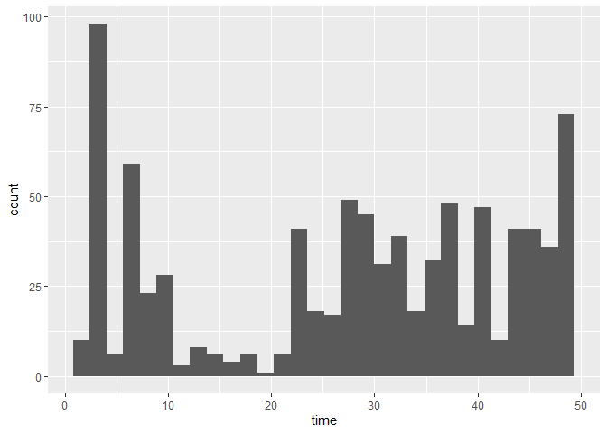
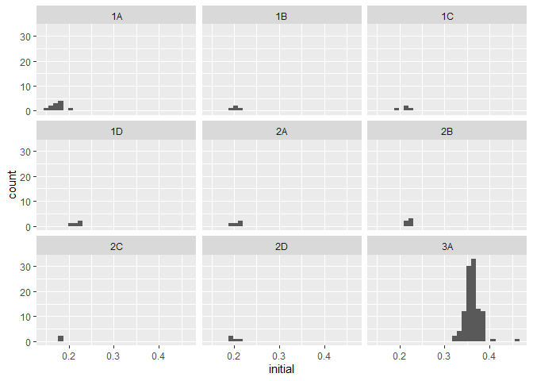
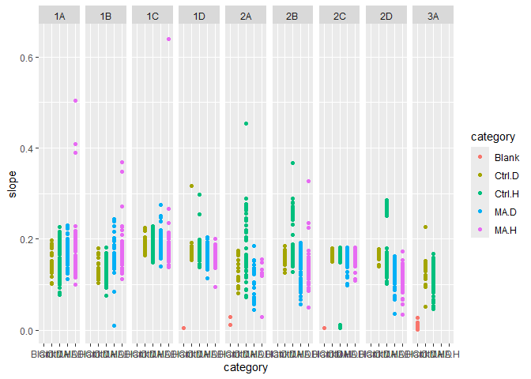
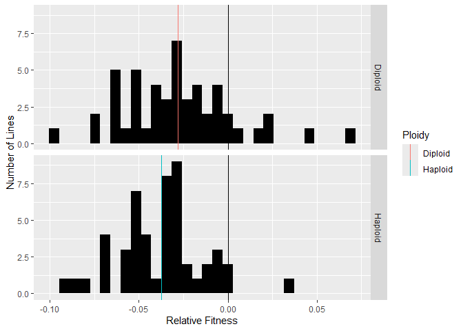
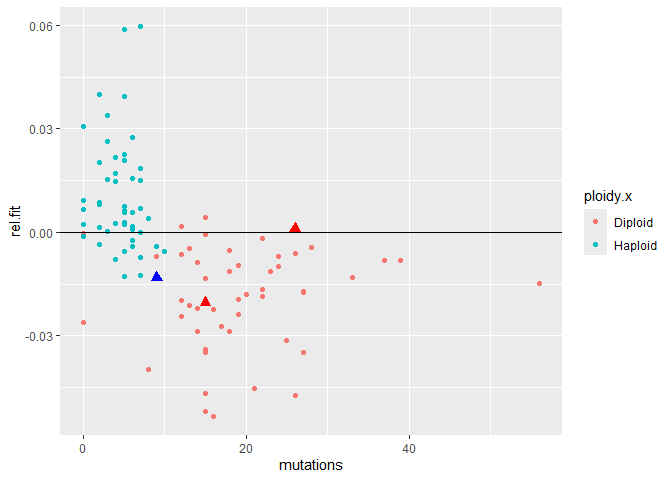
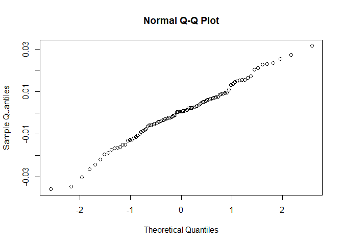

MA Fitness FA24
================
Rutuja
2024-09-23

# Setup functions

### This fits a spline to y=OD versus x=time, and then finds the maximum slope

``` r
spline.slope<-function(x, y, n=101, eps=1e-5, span=0.075){
  max(nderiv(loess(log(y) ~ x, degree=1, span=span), x), na.rm=TRUE)
}
```

### Used by the function above to get a local (linear) slope around a point

``` r
nderiv <- function(fit, x, eps=1e-5){
  (predict(fit, x + eps) - predict(fit, x - eps))/(2 * eps)}
```

## Spline fitting:

First we start by converting everything to log scale. During the
exponential growth phase, log(N) is proportional to t where N is the
population and t is time. There is noise in the original data. We remove
the noise and try to obtain the underlying curve using loess. It gives a
smooth curve. Then we use that curve to find local slopes. nderiv gives
precise estimate of the local linear slope at every point.

- this fits a spline to y=OD versus x=time, and then finds the
  time-stamp for maximum slope

``` r
spline.time<-function(x, y, n=101, eps=1e-5, span=0.075){
  estimates <- loess(log(y) ~ x, degree=1, span=span)
  slopes <- nderiv(estimates, x)
  return(which.max(slopes))
}
```

**Note that the unit of the time stamp is the number of 15 minute
intervals from the beginning of measurement.**

## Figuring out the parameters for the splines

``` r
d.test <- read.csv("data/Ref 04 06.csv")
assay.testdata <- read.delim("data/Rutuja 04 06.txt")
```

``` r
well <- assay.testdata$M12
time <- seq(1, length(well))


ggplot() + 
  geom_point(aes(x=time, y=well))
```

    ## Warning: Removed 43 rows containing missing values or values outside the scale range
    ## (`geom_point()`).

<!-- -->

``` r
## Now trying to smooth 
smoothed <- predict(loess(log(well) ~ time, degree=1, span=0.05), time)
```

    ## Warning in simpleLoess(y, x, w, span, degree = degree, parametric = parametric,
    ## : k-d tree limited by memory. ncmax= 200

``` r
ggplot() + 
  geom_point(aes(x=time, y=smoothed), color="red") +
  geom_point(aes(x=time, y=log(well)))
```

    ## Warning: Removed 43 rows containing missing values or values outside the scale range
    ## (`geom_point()`).
    ## Removed 43 rows containing missing values or values outside the scale range
    ## (`geom_point()`).

<!-- -->

``` r
# slopes <- nderiv(log(well), time)
# fitted.slopes <- nderiv(log(well), time)
```

## Reading and cleaning the data

Load all files and setup variables

This is just some information from the experiment. Using the info to
make sure everything is labelled right and is categorized right
downstream.

``` r
dates.1 <- seq(mdy(04062023), mdy(04102023), 1)
dates.2 <- seq(mdy(04282023), mdy(11302023), 1)
dates.3 <- c(mdy(11022023))
# dates.2 <- c(dates.2, mdy(11022023))

ancestors <- c('H1', 'H2', 'H3', 'D1', 'D2', 'D3')

# these are all the haploid ancestors including the diploids that are found to haploids
ancestors.haploid <- c('H1', 'H2', 'H3', 'D2', 'D3', 'C1', 'C3')

# these are haploids that were intended to be haploids
anc.hap.og <- c('H1', 'H2', 'H3', 'C1', 'C2')

# these are haploids that were intended to be diploids
anc.hap.fake <- c('D2', 'D3')

# this is the only actual diploid control that was diploid
ancestors.diploid <- c('D1')

# this MA line started out as a haploid but ended up as a diploid
fake.haploids <- c(81)

# these MA lines started out as diploids but ended up as haploids
fake.diploids <- c(20, 28, 48, 52, 54, 84, 100)

# these have an aneuploidy of chromosome 3
aneuploids <- c(45, 68, 98)
```

Adding additional information for categorization. Excluding MA lines
that changed ploidy. For now I am excluding the lines that changed
ploidy. Originally I was categorizing them as whatever their final
ploidy was but I need to rethink that.

``` r
d$batch[d$date %in% dates.1] <- 1
d$batch[d$date %in% dates.2] <- 2
d$batch[d$date %in% dates.3] <- 3


d$label <- d$treatment
d$label[d$treatment == 'Blank'] <- '0'
d$label[d$treatment == 'H1'] <- '101'
d$label[d$treatment == 'D1'] <- '102'
d$label[d$treatment == 'H2'] <- '103'
d$label[d$treatment == 'D2'] <- '104'
d$label[d$treatment == 'H3'] <- '105'
d$label[d$treatment == 'D3'] <- '106'
d$label[d$treatment == 'C1'] <- '107'
d$label[d$treatment == 'C3'] <- '109'
d$label <- as.numeric(d$label)

d <- d %>% mutate(category = case_when(label == 0 ~ 'Blank',
                              label > 100 & treatment %in% ancestors.haploid ~ 'Ctrl.H',
                              label > 100 & treatment %in% ancestors.diploid ~ 'Ctrl.D',
                              label %% 2 == 0 ~ 'MA.D',
                              label %% 2 == 1 ~ 'MA.H'))


# 
# d <- d %>% mutate(category = ifelse(label %in% fake.diploids, 'MA.H', category))
# d <- d %>% mutate(category = ifelse(label %in% fake.haploids, 'MA.D', category))

d <- d %>% filter(!(label %in% fake.diploids))
d <- d %>% filter(!(label %in% fake.haploids))

# Labeling the dates
dates <- d %>% distinct(date)
alphabet <- c('1A', '1B', '1C', '1D', '2A', '2B', '2C', '2D', '3A')
dates <- dates %>% mutate(day = alphabet)
d <- d %>% left_join(dates, by='date') %>% select(-date)

head(d)
```

    ##   well treatment       slope initial     final monotone final_slope time batch
    ## 1   A1     Blank 0.008556741 0.16275 0.1664968       27  0.00143824   22     1
    ## 2   B1        H1 0.177044571 0.17475 0.6231032        0  0.04391984   56     1
    ## 3   C1        H2 0.181338943 0.17300 0.6569032        0  0.04570547   52     1
    ## 4   D1        H3 0.179039043 0.17825 0.5738387        0  0.04193645   56     1
    ## 5   E1        D1 0.163659261 0.17000 0.4803484        0  0.03961091   67     1
    ## 6   F1        D2 0.132832780 0.17175 0.3771548        3  0.03524914   67     1
    ##   label category day
    ## 1     0    Blank  1A
    ## 2   101   Ctrl.H  1A
    ## 3   103   Ctrl.H  1A
    ## 4   105   Ctrl.H  1A
    ## 5   102   Ctrl.D  1A
    ## 6   104   Ctrl.H  1A

``` r
d %>%
  # filter(category == 'Ctrl.H' | category == 'Ctrl.D') %>% 
  ggplot() + geom_point(aes(x=category, y=slope, color=category)) + facet_grid(cols=vars(day)) +
  theme(axis.text.x = element_text(angle = 90, vjust = 0.5, hjust=1))
```

<!-- -->

### Additional information about the days

An additional assay was conducted that compared only the control lines
with frozen lab stocks. The ancestors used for the experiment were
replicates of the frozen lab stocks. However, they demonstrated
considerable variance from the lab stocks. This was a cause for concern
which led to the conduction of the supplemental assay. The supplemental
assay demonstrated that the control lines used for the original assay
behaved similar to the lab stocks. Thus it is reasonable to add these
values to the dataset before trimming for reasonable values.

# Preliminary exploration

Plot ancestors across all days to visually check for day effects
<!-- -->

Plotting the distribution of the slope values

``` r
# ci <- c(quantile(d$slope, 0.25) - 1.5* IQR(d$slope),
        # quantile(d$slope, 0.75) + 1.5* IQR(d$slope))

ci <- c(0.07, 0.24)

d %>% ggplot() +
  geom_density(aes(x=slope)) +
  geom_vline(xintercept = ci, color='red', linetype='dashed')
```

<!-- -->

``` r
blanks <-  d %>% filter(category == 'Blank')
```

Plotting the distribution of the final OD values

``` r
d %>% ggplot() +
  geom_density(aes(x=final))
```

<!-- -->

visualize the blanks

    ## `stat_bin()` using `bins = 30`. Pick better value with `binwidth`.

<!-- -->

Setting cutoff for blanks around 0.06 and using the good blanks to make
blank predictions for each day.

``` r
bad.blanks <- blanks %>% filter(slope > 0.06)
good.blanks <- blanks %>% filter(slope < 0.06)

model <- lmer(slope~(1|day), data = good.blanks)
dates.predict <- data.frame(date=distinct(d, day))
dates.predict$null = predict(model, dates.predict)
```

Checking for effects of time (time taken to attain maximum growth rate).
Each time stamp is of 15 minutes.

Plotting the low values of time

    ## `stat_bin()` using `bins = 30`. Pick better value with `binwidth`.

<!-- -->

Samples with time \< 10 were identified to be erroneous.

Looking to see if they reached saturation or not

``` r
sat <- c(0, 0.045)

d %>% ggplot() +
  geom_density(aes(x=final_slope)) +
  geom_vline(xintercept = sat, color='red', linetype='dashed')
```

<!-- -->

## Error removal

Accounting for experimental error by removing lines according to the
following rules:  
1. Remove unreasonable slope values  
2. Remove the bad blanks.  
3. Remove lines where the initial optical density was more than the
final optical density since the optical density should not decrease
unless there was an error.  
4. Remove the diploid ancestors that were found to be haploids.  
5. Remove the lines that reach saturation within the first 2 hours which
is too soon to reach saturation.

``` r
data <- d %>%
  filter(slope > ci[1] & slope < ci[2]) %>%
  anti_join(bad.blanks) %>%
  filter(initial <= final) %>%
  filter(final_slope > sat[1] & final_slope < sat[2]) #%>%
```

    ## Joining with `by = join_by(well, treatment, slope, initial, final, monotone,
    ## final_slope, time, batch, label, category, day)`

``` r
  # filter(!(batch == 1 & treatment == "D1")) %>%
  # filter(!(treatment %in% anc.hap.fake)) %>%
  # filter(time > 10) %>%
  # filter(monotone <= 5)

cat(data$well[data$day=="1A"])
```

    ## B1 D1 E1 F1 G1 H1 I1 J1 K1 L1 M1 E2 F2 G2 H2 I2 J2 K2 L2 M2 N2 O2 P2 B3 I3 B4 C4 E4 I4 J4 L4 M4 N4 B5 P5 P6 B7 D7 F7 H7 L7 A8 B8 D8 O8 P8 B9 H9 J9 O9 P9 B10 L10 O10 P10 B11 L11 B12 D12 N12 O12 B13 L13 A14 B14 E14 I14 L14 M14 N14 O14 P14 A15 E15 F15 H15 L15 N15 O15 P15 A16 D16 H16 L16 N16 O16 P16 C17 F17 J17 K17 O17 P17 B18 D18 I18 J18 L18 N18 O18 P18 F19 H19 J19 B20 D20 F20 P20 D21 P21 A22 C22 D22 E22 F22 H22 P22 H23 J23 K23 L23 M23 N23 O23 D24 E24 F24 G24 I24

``` r
print("")
```

    ## [1] ""

``` r
cat(data$well[data$day=="1B"])
```

    ## F1 G1 M1 O1 A2 F2 G2 M2 O2 C3 E3 I3 L3 M3 N3 P3 D4 E4 P4 D5 F5 H5 L5 N5 J6 L6 N6 P6 B7 H7 K7 B8 C8 D8 L8 P8 F9 J9 L9 P9 B10 C10 P10 B11 P11 G12 J12 K12 L12 M12 P12 B13 D13 E13 F13 G13 H13 I13 L13 H14 L14 N14 F15 L15 N15 P15 D16 H16 N16 F17 H17 K17 I18 L18 P18 N19 P19 A20 P20 A21 E21 P21 A22 H22 I22 J22 K22 L22 M22 N22 O22 P22 C23 I23 J23 M23 O23 P23 B24 I24 J24 K24 L24 M24 N24 O24

``` r
print("")
```

    ## [1] ""

``` r
cat(data$well[data$day=="1C"])
```

    ## I4 C9 D10 M10 C11 J11 M19 J21 N22

``` r
print("")
```

    ## [1] ""

``` r
cat(data$well[data$day=="1D"])
```

    ## B1 C1 D1 E1 F1 G1 H1 I1 J1 K1 L1 M1 N1 O1 A2 B2 C2 D2 E2 F2 G2 H2 I2 J2 K2 M2 N2 O2 P2 A3 B3 C3 D3 E3 F3 G3 H3 I3 J3 K3 M3 N3 O3 P3 A4 B4 E4 F4 G4 H4 I4 J4 K4 L4 M4 N4 O4 P4 A5 B5 D5 E5 F5 G5 H5 I5 K5 L5 M5 N5 O5 P5 A6 C6 D6 E6 G6 H6 I6 J6 K6 L6 M6 O6 P6 A7 B7 C7 D7 E7 F7 G7 H7 I7 J7 K7 L7 M7 O7 P7 A8 B8 C8 D8 E8 G8 I8 J8 K8 L8 M8 N8 O8 P8 A9 B9 C9 D9 E9 F9 G9 H9 I9 J9 K9 L9 M9 N9 O9 P9 A10 B10 C10 D10 E10 F10 G10 H10 I10 J10 L10 M10 O10 P10 A11 B11 C11 D11 E11 F11 G11 H11 I11 J11 K11 L11 M11 N11 O11 P11 A12 B12 C12 D12 E12 G12 H12 I12 J12 K12 L12 M12 N12 O12 P12 B13 C13 D13 E13 F13 G13 H13 I13 J13 K13 L13 M13 O13 P13 A14 B14 C14 D14 E14 F14 G14 H14 I14 J14 K14 L14 M14 N14 O14 P14 A15 B15 C15 D15 E15 F15 G15 H15 I15 K15 L15 M15 N15 O15 P15 A16 B16 C16 D16 E16 G16 H16 I16 J16 K16 L16 M16 N16 O16 P16 A17 B17 C17 D17 E17 F17 G17 H17 I17 J17 K17 M17 O17 P17 A18 B18 C18 D18 E18 G18 I18 J18 K18 L18 M18 N18 O18 P18 A19 C19 D19 E19 F19 G19 H19 I19 J19 L19 M19 N19 O19 P19 A20 B20 C20 D20 E20 F20 G20 H20 O20 P20 A21 B21 D21 E21 F21 G21 H21 O21 P21 A22 B22 C22 D22 E22 F22 G22 H22 I22 J22 O22 P22 A23 B23 C23 D23 G23 H23 I23 J23 K23 L23 M23 N23 O23 P23 B24 F24 I24 J24 K24 M24 N24 O24

``` r
print("")
```

    ## [1] ""

``` r
cat(data$well[data$day=="2A"])
```

    ## B1 F1 G1 H1 M1 N1 C2 D2 I2 J2 K2 O2 P2 A3 C3 F3 G3 H3 M3 N3 P3 A4 C4 E4 F4 G4 H4 I4 J4 K4 L4 M4 N4 O4 P4 C5 D5 F5 G5 H5 I5 K5 L5 M5 N5 O5 P5 B6 C6 E6 G6 J6 K6 L6 B7 C7 D7 F7 G7 J7 K7 L7 O7 A8 B8 C8 D8 E8 G8 I8 J8 K8 M8 N8 A9 E9 G9 H9 I9 J9 K9 L9 M9 P9 A10 E10 F10 G10 I10 J10 M10 P10 A11 G11 H11 I11 J11 K11 L11 M11 N11 P11 B12 D12 L12 O12 P12 D13 E13 F13 J13 L13 M13 O13 A14 B14 C14 D14 L14 N14 A15 B15 C15 D15 E15 H15 I15 P15 A16 C16 I16 J16 K16 L16 M16 N16 O16 P16 C17 D17 E17 F17 G17 J17 L17 M17 O17 C18 D18 E18 J18 K18 L18 M18 N18 P18 C19 D19 E19 F19 G19 H19 I19 J19 K19 M19 N19 O19 C20 D20 F20 H20 J20 L20 A21 C21 D21 E21 F21 G21 H21 J21 L21 M21 N21 P21 A22 C22 D22 E22 I22 J22 K22 L22 P22 A23 C23 F23 L23 M23 N23 O23 P23 C24 D24 E24 I24 J24 K24 O24

``` r
print("")
```

    ## [1] ""

``` r
cat(data$well[data$day=="2B"])
```

    ## B1 F1 G1 H1 L1 M1 N1 C2 D2 E2 I2 J2 O2 P2 A3 B3 F3 G3 H3 I3 L3 M3 N3 P3 A4 C4 D4 E4 F4 G4 H4 I4 J4 K4 L4 M4 N4 O4 P4 A5 C5 D5 E5 F5 G5 I5 K5 L5 N5 O5 P5 B6 C6 D6 E6 G6 H6 I6 J6 K6 L6 M6 N6 O6 P6 B7 C7 D7 E7 F7 G7 H7 I7 J7 K7 L7 M7 P7 A8 B8 C8 D8 E8 G8 I8 J8 K8 L8 M8 N8 C9 D9 E9 F9 G9 H9 I9 K9 M9 N9 P9 A10 C10 D10 E10 F10 G10 H10 I10 J10 L10 M10 O10 P10 C11 D11 E11 F11 G11 H11 I11 J11 K11 L11 M11 N11 O11 P11 C12 D12 E12 G12 J12 K12 L12 O12 D13 E13 I13 J13 K13 L13 M13 A14 B14 C14 D14 E14 F14 G14 H14 I14 J14 K14 L14 M14 A15 C15 D15 E15 F15 G15 H15 I15 L15 M15 N15 P15 B16 C16 E16 G16 J16 K16 L16 N16 O16 P16 C17 D17 E17 F17 G17 H17 I17 J17 K17 L17 M17 O17 P17 B18 C18 D18 E18 I18 J18 K18 L18 M18 N18 O18 A19 B19 C19 D19 E19 F19 G19 H19 I19 J19 K19 L19 M19 N19 A20 B20 C20 D20 E20 F20 G20 H20 I20 J20 L20 M20 A21 C21 D21 E21 F21 G21 H21 I21 J21 K21 L21 M21 N21 P21 C22 D22 E22 I22 J22 K22 P22 A23 F23 G23 H23 L23 M23 N23 O23 P23 C24 F24 I24 J24 K24 O24

``` r
print("")
```

    ## [1] ""

``` r
cat(data$well[data$day=="2C"])
```

    ## B1 E1 F1 G1 H1 L1 M1 N1 C2 D2 E2 J2 O2 P2 A3 D3 E3 F3 G3 H3 J3 L3 M3 N3 A4 C4 D4 E4 F4 G4 H4 I4 J4 K4 L4 M4 N4 O4 P4 B5 D5 E5 F5 G5 H5 I5 K5 L5 M5 N5 O5 P5 C6 D6 E6 G6 H6 I6 J6 K6 L6 M6 N6 O6 A7 C7 D7 E7 F7 G7 H7 I7 J7 K7 L7 M7 P7 A8 B8 C8 D8 E8 G8 I8 J8 K8 L8 M8 N8 O8 A9 C9 D9 E9 F9 G9 H9 J9 K9 L9 M9 N9 P9 A10 C10 D10 E10 F10 G10 H10 I10 J10 L10 M10 O10 P10 B11 C11 D11 E11 F11 G11 H11 J11 K11 L11 M11 N11 O11 P11 B12 C12 D12 E12 J12 K12 L12 N12 O12 B13 C13 E13 F13 J13 K13 L13 B14 C14 D14 E14 F14 H14 J14 K14 L14 M14 N14 A15 B15 C15 D15 E15 F15 G15 H15 I15 K15 L15 M15 N15 P15 A16 B16 C16 D16 E16 G16 H16 I16 J16 K16 L16 M16 N16 O16 P16 B17 C17 D17 E17 F17 G17 H17 I17 K17 L17 M17 O17 P17 B18 C18 D18 E18 G18 I18 J18 K18 L18 M18 N18 O18 A19 C19 D19 E19 F19 G19 H19 I19 J19 L19 N19 P19 A20 C20 D20 E20 F20 G20 H20 J20 L20 M20 O20 A21 G21 H21 J21 K21 M21 N21 P21 A22 B22 D22 P22 A23 F23 G23 H23 J23 L23 M23 N23 O23 P23 D24 E24 I24 J24 K24 M24 O24

``` r
print("")
```

    ## [1] ""

``` r
cat(data$well[data$day=="2D"])
```

    ## B1 F1 G1 H1 L1 M1 N1 C2 D2 E2 I2 J2 K2 O2 P2 A3 F3 G3 H3 L3 M3 N3 P3 A4 C4 D4 E4 F4 G4 H4 J4 L4 N4 O4 P4 C5 D5 E5 F5 G5 H5 I5 K5 M5 N5 O5 P5 B6 C6 D6 E6 H6 I6 J6 K6 L6 M6 N6 O6 B7 D7 E7 F7 G7 H7 J7 K7 L7 M7 P7 A8 B8 C8 G8 I8 J8 K8 L8 A9 C9 D9 E9 F9 G9 H9 I9 J9 K9 L9 M9 N9 P9 A10 C10 D10 E10 F10 G10 H10 I10 J10 L10 M10 O10 P10 D11 E11 F11 G11 H11 I11 J11 K11 L11 M11 N11 O11 P11 B12 C12 D12 H12 I12 K12 L12 O12 B13 E13 F13 J13 K13 L13 A14 B14 C14 D14 E14 F14 G14 H14 I14 J14 K14 L14 M14 N14 A15 C15 D15 E15 F15 G15 I15 K15 L15 N15 P15 A16 C16 E16 G16 H16 I16 J16 K16 L16 M16 N16 O16 P16 D17 F17 G17 H17 I17 J17 K17 M17 O17 P17 C18 D18 I18 J18 K18 L18 O18 B19 C19 D19 E19 F19 G19 H19 I19 J19 K19 L19 N19 A20 B20 C20 D20 E20 F20 G20 H20 I20 J20 L20 M20 A21 C21 D21 E21 F21 G21 H21 I21 J21 K21 L21 M21 N21 P21 A22 C22 D22 E22 I22 J22 K22 P22 A23 F23 G23 H23 L23 M23 N23 O23 P23 C24 D24 E24 I24 J24 K24 O24

``` r
print("")
```

    ## [1] ""

``` r
cat(data$well[data$day=="1A"])
```

    ## B1 D1 E1 F1 G1 H1 I1 J1 K1 L1 M1 E2 F2 G2 H2 I2 J2 K2 L2 M2 N2 O2 P2 B3 I3 B4 C4 E4 I4 J4 L4 M4 N4 B5 P5 P6 B7 D7 F7 H7 L7 A8 B8 D8 O8 P8 B9 H9 J9 O9 P9 B10 L10 O10 P10 B11 L11 B12 D12 N12 O12 B13 L13 A14 B14 E14 I14 L14 M14 N14 O14 P14 A15 E15 F15 H15 L15 N15 O15 P15 A16 D16 H16 L16 N16 O16 P16 C17 F17 J17 K17 O17 P17 B18 D18 I18 J18 L18 N18 O18 P18 F19 H19 J19 B20 D20 F20 P20 D21 P21 A22 C22 D22 E22 F22 H22 P22 H23 J23 K23 L23 M23 N23 O23 D24 E24 F24 G24 I24

``` r
print("")
```

    ## [1] ""

Plotting the ancestors again
<!-- --><!-- --><!-- --><!-- -->

## Preparing for data analysis

``` r
df <- data %>%
  select(treatment, label, slope, initial, day, category, time) %>%
  filter(category != 'Blank')

df <- df %>% rename('lineid' = 'treatment')

df$ploidy <- case_when(
  df$category %in% c('Ctrl.H', 'MA.H') ~ 'Haploid',
  df$category %in% c('Ctrl.D', 'MA.D') ~ 'Diploid'
)

df$MA <- case_when(
  df$category %in% c('MA.H', 'MA.D') ~ 'MA',
  df$category %in% c('Ctrl.H', 'Ctrl.D') ~ 'Ctrl',
)

head(df)
```

    ##   lineid label     slope initial day category time  ploidy   MA
    ## 1     H1   101 0.1770446 0.17475  1A   Ctrl.H   56 Haploid Ctrl
    ## 2     H3   105 0.1790390 0.17825  1A   Ctrl.H   56 Haploid Ctrl
    ## 3     D1   102 0.1636593 0.17000  1A   Ctrl.D   67 Diploid Ctrl
    ## 4     D2   104 0.1328328 0.17175  1A   Ctrl.H   67 Haploid Ctrl
    ## 5     D3   106 0.1762426 0.16800  1A   Ctrl.H   65 Haploid Ctrl
    ## 6     H1   101 0.1262669 0.17575  1A   Ctrl.H   55 Haploid Ctrl

# Data Analysis

### Calculating relative fitness

``` r
# MA lines
trt <- df %>% filter(label > 0 & label <= 100)
# ancestor lines
ctrl <- df %>% filter(label > 100)

# model to predict the slope of the ancestors of each ploidy with date as a random effect
mod <- lmer(slope ~ ploidy + (1|day), ctrl)

# making predictions for each date
ctrl.predict <- data.frame(distinct(ctrl, day, ploidy))
ctrl.predict$ctrl <- predict(mod, ctrl.predict)

# combining with the MA line dateset
trt <- left_join(trt, ctrl.predict, by=c('day', 'ploidy'))

# calculating relative fitness as the difference between the slope for the MA line and its ancestor
trt$rel.fit <- trt$slope - trt$ctrl

# grouping all the readings for the lines and summarizing by calculating the mean relative fitness
trt <- trt %>% group_by(ploidy, label) %>%
  summarize(rel.fit = mean(rel.fit, na.rm=TRUE)) %>%
  ungroup()
```

    ## `summarise()` has grouped output by 'ploidy'. You can override using the
    ## `.groups` argument.

``` r
# mean and standard deviation for the diploids
mu.dip <- mean(trt$rel.fit[trt$ploidy == 'Diploid'], na.rm=TRUE)
sd.dip <- sd(trt$rel.fit[trt$ploidy == 'Diploid'])
paste0("Diploids: ", mu.dip, " Deviation: ", sd.dip)
```

    ## [1] "Diploids: -0.0085052513029368 Deviation: 0.0110468471548802"

``` r
# mean and standard deviation for the haploids
mu.hap <- mean(trt$rel.fit[trt$ploidy == 'Haploid'], na.rm=TRUE)
sd.hap <- sd(trt$rel.fit[trt$ploidy == 'Haploid'])
paste0("Haploids: ", mu.hap, " Deviation: ", sd.dip)
```

    ## [1] "Haploids: -0.0137118511878981 Deviation: 0.0110468471548802"

    ## `stat_bin()` using `bins = 30`. Pick better value with `binwidth`.

<!-- -->

Black line is the 0 line. The haploid MA lines performed worse than the
diploid MA lines.

### Using lmer models to test for any differences between the ancestors

``` r
null <- lmer(slope ~ 1 + (1|day), ctrl)
full <- lmer(slope ~ ploidy + (1|day), ctrl)
summary(full)
```

    ## Linear mixed model fit by REML ['lmerMod']
    ## Formula: slope ~ ploidy + (1 | day)
    ##    Data: ctrl
    ## 
    ## REML criterion at convergence: -4247.6
    ## 
    ## Scaled residuals: 
    ##     Min      1Q  Median      3Q     Max 
    ## -3.5032 -0.5084  0.0079  0.4933  4.5137 
    ## 
    ## Random effects:
    ##  Groups   Name        Variance  Std.Dev.
    ##  day      (Intercept) 0.0003993 0.01998 
    ##  Residual             0.0005300 0.02302 
    ## Number of obs: 914, groups:  day, 9
    ## 
    ## Fixed effects:
    ##                 Estimate Std. Error t value
    ## (Intercept)    0.1524094  0.0070738   21.55
    ## ploidyHaploid -0.0003684  0.0018449   -0.20
    ## 
    ## Correlation of Fixed Effects:
    ##             (Intr)
    ## ploidyHapld -0.203

``` r
mod <- anova(null, full)
```

    ## refitting model(s) with ML (instead of REML)

``` r
mod
```

    ## Data: ctrl
    ## Models:
    ## null: slope ~ 1 + (1 | day)
    ## full: slope ~ ploidy + (1 | day)
    ##      npar     AIC     BIC logLik deviance  Chisq Df Pr(>Chisq)
    ## null    3 -4260.5 -4246.1 2133.3  -4266.5                     
    ## full    4 -4258.6 -4239.3 2133.3  -4266.6 0.0395  1     0.8424

Ploidy does not have a significant effect on fitness in the ancestors.

### Using lmer models with lineid and date as random effects.

##### Looking for MA-ploidy interaction:

``` r
null <- lmer(slope ~ MA + ploidy + (1|day) + (1|lineid), df)
summary(null)
```

    ## Linear mixed model fit by REML ['lmerMod']
    ## Formula: slope ~ MA + ploidy + (1 | day) + (1 | lineid)
    ##    Data: df
    ## 
    ## REML criterion at convergence: -7965.2
    ## 
    ## Scaled residuals: 
    ##     Min      1Q  Median      3Q     Max 
    ## -2.7638 -0.5442  0.0257  0.4806  4.0051 
    ## 
    ## Random effects:
    ##  Groups   Name        Variance  Std.Dev.
    ##  lineid   (Intercept) 5.203e-05 0.007213
    ##  day      (Intercept) 3.044e-04 0.017448
    ##  Residual             6.498e-04 0.025491
    ## Number of obs: 1799, groups:  lineid, 100; day, 9
    ## 
    ## Fixed effects:
    ##                Estimate Std. Error t value
    ## (Intercept)    0.155210   0.006788  22.865
    ## MAMA          -0.008291   0.003218  -2.576
    ## ploidyHaploid -0.003311   0.002207  -1.500
    ## 
    ## Correlation of Fixed Effects:
    ##             (Intr) MAMA  
    ## MAMA        -0.439       
    ## ploidyHapld -0.282  0.248

``` r
full <- lmer(slope ~ MA*ploidy + (1|day) + (1|lineid), df)
summary(full)
```

    ## Linear mixed model fit by REML ['lmerMod']
    ## Formula: slope ~ MA * ploidy + (1 | day) + (1 | lineid)
    ##    Data: df
    ## 
    ## REML criterion at convergence: -7957.5
    ## 
    ## Scaled residuals: 
    ##     Min      1Q  Median      3Q     Max 
    ## -2.7651 -0.5433  0.0288  0.4815  3.9994 
    ## 
    ## Random effects:
    ##  Groups   Name        Variance  Std.Dev.
    ##  lineid   (Intercept) 5.435e-05 0.007373
    ##  day      (Intercept) 3.042e-04 0.017442
    ##  Residual             6.494e-04 0.025484
    ## Number of obs: 1799, groups:  lineid, 100; day, 9
    ## 
    ## Fixed effects:
    ##                     Estimate Std. Error t value
    ## (Intercept)         0.154211   0.009603  16.059
    ## MAMA               -0.007241   0.007785  -0.930
    ## ploidyHaploid      -0.002167   0.008164  -0.265
    ## MAMA:ploidyHaploid -0.001243   0.008489  -0.146
    ## 
    ## Correlation of Fixed Effects:
    ##             (Intr) MAMA   pldyHp
    ## MAMA        -0.772              
    ## ploidyHapld -0.733  0.901       
    ## MAMA:pldyHp  0.705 -0.908 -0.962

``` r
mod <- anova(null, full)
```

    ## refitting model(s) with ML (instead of REML)

``` r
mod
```

    ## Data: df
    ## Models:
    ## null: slope ~ MA + ploidy + (1 | day) + (1 | lineid)
    ## full: slope ~ MA * ploidy + (1 | day) + (1 | lineid)
    ##      npar     AIC     BIC logLik deviance  Chisq Df Pr(>Chisq)
    ## null    6 -7981.8 -7948.8 3996.9  -7993.8                     
    ## full    7 -7979.8 -7941.3 3996.9  -7993.8 0.0236  1     0.8778

No significant MA-ploidy interaction

##### Exploring effect of MA on the slope

``` r
# lmer for effect of MA
null <- lmer(slope ~ 1 + ploidy + (1|day) + (1|lineid), df)
full <- lmer(slope ~ MA + ploidy + (1|day) + (1|lineid), df)
summary(full)
```

    ## Linear mixed model fit by REML ['lmerMod']
    ## Formula: slope ~ MA + ploidy + (1 | day) + (1 | lineid)
    ##    Data: df
    ## 
    ## REML criterion at convergence: -7965.2
    ## 
    ## Scaled residuals: 
    ##     Min      1Q  Median      3Q     Max 
    ## -2.7638 -0.5442  0.0257  0.4806  4.0051 
    ## 
    ## Random effects:
    ##  Groups   Name        Variance  Std.Dev.
    ##  lineid   (Intercept) 5.203e-05 0.007213
    ##  day      (Intercept) 3.044e-04 0.017448
    ##  Residual             6.498e-04 0.025491
    ## Number of obs: 1799, groups:  lineid, 100; day, 9
    ## 
    ## Fixed effects:
    ##                Estimate Std. Error t value
    ## (Intercept)    0.155210   0.006788  22.865
    ## MAMA          -0.008291   0.003218  -2.576
    ## ploidyHaploid -0.003311   0.002207  -1.500
    ## 
    ## Correlation of Fixed Effects:
    ##             (Intr) MAMA  
    ## MAMA        -0.439       
    ## ploidyHapld -0.282  0.248

``` r
mod <- anova(null, full)
```

    ## refitting model(s) with ML (instead of REML)

``` r
mod
```

    ## Data: df
    ## Models:
    ## null: slope ~ 1 + ploidy + (1 | day) + (1 | lineid)
    ## full: slope ~ MA + ploidy + (1 | day) + (1 | lineid)
    ##      npar     AIC     BIC logLik deviance  Chisq Df Pr(>Chisq)  
    ## null    5 -7977.5 -7950.0 3993.8  -7987.5                       
    ## full    6 -7981.8 -7948.8 3996.9  -7993.8 6.2717  1    0.01227 *
    ## ---
    ## Signif. codes:  0 '***' 0.001 '**' 0.01 '*' 0.05 '.' 0.1 ' ' 1

The MA lines have different slopes than the ancestors

##### Exploring effect of ploidy on the slope

``` r
null <- lmer(slope ~ 1 + MA + (1|day) + (1|lineid), df)
full <- lmer(slope ~ ploidy + MA + (1|day) + (1|lineid), df)
summary(full)
```

    ## Linear mixed model fit by REML ['lmerMod']
    ## Formula: slope ~ ploidy + MA + (1 | day) + (1 | lineid)
    ##    Data: df
    ## 
    ## REML criterion at convergence: -7965.2
    ## 
    ## Scaled residuals: 
    ##     Min      1Q  Median      3Q     Max 
    ## -2.7638 -0.5442  0.0257  0.4806  4.0051 
    ## 
    ## Random effects:
    ##  Groups   Name        Variance  Std.Dev.
    ##  lineid   (Intercept) 5.203e-05 0.007213
    ##  day      (Intercept) 3.044e-04 0.017448
    ##  Residual             6.498e-04 0.025491
    ## Number of obs: 1799, groups:  lineid, 100; day, 9
    ## 
    ## Fixed effects:
    ##                Estimate Std. Error t value
    ## (Intercept)    0.155210   0.006788  22.865
    ## ploidyHaploid -0.003311   0.002207  -1.500
    ## MAMA          -0.008291   0.003218  -2.576
    ## 
    ## Correlation of Fixed Effects:
    ##             (Intr) pldyHp
    ## ploidyHapld -0.282       
    ## MAMA        -0.439  0.248

``` r
mod <- anova(null, full)
```

    ## refitting model(s) with ML (instead of REML)

``` r
mod
```

    ## Data: df
    ## Models:
    ## null: slope ~ 1 + MA + (1 | day) + (1 | lineid)
    ## full: slope ~ ploidy + MA + (1 | day) + (1 | lineid)
    ##      npar     AIC     BIC logLik deviance  Chisq Df Pr(>Chisq)
    ## null    5 -7981.5 -7954.0 3995.8  -7991.5                     
    ## full    6 -7981.8 -7948.8 3996.9  -7993.8 2.2761  1     0.1314

Haploids and diploids may have different slopes

##### Combining information from the mutation rate dataset

``` r
# read the files
mut <- read_delim("pombe_MA_data.txt")
```

    ## Rows: 100 Columns: 10
    ## ── Column specification ────────────────────────────────────────────────────────
    ## Delimiter: "\t"
    ## chr (2): ploidy, ploidy_final
    ## dbl (8): line, transfers, shared_ancestry, generations, chr_gens1, chr_gens2...
    ## 
    ## ℹ Use `spec()` to retrieve the full column specification for this data.
    ## ℹ Specify the column types or set `show_col_types = FALSE` to quiet this message.

``` r
# combine with the relative fitness data
trt2 <- trt %>%
  left_join(mut, by=c('label'='line'))
trt2 <- trt2 %>% select(ploidy.x, label, rel.fit, ploidy.y, ploidy_final,
                        n.SNM, n.indel)
trt2 <- trt2 %>% mutate(mutations = n.SNM + n.indel)
```

<!-- -->

Some diploids have a relative fitness that is greater than 0. Diploids
have more mutations than haploids.

##### Using a linear model to explore mutation rate and ploidy interaction

``` r
mod <- lm(rel.fit ~ ploidy.x*mutations + ploidy.x + mutations, trt2)
summary(mod)
```

    ## 
    ## Call:
    ## lm(formula = rel.fit ~ ploidy.x * mutations + ploidy.x + mutations, 
    ##     data = trt2)
    ## 
    ## Residuals:
    ##       Min        1Q    Median        3Q       Max 
    ## -0.025346 -0.007968  0.000022  0.007373  0.033824 
    ## 
    ## Coefficients:
    ##                             Estimate Std. Error t value Pr(>|t|)  
    ## (Intercept)               -7.790e-03  3.780e-03  -2.061   0.0423 *
    ## ploidy.xHaploid           -5.072e-03  5.148e-03  -0.985   0.3272  
    ## mutations                 -3.837e-05  1.799e-04  -0.213   0.8316  
    ## ploidy.xHaploid:mutations -1.442e-04  6.874e-04  -0.210   0.8344  
    ## ---
    ## Signif. codes:  0 '***' 0.001 '**' 0.01 '*' 0.05 '.' 0.1 ' ' 1
    ## 
    ## Residual standard error: 0.01147 on 88 degrees of freedom
    ## Multiple R-squared:  0.05211,    Adjusted R-squared:  0.01979 
    ## F-statistic: 1.613 on 3 and 88 DF,  p-value: 0.1922

``` r
qqnorm(resid(mod))
```

<!-- -->

##### Linear model with no mutation rate and ploidy interactions

``` r
mod <- lm(rel.fit ~ ploidy.x + mutations, trt2)
summary(mod)
```

    ## 
    ## Call:
    ## lm(formula = rel.fit ~ ploidy.x + mutations, data = trt2)
    ## 
    ## Residuals:
    ##       Min        1Q    Median        3Q       Max 
    ## -0.025372 -0.007705  0.000056  0.007327  0.033777 
    ## 
    ## Coefficients:
    ##                   Estimate Std. Error t value Pr(>|t|)  
    ## (Intercept)     -7.607e-03  3.657e-03  -2.080   0.0404 *
    ## ploidy.xHaploid -5.881e-03  3.393e-03  -1.733   0.0865 .
    ## mutations       -4.825e-05  1.727e-04  -0.279   0.7806  
    ## ---
    ## Signif. codes:  0 '***' 0.001 '**' 0.01 '*' 0.05 '.' 0.1 ' ' 1
    ## 
    ## Residual standard error: 0.01141 on 89 degrees of freedom
    ## Multiple R-squared:  0.05163,    Adjusted R-squared:  0.03032 
    ## F-statistic: 2.423 on 2 and 89 DF,  p-value: 0.0945

``` r
qqnorm(resid(mod))
```

<!-- -->

##### Linear model with only the mutations

``` r
mod <- lm(rel.fit ~ mutations, trt2)
summary(mod)
```

    ## 
    ## Call:
    ## lm(formula = rel.fit ~ mutations, data = trt2)
    ## 
    ## Residuals:
    ##       Min        1Q    Median        3Q       Max 
    ## -0.023265 -0.008346  0.000327  0.008749  0.032346 
    ## 
    ## Coefficients:
    ##               Estimate Std. Error t value Pr(>|t|)    
    ## (Intercept) -0.0131202  0.0018251  -7.189 1.85e-10 ***
    ## mutations    0.0001647  0.0001227   1.342    0.183    
    ## ---
    ## Signif. codes:  0 '***' 0.001 '**' 0.01 '*' 0.05 '.' 0.1 ' ' 1
    ## 
    ## Residual standard error: 0.01154 on 90 degrees of freedom
    ## Multiple R-squared:  0.01962,    Adjusted R-squared:  0.008722 
    ## F-statistic: 1.801 on 1 and 90 DF,  p-value: 0.183

``` r
qqnorm(resid(mod))
```

<!-- -->

##### Combining the mutation dataset with the entire assay data

``` r
mut_join <- trt2 %>% select(label, mutations)
df <- df %>% left_join(mut_join) %>%
  mutate(mutations = ifelse(is.na(mutations), 0, mutations))
```

    ## Joining with `by = join_by(label)`

##### Mutation rate - ploidy interaction

``` r
null <- lmer(slope ~ mutations + ploidy + (1|day) + (1|lineid), df)
summary(null)
```

    ## Linear mixed model fit by REML ['lmerMod']
    ## Formula: slope ~ mutations + ploidy + (1 | day) + (1 | lineid)
    ##    Data: df
    ## 
    ## REML criterion at convergence: -7953.8
    ## 
    ## Scaled residuals: 
    ##     Min      1Q  Median      3Q     Max 
    ## -2.7091 -0.5376  0.0238  0.4819  3.9388 
    ## 
    ## Random effects:
    ##  Groups   Name        Variance  Std.Dev.
    ##  lineid   (Intercept) 6.197e-05 0.007872
    ##  day      (Intercept) 2.913e-04 0.017067
    ##  Residual             6.488e-04 0.025471
    ## Number of obs: 1799, groups:  lineid, 100; day, 9
    ## 
    ## Fixed effects:
    ##                 Estimate Std. Error t value
    ## (Intercept)    0.1500534  0.0065903  22.769
    ## mutations     -0.0001465  0.0001553  -0.943
    ## ploidyHaploid -0.0040565  0.0031225  -1.299
    ## 
    ## Correlation of Fixed Effects:
    ##             (Intr) muttns
    ## mutations   -0.415       
    ## ploidyHapld -0.427  0.699

``` r
full <- lmer(slope ~ mutations*ploidy + (1|day) + (1|lineid), df)
summary(full)
```

    ## Linear mixed model fit by REML ['lmerMod']
    ## Formula: slope ~ mutations * ploidy + (1 | day) + (1 | lineid)
    ##    Data: df
    ## 
    ## REML criterion at convergence: -7943
    ## 
    ## Scaled residuals: 
    ##     Min      1Q  Median      3Q     Max 
    ## -2.7307 -0.5363  0.0192  0.4841  3.9581 
    ## 
    ## Random effects:
    ##  Groups   Name        Variance  Std.Dev.
    ##  lineid   (Intercept) 5.817e-05 0.007627
    ##  day      (Intercept) 2.928e-04 0.017111
    ##  Residual             6.494e-04 0.025483
    ## Number of obs: 1799, groups:  lineid, 100; day, 9
    ## 
    ## Fixed effects:
    ##                           Estimate Std. Error t value
    ## (Intercept)              1.486e-01  6.640e-03  22.387
    ## mutations               -7.295e-05  1.600e-04  -0.456
    ## ploidyHaploid            1.167e-04  4.048e-03   0.029
    ## mutations:ploidyHaploid -8.307e-04  5.263e-04  -1.579
    ## 
    ## Correlation of Fixed Effects:
    ##             (Intr) muttns pldyHp
    ## mutations   -0.427              
    ## ploidyHapld -0.406  0.700       
    ## mttns:pldyH  0.139 -0.299 -0.652

``` r
mod <- anova(null, full)
```

    ## refitting model(s) with ML (instead of REML)

``` r
mod
```

    ## Data: df
    ## Models:
    ## null: slope ~ mutations + ploidy + (1 | day) + (1 | lineid)
    ## full: slope ~ mutations * ploidy + (1 | day) + (1 | lineid)
    ##      npar     AIC     BIC logLik deviance  Chisq Df Pr(>Chisq)
    ## null    6 -7976.4 -7943.5 3994.2  -7988.4                     
    ## full    7 -7977.0 -7938.5 3995.5  -7991.0 2.5397  1      0.111

No significant interaction in number of mutations and ploidy

##### Effect of mutations

``` r
null <- lmer(slope ~ 1 + ploidy + (1|day) + (1|lineid), df)
full <- lmer(slope ~ mutations + ploidy + (1|day) + (1|lineid), df)
summary(full)
```

    ## Linear mixed model fit by REML ['lmerMod']
    ## Formula: slope ~ mutations + ploidy + (1 | day) + (1 | lineid)
    ##    Data: df
    ## 
    ## REML criterion at convergence: -7953.8
    ## 
    ## Scaled residuals: 
    ##     Min      1Q  Median      3Q     Max 
    ## -2.7091 -0.5376  0.0238  0.4819  3.9388 
    ## 
    ## Random effects:
    ##  Groups   Name        Variance  Std.Dev.
    ##  lineid   (Intercept) 6.197e-05 0.007872
    ##  day      (Intercept) 2.913e-04 0.017067
    ##  Residual             6.488e-04 0.025471
    ## Number of obs: 1799, groups:  lineid, 100; day, 9
    ## 
    ## Fixed effects:
    ##                 Estimate Std. Error t value
    ## (Intercept)    0.1500534  0.0065903  22.769
    ## mutations     -0.0001465  0.0001553  -0.943
    ## ploidyHaploid -0.0040565  0.0031225  -1.299
    ## 
    ## Correlation of Fixed Effects:
    ##             (Intr) muttns
    ## mutations   -0.415       
    ## ploidyHapld -0.427  0.699

``` r
mod <- anova(null, full)
```

    ## refitting model(s) with ML (instead of REML)

``` r
mod
```

    ## Data: df
    ## Models:
    ## null: slope ~ 1 + ploidy + (1 | day) + (1 | lineid)
    ## full: slope ~ mutations + ploidy + (1 | day) + (1 | lineid)
    ##      npar     AIC     BIC logLik deviance  Chisq Df Pr(>Chisq)
    ## null    5 -7977.5 -7950.0 3993.8  -7987.5                     
    ## full    6 -7976.4 -7943.5 3994.2  -7988.4 0.9117  1     0.3397

No significant fitness effects of number of mutations.

###### Effect of ploidy

``` r
null <- lmer(slope ~ 1 + mutations + (1|day) + (1|lineid), df)
full <- lmer(slope ~ ploidy + mutations + (1|day) + (1|lineid), df)
summary(full)
```

    ## Linear mixed model fit by REML ['lmerMod']
    ## Formula: slope ~ ploidy + mutations + (1 | day) + (1 | lineid)
    ##    Data: df
    ## 
    ## REML criterion at convergence: -7953.8
    ## 
    ## Scaled residuals: 
    ##     Min      1Q  Median      3Q     Max 
    ## -2.7091 -0.5376  0.0238  0.4819  3.9388 
    ## 
    ## Random effects:
    ##  Groups   Name        Variance  Std.Dev.
    ##  lineid   (Intercept) 6.197e-05 0.007872
    ##  day      (Intercept) 2.913e-04 0.017067
    ##  Residual             6.488e-04 0.025471
    ## Number of obs: 1799, groups:  lineid, 100; day, 9
    ## 
    ## Fixed effects:
    ##                 Estimate Std. Error t value
    ## (Intercept)    0.1500534  0.0065903  22.769
    ## ploidyHaploid -0.0040565  0.0031225  -1.299
    ## mutations     -0.0001465  0.0001553  -0.943
    ## 
    ## Correlation of Fixed Effects:
    ##             (Intr) pldyHp
    ## ploidyHapld -0.427       
    ## mutations   -0.415  0.699

``` r
mod <- anova(null, full)
```

    ## refitting model(s) with ML (instead of REML)

``` r
mod
```

    ## Data: df
    ## Models:
    ## null: slope ~ 1 + mutations + (1 | day) + (1 | lineid)
    ## full: slope ~ ploidy + mutations + (1 | day) + (1 | lineid)
    ##      npar     AIC     BIC logLik deviance  Chisq Df Pr(>Chisq)
    ## null    5 -7976.7 -7949.2 3993.4  -7986.7                     
    ## full    6 -7976.4 -7943.5 3994.2  -7988.4 1.7077  1     0.1913
